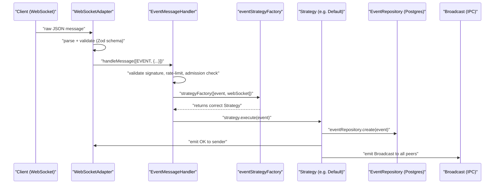
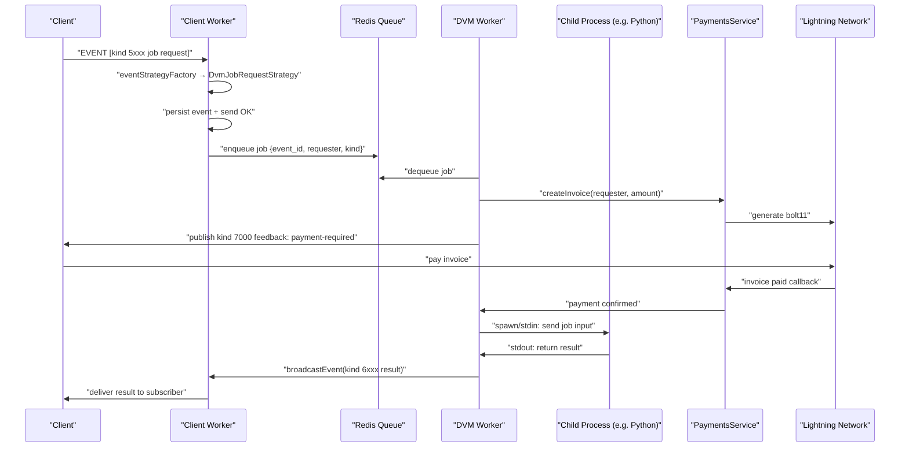

Here's a detailed breakdown of how to approach this task within the nostream codebase, organized by each expected outcome.

---

## Codebase Architecture Overview

Nostream uses a **clustered Node.js architecture** with a primary process (`App`) that forks specialized workers: [0-cite-0](#0-cite-0) 

- **Client workers** (`AppWorker`) handle WebSocket connections and event processing
- **Maintenance worker** runs background tasks (invoice polling, event purging)
- **Static mirroring workers** replicate events from remote relays

The primary process already has an IPC broadcast mechanism — it relays messages between workers via `cluster.on('message', ...)`: [0-cite-1](#0-cite-1) 

Events flow through a pipeline: `WebSocketAdapter.onClientMessage` → `messageHandlerFactory` → `EventMessageHandler` → `eventStrategyFactory` → specific strategy (e.g., `DefaultEventStrategy`). [0-cite-2](#0-cite-2) [0-cite-3](#0-cite-3) 

---

## 1. Async Job Queue for NIP-90 Requests

**NIP-90 event kinds** are in the range `5000–7000` (job requests are `5000–5999`, results are `6000–6999`, feedback is `7000`). These are **not currently defined** in `EventKinds`: [0-cite-4](#0-cite-4) 

### What to build:

**a) Add NIP-90 event kind constants** to `src/constants/base.ts`:
```typescript
// NIP-90: Data Vending Machine
DVM_JOB_REQUEST_FIRST = 5000,
DVM_JOB_REQUEST_LAST = 5999,
DVM_JOB_RESULT_FIRST = 6000,
DVM_JOB_RESULT_LAST = 6999,
DVM_JOB_FEEDBACK = 7000,
```

**b) Create a new event strategy** — `DvmJobRequestStrategy` — following the pattern of existing strategies in `src/handlers/event-strategies/`. The `DefaultEventStrategy` shows the pattern: persist the event, send an OK, and broadcast: [0-cite-5](#0-cite-5) 

Your new strategy would additionally enqueue the job into a new `DvmJobQueue`.

**c) Register the strategy** in `eventStrategyFactory` by adding an `isDvmJobRequestEvent()` check (similar to `isEphemeralEvent`, `isDeleteEvent`, etc.): [0-cite-6](#0-cite-6) 

**d) Build the job queue** as a new module (e.g., `src/dvm/job-queue.ts`). This should:
- Accept NIP-90 events and extract the `i` (input), `param`, and `bid` tags
- Spawn external processes via `child_process.spawn()` or TCP sockets
- Track job state (pending → running → completed/failed)
- Use Redis (already available via `src/cache/client.ts`) for queue persistence across worker restarts

**e) Create a new worker type** — `dvm` — following the pattern of the existing worker types. Register it in `src/index.ts`: [0-cite-0](#0-cite-0) 

And fork it from `App.run()`: [0-cite-7](#0-cite-7) 

The DVM worker would consume from the Redis-backed queue and manage child processes.

---

## 2. IPC Worker Sandboxing & Safeguards

**Key integration point:** The existing IPC between primary and workers uses Node.js cluster messaging: [0-cite-8](#0-cite-8) 

### What to build:

Create a `DvmProcessManager` (e.g., `src/dvm/process-manager.ts`) that:

- **Spawns child processes** using `child_process.spawn()` with `stdio: ['pipe', 'pipe', 'pipe']` for stdin/stdout/stderr communication, or TCP sockets for more complex scenarios
- **Memory limits**: Use `--max-old-space-size` for Node.js children; for non-Node processes, use OS-level cgroups or the `resource` module
- **Timeout enforcement**: Use `AbortController` + `setTimeout` to kill processes that exceed a configurable deadline. The codebase already uses abort patterns: [0-cite-9](#0-cite-9) 

- **Sandboxing**: Run child processes with restricted permissions (e.g., `uid`/`gid` options in `spawn`, or Docker containers for full isolation)
- **Protocol**: Define a JSON-over-stdio protocol where the parent sends the NIP-90 event as input and reads the result event from stdout

Add configuration to `Settings` interface: [0-cite-10](#0-cite-10) 

```typescript
export interface DvmWorkerConfig {
  command: string        // e.g., "python3 /opt/dvm/translate.py"
  kinds: number[]        // which NIP-90 job kinds this worker handles
  timeoutMs: number      // max execution time
  maxMemoryMb: number    // memory limit
  maxConcurrency: number // max parallel jobs
}

export interface DvmSettings {
  enabled: boolean
  workers: DvmWorkerConfig[]
}
```

And add `dvm?: DvmSettings` to the `Settings` interface, plus corresponding YAML in `resources/default-settings.yaml`: [0-cite-11](#0-cite-11) 

---

## 3. NIP-89 Application Handler Publisher

**NIP-89** uses kind `31990` (handler recommendation) — this falls in the **parameterized replaceable** range (`30000–39999`), which nostream already supports: [0-cite-12](#0-cite-12) 

### What to build:

Create a `DvmAnnouncerService` (e.g., `src/dvm/announcer-service.ts`) that:

**a) Publishes NIP-89 handler events** — kind `31990` events signed by the relay's private key. The relay already has key management: [0-cite-13](#0-cite-13) 

And the `PaymentsService.sendInvoiceUpdateNotification()` shows exactly how to create, sign, persist, and broadcast relay-authored events: [0-cite-14](#0-cite-14) 

Follow this same pattern: build an unsigned event → `identifyEvent` → `signEvent(relayPrivkey)` → `eventRepository.create()` → `broadcastEvent()`.

**b) Periodic heartbeat** — Run this in the **maintenance worker** (or the new DVM worker). The maintenance worker already runs periodic tasks: [0-cite-15](#0-cite-15) 

Add a `publishDvmHandlers()` method that:
- Iterates over configured DVM workers
- For each, publishes/updates a kind `31990` event with `d` tag = the job kind, `k` tags listing supported kinds, and relay URL
- Checks process health (is the child process alive?) before publishing
- If a process has crashed, publishes a **deletion event** (kind `5`) referencing the handler event to withdraw it from the network

---

## 4. Saga-Pattern State Machine for Billing

The existing payment system handles **admission fees** — it creates invoices, polls for payment, and admits users: [0-cite-16](#0-cite-16) [0-cite-17](#0-cite-17) 

The payment processor abstraction (`IPaymentsProcessor`) supports multiple backends: [0-cite-18](#0-cite-18) 

### What to build:

Create a `DvmBillingSaga` (e.g., `src/dvm/billing-saga.ts`) implementing a state machine:

```mermaid
stateDiagram-v2
    [*] --> "JobReceived"
    "JobReceived" --> "InvoiceSent" : "Create Lightning invoice via IPaymentsProcessor"
    "InvoiceSent" --> "PaymentConfirmed" : "Payment callback/poll confirms"
    "InvoiceSent" --> "PaymentTimeout" : "Invoice expires"
    "PaymentConfirmed" --> "ComputeDispatched" : "Enqueue to DVM job queue"
    "ComputeDispatched" --> "ComputeCompleted" : "Worker returns result"
    "ComputeDispatched" --> "ComputeFailed" : "Worker timeout/error"
    "ComputeCompleted" --> "ResultDelivered" : "Publish kind 6xxx result event"
    "ComputeFailed" --> "Refunded" : "Issue refund via NWC/payment processor"
    "PaymentTimeout" --> "[*]" : "Publish kind 7000 feedback: expired"
    "ResultDelivered" --> "[*]"
    "Refunded" --> "[*]"
```

**Key integration points:**

- **Invoice creation**: Reuse `IPaymentsService.createInvoice()` but for per-job billing instead of admission [0-cite-19](#0-cite-19) 

- **Payment confirmation**: Reuse the existing callback routes and `confirmInvoice()` flow. The invoice controller already handles this: [0-cite-20](#0-cite-20) 

- **State persistence**: Create a new database table (e.g., `dvm_jobs`) via a Knex migration in `migrations/`:


  Columns: `id`, `event_id`, `requester_pubkey`, `job_kind`, `state` (enum), `invoice_id` (FK to invoices), `result_event_id`, `created_at`, `updated_at`, `timeout_at`

- **NIP-90 feedback events**: Publish kind `7000` events at each state transition (payment-required, processing, success, error) using the same `identifyEvent` → `signEvent` → `broadcastEvent` pattern from `PaymentsService`

- **Fee schedule**: Extend `FeeSchedules` in settings to include DVM job fees: [0-cite-21](#0-cite-21) 

---

## Suggested File Structure for New Code

```
src/dvm/
  ├── job-queue.ts              # Redis-backed async job queue
  ├── process-manager.ts        # Child process spawning + sandboxing
  ├── billing-saga.ts           # State machine coordinating payment + compute
  ├── announcer-service.ts      # NIP-89 handler event publisher
  ├── dvm-job-request-strategy.ts  # Event strategy for kind 5000-5999
  └── @types/
      └── dvm.ts                # DVM-specific type definitions
```

## Summary of Codebase Touch Points

| Component | Files to Modify | Purpose |
|---|---|---|
| Event kinds | `src/constants/base.ts` | Add NIP-90 kind constants |
| Event routing | `src/utils/event.ts`, `src/factories/event-strategy-factory.ts` | Add `isDvmJobRequestEvent()` + strategy registration |
| Worker lifecycle | `src/index.ts`, `src/app/app.ts` | Add `dvm` worker type |
| Settings | `src/@types/settings.ts`, `resources/default-settings.yaml` | Add DVM configuration |
| Payments | `src/services/payments-service.ts`, `src/@types/services.ts` | Extend for per-job billing |
| Database | `migrations/` | New `dvm_jobs` table |
| Maintenance | `src/services/maintenance-service.ts` | Add NIP-89 heartbeat publishing |

The codebase is well-structured with clear separation of concerns (strategies, services, repositories, factories), so each piece of this project maps cleanly onto existing patterns. The biggest architectural decision is whether the DVM orchestrator runs as its own worker type (recommended for isolation) or is embedded in the existing maintenance worker.


--------


## How the Event Pipeline Works Today

To understand why this design works, you need to see how nostream already processes events — because the DVM system plugs directly into this existing pipeline.

### The request lifecycle, step by step:



**Step 1:** A raw WebSocket message arrives at `WebSocketAdapter.onClientMessage()`. It's parsed from JSON and validated against a Zod schema. [1-cite-0](#1-cite-0) 

**Step 2:** The parsed message is routed by type. An `EVENT` message goes to `EventMessageHandler`. [1-cite-1](#1-cite-1) 

**Step 3:** `EventMessageHandler.handleMessage()` runs a gauntlet of checks — signature validity, rate limiting, admission (has the user paid?), NIP-05 verification — before it ever touches the event strategy. [1-cite-2](#1-cite-2) 

**Step 4:** The `eventStrategyFactory` inspects the event's `kind` and returns the right strategy object. This is a simple if/else chain: [1-cite-3](#1-cite-3) 

**Step 5:** The strategy executes. For `DefaultEventStrategy`, this means: persist to Postgres, send an `OK` back to the sender, and broadcast to all connected clients. [1-cite-4](#1-cite-4) 

**Why this matters for DVM:** The entire design is a **strategy pattern**. Adding a new event kind doesn't require changing the pipeline — you just add a new `if` branch in the factory and a new strategy class. The DVM job request strategy slots in exactly like `GiftWrapEventStrategy` or `DeleteEventStrategy` did.

---

## How Broadcasting Works (and Why IPC Is Already Solved)

Nostream runs multiple worker processes via Node.js `cluster`. When a strategy calls `this.webSocket.emit(WebSocketAdapterEvent.Broadcast, event)`, here's what happens:

**Within the same worker:** The `WebSocketAdapter.onBroadcast()` method forwards the event to the `WebSocketServerAdapter`, which iterates over all connected WebSocket clients in that worker and delivers matching events: [1-cite-5](#1-cite-5) [1-cite-6](#1-cite-6) 

**Across workers:** The same `onBroadcast` also calls `process.send()` to send the event to the primary process via Node.js IPC. The primary process (`App`) receives it and relays it to every *other* worker: [1-cite-7](#1-cite-7) 

Each worker receives the message in `AppWorker.onMessage()` and re-emits it on its local adapter, which triggers the same broadcast logic for that worker's connected clients: [1-cite-8](#1-cite-8) 

**Why this matters for DVM:** The DVM worker can publish result events (kind `6xxx`) and feedback events (kind `7000`) using the exact same `broadcastEvent()` utility that the payments service already uses. It calls `process.send()` with the event, the primary relays it to all client workers, and every subscribed client gets the result. No new transport layer needed. [1-cite-9](#1-cite-9) 

---

## How the Worker System Works (and Why a DVM Worker Fits)

The primary process forks workers by setting a `WORKER_TYPE` environment variable: [1-cite-10](#1-cite-10) 

The entry point dispatches based on that variable: [1-cite-11](#1-cite-11) 

Each worker type has its own factory. The maintenance worker, for example, is created with a payments service, a maintenance service, and settings: [1-cite-12](#1-cite-12) 

**Why a DVM worker fits:** Adding `case 'dvm': return dvmWorkerFactory()` to the switch statement is all it takes to introduce a new process type. The primary process already handles automatic restart of crashed workers — if a DVM worker dies, `onClusterExit` respawns it after 10 seconds using the saved environment: [1-cite-13](#1-cite-13) 

This gives you process isolation for free. The DVM worker can spawn child processes (Python scripts, etc.) without affecting the client-facing WebSocket workers. If a child process leaks memory or hangs, only the DVM worker is impacted.

---

## How Payments Already Work (and Why the Billing Saga Extends Them)

The existing payment flow handles **admission fees** — a user pays a Lightning invoice to be allowed to publish events. Here's the flow:

1. **Invoice creation:** `PaymentsService.createInvoice()` wraps everything in a database transaction — it upserts the user, calls the payment processor (LNbits, LNURL, etc.) to generate a bolt11 invoice, and persists the invoice record: [1-cite-14](#1-cite-14) 

2. **Invoice confirmation:** When the payment processor reports the invoice is paid, `confirmInvoice()` verifies the amount, updates the invoice status, and admits the user — again inside a transaction: [1-cite-15](#1-cite-15) 

3. **Notification:** After confirmation, `sendInvoiceUpdateNotification()` creates a relay-signed event (kind `402`) and broadcasts it to all connected clients. This is the exact pattern for publishing relay-authored events: [1-cite-16](#1-cite-16) 

**Why the billing saga works:** The DVM billing saga doesn't replace this system — it reuses it. The same `IPaymentsProcessor` interface that creates admission invoices can create per-job invoices. The same `confirmInvoice` flow can confirm job payments. The difference is what happens *after* confirmation:

- **Admission flow:** payment confirmed → user admitted → done
- **DVM flow:** payment confirmed → job dispatched to child process → result received → result event published

The saga pattern adds states around the compute step. If the compute fails after payment, you need a compensating action (refund). If payment times out, you need to cancel the job. This is why it's a state machine rather than a simple linear flow — each transition has a defined rollback path.

---

## How NIP-89 Announcements Work (and Why Heartbeats Matter)

NIP-89 handler events are kind `31990`, which falls in the parameterized replaceable range (`30000–39999`). Nostream already handles these — `ParameterizedReplaceableEventStrategy` uses `eventRepository.upsert()` so that publishing a new handler event with the same `d` tag replaces the old one: [1-cite-17](#1-cite-17) 

The relay can publish these events about itself using its own private key, following the same `identifyEvent → signEvent → persistEvent → broadcastEvent` pipeline that `sendInvoiceUpdateNotification` uses: [1-cite-18](#1-cite-18) 

**Why heartbeats matter:** If a DVM child process crashes (say, the Python ML model runs out of memory), the relay is advertising a capability it can't fulfill. The heartbeat mechanism periodically checks if each configured child process is alive. If it's dead, the relay publishes a kind `5` (delete) event referencing the handler event's `d` tag, which withdraws the advertisement from the network. When the process recovers, the next heartbeat re-publishes the handler event. This runs naturally in the maintenance worker's periodic loop, which already does similar housekeeping: [1-cite-19](#1-cite-19) 

---

## End-to-End: A Complete DVM Job

Putting it all together, here's what happens when a client submits a NIP-90 job request:



**Why each piece is necessary:**

| Component | Why it exists |
|---|---|
| **New event strategy** | Intercepts NIP-90 events at the right point in the pipeline without modifying existing code |
| **Redis queue** | Decouples the WebSocket worker (which must respond fast) from the DVM worker (which does slow compute). Without this, a long-running ML job would block the event loop |
| **Separate DVM worker** | Process isolation — a misbehaving child process can't crash the relay's WebSocket handling |
| **Child process spawning** | The actual compute (ML inference, image generation, etc.) runs in a separate OS process with its own memory space, enforced timeouts, and killability |
| **Saga state machine** | Coordinates two async operations (payment + compute) that can each fail independently. Without it, you risk charging users for failed jobs or delivering results without payment |
| **NIP-89 publisher** | Tells the network what this relay can do, so clients can discover it. Without it, nobody knows to send job requests here |
| **Heartbeat/withdrawal** | Prevents advertising dead capabilities. Without it, clients send jobs to a relay that can't fulfill them |

The core insight is that nostream's architecture — strategy pattern for events, cluster-based workers, IPC broadcasting, and a pluggable payments processor — already provides most of the infrastructure. The DVM system is essentially a new strategy + a new worker type + a state machine that bridges the existing payment system with external compute.
