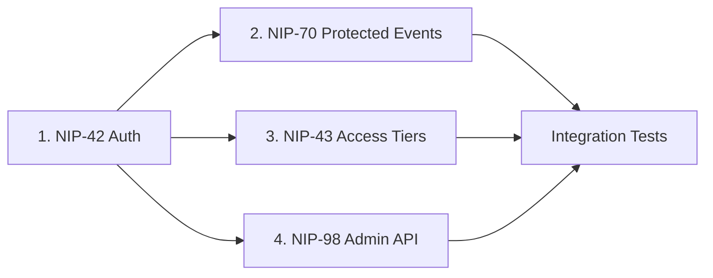
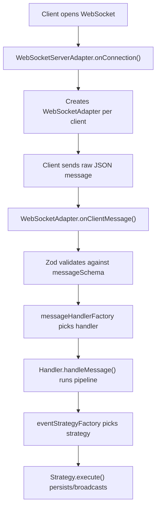

Here's a detailed breakdown of how to approach the **Enterprise Provisioning & Access Engine** task within the nostream codebase, organized by each NIP deliverable.

---

## Current Codebase Architecture

The relay is a clustered Node.js/TypeScript app with:

- **`WebSocketAdapter`** — one per client connection, tracks subscriptions but has **no authentication state** today [0-cite-0](#0-cite-0) 

- **`WebSocketServerAdapter`** — manages all WS connections, handles connection-level rate limiting [0-cite-1](#0-cite-1) 

- **`EventMessageHandler`** — the ingestion pipeline where events are validated, rate-limited, admission-checked, and dispatched to strategies [0-cite-2](#0-cite-2) 

- **`messageHandlerFactory`** — routes incoming messages (`EVENT`, `REQ`, `CLOSE`, `COUNT`) to handlers [0-cite-3](#0-cite-3) 

- **`messageSchema`** — Zod union of the four known message types [0-cite-4](#0-cite-4) 

- **Express HTTP layer** — serves NIP-11 info, invoices, admissions, callbacks [0-cite-5](#0-cite-5) 

- **Settings** — hot-reloaded from `settings.yaml` via `SettingsStatic.createSettings()` [0-cite-6](#0-cite-6) 

Currently supported NIPs do **not** include NIP-42, NIP-43, NIP-70, or NIP-98: [0-cite-7](#0-cite-7) 

---

## 1. NIP-42: Session-State Tracking for Authenticated WebSockets

**What NIP-42 requires:** The relay sends an `AUTH` challenge on connection. The client responds with a signed `AUTH` event (kind 22242). Once verified, the relay associates the client's pubkey with that WebSocket session.

### Where to make changes:

**a) Add `authenticatedPubkey` to `WebSocketAdapter`**

The adapter currently tracks `clientId`, `clientAddress`, `alive`, and `subscriptions`. You need to add:
- A `challenge: string` field (random nonce generated on connection)
- An `authenticatedPubkey: string | null` field
- A getter `getAuthenticatedPubkey()` exposed on the `IWebSocketAdapter` interface [0-cite-8](#0-cite-8) 

Update the `IWebSocketAdapter` type to include the new getter: [0-cite-9](#0-cite-9) 

**b) Send the `AUTH` challenge on connection**

In the `WebSocketAdapter` constructor, after setup, send an `["AUTH", challenge]` message to the client.

**c) Add `AUTH` message type**

- Add `AUTH = 'AUTH'` to the `MessageType` enum [0-cite-10](#0-cite-10) 

- Create an `authMessageSchema` in `message-schema.ts` and add it to the union [0-cite-11](#0-cite-11) 

**d) Create `AuthMessageHandler`**

A new handler that:
1. Validates the kind 22242 event signature
2. Checks the challenge matches
3. Checks the relay URL tag
4. Sets `authenticatedPubkey` on the adapter

Wire it into `messageHandlerFactory`: [0-cite-12](#0-cite-12) 

---

## 2. NIP-70: Protected Events Enforcement

**What NIP-70 requires:** Events with a `["-"]` tag are "protected" — the relay must only accept them if the publishing WebSocket is authenticated (via NIP-42) as the event's author.

### Where to make changes:

**In `EventMessageHandler.handleMessage()`**, add a check **after** `isEventValid()` and **before** `canAcceptEvent()`:

```typescript
// NIP-70: Protected events
if (event.tags.some(tag => tag.length === 1 && tag[0] === '-')) {
  const authedPubkey = this.webSocket.getAuthenticatedPubkey()
  if (!authedPubkey || authedPubkey !== event.pubkey) {
    // reject with auth-required
    this.webSocket.emit(WebSocketAdapterEvent.Message,
      createCommandResult(event.id, false, 'auth-required: this event is protected'))
    return
  }
}
```

This fits naturally into the existing validation pipeline: [0-cite-13](#0-cite-13) 

You should also consider NIP-70 on the **read side** — in `SubscribeMessageHandler`, filter out protected events from query results if the subscriber isn't authenticated as the event author.

---

## 3. NIP-43: Access Tier Provisioning State Machine

**What NIP-43 requires:** The relay exposes metadata about access tiers and handles kind 843 access requests. This involves:

### a) Metadata endpoints

Add new Express routes (e.g., `GET /api/v1/access-tiers`) that return the relay's available access tiers (free, paid, premium, etc.) as JSON. Mount them in the router: [0-cite-14](#0-cite-14) 

### b) Settings schema extension

Add a `nip43` section to the `Settings` interface defining access tiers: [0-cite-15](#0-cite-15) 

And corresponding YAML defaults: [0-cite-16](#0-cite-16) 

### c) Kind 843 event strategy

- Add `ACCESS_REQUEST = 843` to `EventKinds` [0-cite-17](#0-cite-17) 

- Create an `AccessRequestEventStrategy` in `src/handlers/event-strategies/` that implements a state machine:
  - **PENDING** → validates the request, checks payment/eligibility
  - **APPROVED** → updates the user's access tier in the database
  - **DENIED** → sends rejection reason


- Register it in `eventStrategyFactory`: [0-cite-18](#0-cite-18) 

### d) Database changes

Extend the user model/repository to store access tier and expiration. The existing `UserRepository` already handles admission: [0-cite-19](#0-cite-19) 

You'd add a migration under `src/database/` and update the repository layer.


---

## 4. NIP-98: Cryptographic HTTP Admin API with Hot-Reload

**What NIP-98 requires:** HTTP requests are authenticated by including a signed Nostr event (kind 27235) in the `Authorization` header. The relay verifies the event's signature, method, URL, and timestamp.

### a) Create NIP-98 middleware

Create `src/handlers/request-handlers/nip98-auth-middleware.ts`:

```typescript
// Pseudocode
export const nip98AuthMiddleware = (req, res, next) => {
  const authHeader = req.headers.authorization // "Nostr <base64-encoded-event>"
  // 1. Decode and parse the kind 27235 event
  // 2. Verify signature (using existing isEventSignatureValid)
  // 3. Check created_at is within ±60 seconds
  // 4. Check 'u' tag matches request URL
  // 5. Check 'method' tag matches HTTP method
  // 6. Verify pubkey is in the admin pubkey list from settings
  // 7. Call next() or return 401
}
```

The existing `isEventSignatureValid` and `isEventIdValid` utilities can be reused: [0-cite-20](#0-cite-20) 

### b) Create admin API routes

Create `src/routes/admin.ts` with endpoints like:

| Endpoint | Purpose |
|---|---|
| `GET /api/admin/settings` | Read current settings |
| `PUT /api/admin/settings` | Update settings (hot-reload) |
| `GET /api/admin/access-tiers` | List access tiers |
| `PUT /api/admin/access-tiers/:id` | Modify a tier |
| `GET /api/admin/sessions` | List active WebSocket sessions |
| `DELETE /api/admin/sessions/:id` | Disconnect a session |

Mount with the NIP-98 middleware:
```typescript
router.use('/api/admin', nip98AuthMiddleware, adminRouter)
``` [0-cite-14](#0-cite-14) 

### c) Hot-reload mechanism

The settings system already supports hot-reload — `createSettings()` reads fresh settings on every call: [0-cite-6](#0-cite-6) 

For the admin API, the `PUT /api/admin/settings` endpoint would:
1. Validate the incoming JSON
2. Write to `settings.yaml` (or an in-memory overlay)
3. The existing `createSettings()` pattern means all workers pick up changes immediately without dropping connections

---

## Suggested Implementation Order



1. **NIP-42 first** — it's the foundation. NIP-70 and NIP-43 both depend on knowing who the authenticated user is.
2. **NIP-70 second** — it's a small addition once NIP-42 session state exists (a single check in the event pipeline).
3. **NIP-43 third** — requires database schema changes and a new event strategy, but builds on the auth layer.
4. **NIP-98 last** — it's independent of WebSocket auth and can be developed in parallel, but logically it's the management layer on top of everything else.

## Key Files to Touch

| Area | Files |
|---|---|
| Session state | `src/adapters/web-socket-adapter.ts`, `src/@types/adapters.ts` |
| Message handling | `src/@types/messages.ts`, `src/schemas/message-schema.ts`, `src/factories/message-handler-factory.ts` |
| NIP-42 handler | New: `src/handlers/auth-message-handler.ts` |
| NIP-70 check | `src/handlers/event-message-handler.ts` |
| NIP-43 strategy | New: `src/handlers/event-strategies/access-request-event-strategy.ts` |
| NIP-43 settings | `src/@types/settings.ts`, `resources/default-settings.yaml` |
| Event kinds | `src/constants/base.ts` |
| NIP-98 middleware | New: `src/handlers/request-handlers/nip98-auth-middleware.ts` |
| Admin routes | New: `src/routes/admin.ts` |
| Router | `src/routes/index.ts` |
| Tests | New directories under `test/integration/features/nip-42/`, `nip-70/`, `nip-43/`, `nip-98/` |


The existing test infrastructure uses Cucumber/Gherkin feature files with step definitions — follow the same pattern as `nip-17` or `nip-62` for consistency.


-----


## How the Data Flows Today

To understand why each NIP slots in where it does, you first need to understand the request lifecycle in nostream:



Every WebSocket message goes through this exact pipeline. The key insight is that **the `WebSocketAdapter` instance lives for the entire duration of a client's connection** — it's created once in `onConnection()` and destroyed in `onClientClose()`. This is what makes session-state tracking possible. [1-cite-0](#1-cite-0) [1-cite-1](#1-cite-1) 

---

## NIP-42: Why the WebSocketAdapter Is the Right Place for Auth State

The `WebSocketAdapter` already holds per-connection state: `clientId`, `clientAddress`, `alive`, and `subscriptions`. These persist across all messages on that socket. [1-cite-2](#1-cite-2) 

Adding `challenge` and `authenticatedPubkey` fields here works because:

1. **Lifetime matches the session.** The adapter is created when the client connects and destroyed when they disconnect. Auth state naturally has the same lifetime — you authenticate once, and it holds until the socket closes. There's no need for an external session store.

2. **Every handler already receives `this.webSocket`.** Look at how `EventMessageHandler` is constructed — it gets the adapter as its first argument: [1-cite-3](#1-cite-3) 

This means every handler can call `this.webSocket.getAuthenticatedPubkey()` without any plumbing changes. The adapter is already the shared context object for the connection.

3. **The challenge-response flow fits the existing message dispatch.** When a raw message arrives, it goes through `onClientMessage()`: [1-cite-4](#1-cite-4) 

Line 154 validates the message against `messageSchema` (a Zod union). Line 160 passes it to `messageHandlerFactory`. Adding `AUTH` as a new message type means:
- Add `AUTH` to the `MessageType` enum
- Add an `authMessageSchema` to the Zod union so it passes validation
- Add a `case MessageType.AUTH` in the factory switch

The existing architecture already expects new message types to be added this way — it's a union of schemas and a switch/case factory. No structural changes needed. [1-cite-5](#1-cite-5) [1-cite-6](#1-cite-6) 

---

## NIP-70: Why It's a Single Check in the Event Pipeline

The `handleMessage()` method in `EventMessageHandler` is a **sequential validation pipeline** — a chain of guard clauses that each return early if the event should be rejected:

```
isEventValid() → isExpiredEvent() → isRateLimited() → canAcceptEvent()
→ isBlockedByRequestToVanish() → isUserAdmitted() → checkNip05Verification()
→ strategyFactory → strategy.execute()
```

NIP-70 says: if an event has a `["-"]` tag, only accept it if the socket is authenticated as the event's author. This is purely a **validation concern** — it doesn't change how the event is stored or broadcast. It just adds one more guard clause to the chain.

Why it works as a simple insertion:

- The check is **stateless with respect to the database** — it only needs the event's tags (already parsed) and the socket's auth state (from the adapter). No async calls needed.
- It fits the existing pattern: return a reason string to reject, or `undefined` to continue.
- It should go **early** in the pipeline (after `isEventValid()`, before the heavier checks like `isUserAdmitted()` which hit the database/cache) because it's a cheap O(n) tag scan plus one field comparison.

The handler already has access to `this.webSocket`, so reading `this.webSocket.getAuthenticatedPubkey()` requires zero new dependencies.

On the **read side**, `SubscribeMessageHandler.fetchAndSend()` streams events through a pipeline of filters: [1-cite-8](#1-cite-8) 

You'd add another `streamFilter` step that drops events with a `["-"]` tag unless the subscriber is authenticated as the author. The handler already has `this.webSocket`, so it can check auth state.

---

## NIP-43: Why the Event Strategy Pattern Works for Access Requests

The relay already uses a **strategy pattern** to handle different event kinds differently: [1-cite-9](#1-cite-9) 

Each strategy implements `IEventStrategy<Event, Promise<void>>` with an `execute(event)` method. The factory is a chain of `if/else if` checks based on event kind. This is how the relay already handles vanish requests (kind 62), gift wraps (kind 1059), deletions (kind 5), etc.

Adding kind 843 (access request) follows the identical pattern:

1. Add `isAccessRequestEvent()` to `src/utils/event.ts` (one-liner: `event.kind === 843`)
2. Create `AccessRequestEventStrategy` implementing `execute(event)`
3. Add an `else if (isAccessRequestEvent(event))` branch in the factory

Why this works as a state machine:

- The strategy's `execute()` method receives the full event and the adapter. It can:
  - Read the request details from the event's tags/content
  - Query the database for the user's current tier
  - Check payment status via the existing `userRepository`
  - Transition the user's state (PENDING → APPROVED/DENIED)
  - Emit a response event back through the adapter

- The existing `isUserAdmitted()` check in the event pipeline already queries user admission status and caches it in Redis: [1-cite-10](#1-cite-10) 

The access tier system extends this — instead of a binary admitted/not-admitted check, you'd store a tier level on the user and check it against the event kind's required tier. The caching pattern (lines 343-358) already shows how to avoid hitting the database on every event.

---

## NIP-98: Why Express Middleware + Settings Hot-Reload Works

The HTTP layer is standard Express with a router: [1-cite-11](#1-cite-11) 

NIP-98 authentication is a middleware concern — it intercepts the request before it reaches the route handler, verifies the signed event in the `Authorization` header, and either calls `next()` or returns 401. This is exactly what Express middleware is designed for.

The verification reuses existing crypto utilities: [1-cite-12](#1-cite-12) 

`isEventIdValid()` and `isEventSignatureValid()` already do the Schnorr signature verification that NIP-98 requires. The middleware just needs to additionally check:
- `kind === 27235`
- `created_at` is within ±60 seconds of now
- The `u` tag matches the request URL
- The `method` tag matches the HTTP method
- The pubkey is in an admin whitelist from settings

For **hot-reload without dropping connections**, look at how settings work: [1-cite-13](#1-cite-13) 

`createSettings()` caches settings in `_settings` (line 69). The `watchSettings()` method uses `fs.watch` to detect file changes and sets `_settings = undefined`, forcing a re-read on the next call: [1-cite-14](#1-cite-14) 

This is why hot-reload works without dropping connections: **settings are read lazily on every request/event, not eagerly at startup.** Every handler calls `this.settings()` which calls `createSettings()` which returns the cached value or re-reads from disk. When the admin API writes new settings to the YAML file, `fs.watch` fires, clears the cache, and the next request picks up the new config. WebSocket connections are completely unaffected because they don't hold a reference to the settings object — they call the factory function each time.

The admin API endpoint would:
1. Validate the incoming config
2. Call `SettingsStatic.saveSettings()` to write to disk
3. The existing `fs.watch` triggers the reload automatically [1-cite-15](#1-cite-15) 

---

## Summary: Why It All Fits Together

| NIP | Integration point | Why it works |
|---|---|---|
| **NIP-42** | `WebSocketAdapter` + new `AUTH` message type | The adapter already holds per-connection state and is passed to every handler. Adding auth fields is a natural extension. |
| **NIP-70** | Guard clause in `EventMessageHandler.handleMessage()` | The pipeline is already a chain of validation checks. NIP-70 is just one more check that reads adapter state. |
| **NIP-43** | New event strategy in `eventStrategyFactory` | The strategy pattern already dispatches by event kind. Kind 843 is just another branch. |
| **NIP-98** | Express middleware on admin routes | Standard middleware pattern. Crypto verification reuses existing utilities. Settings hot-reload already works via `fs.watch`. |

The architecture works because nostream was designed with these extension points: the message schema union, the handler factory switch, the strategy factory chain, and the Express middleware stack. Each NIP plugs into one of these existing seams without requiring structural refactoring.
