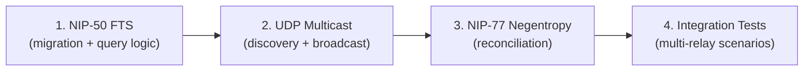
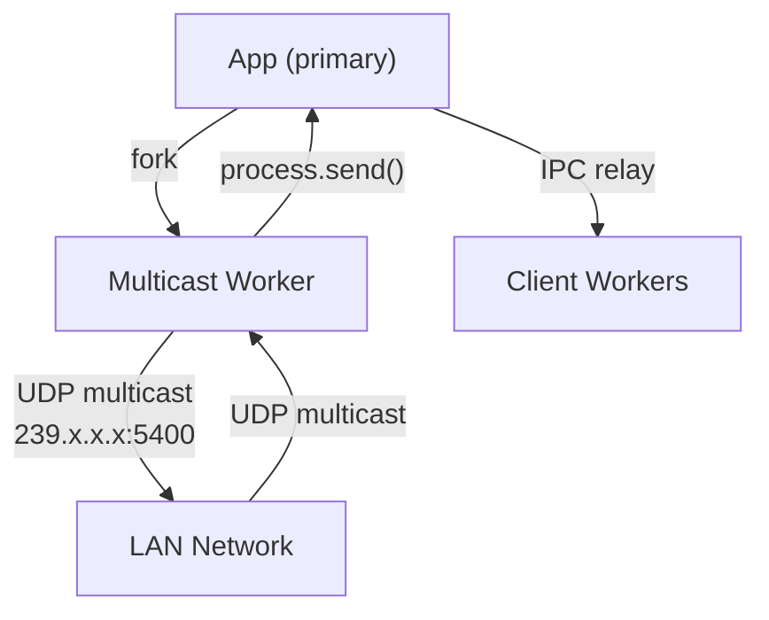
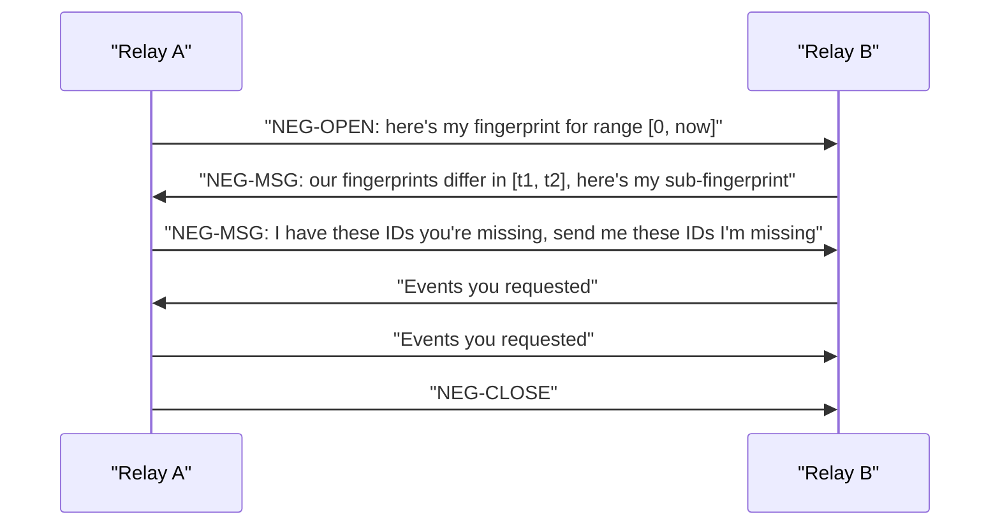
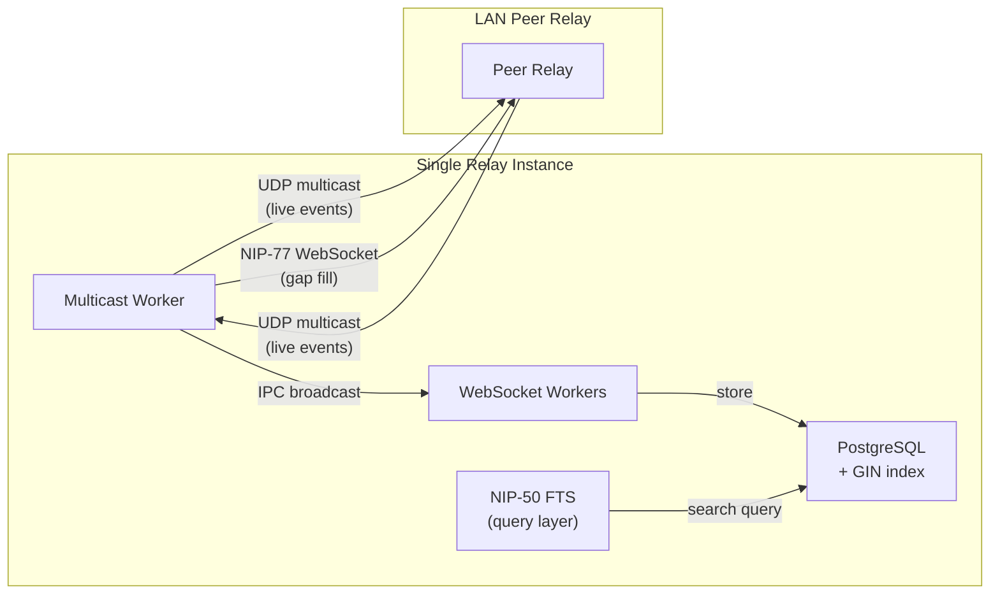

Here's a detailed breakdown of how to approach each component of this task, grounded in the current nostream codebase.

---

## 1. NIP-50: Full-Text Search with PostgreSQL Indexes

### Current State

The `events` table stores content in a plain `text` column (`event_content`) with no full-text search capability. [0-cite-0](#0-cite-0) 

The `SubscriptionFilter` type has no `search` field: [0-cite-1](#0-cite-1) 

Query building in `EventRepository.findByFilters()` handles `ids`, `authors`, `kinds`, `since`, `until`, and generic tag queries — but nothing for full-text search: [0-cite-2](#0-cite-2) 

### What Needs to Change

**a) Database migration** — Create a new migration file (following the naming convention in `migrations/`, e.g. `20260422_000000_add_nip50_fts_index.js`). It should:
- Add a generated `tsvector` column (e.g. `event_content_tsv`) to the `events` table, or use an expression index.
- Create a GIN index on it: `CREATE INDEX CONCURRENTLY IF NOT EXISTS events_content_fts_idx ON events USING GIN (to_tsvector('simple', event_content))`.
- Use `exports.config = { transaction: false }` like the hot-path index migration does, so `CONCURRENTLY` works. [0-cite-3](#0-cite-3) 

**b) Extend `SubscriptionFilter`** — Add an optional `search?: string` field to `src/@types/subscription.ts`.

**c) Extend `EventRepository.applyFilterConditions()`** — When `currentFilter.search` is present, add a `WHERE to_tsvector('simple', event_content) @@ plainto_tsquery('simple', ?)` clause via `builder.whereRaw(...)`. [0-cite-4](#0-cite-4) 

**d) Extend `isEventMatchingFilter()`** in `src/utils/event.ts` — Add a client-side check so that the in-memory broadcast filter also respects the `search` field (simple substring or regex match for live events). [0-cite-5](#0-cite-5) 

**e) Update the message schema** — The Zod schema in `src/schemas/message-schema.ts` needs to accept the `search` key in REQ filter objects.

**f) Update `countByFilters()`** — Same FTS predicate needs to be applied there. [0-cite-6](#0-cite-6) 

**g) Add NIP-50 to `supportedNips`** in `package.json`. [0-cite-7](#0-cite-7) 

---

## 2. UDP Multicast Transport Layer

### Current State

There is **no UDP or multicast code** in the codebase. The closest analog is the `StaticMirroringWorker`, which connects to remote relays over WebSocket and relays events via IPC (`process.send`): [0-cite-8](#0-cite-8) 

The primary `App` process broadcasts IPC messages to all workers: [0-cite-9](#0-cite-9) 

There's even a commented-out NIP-27 multicast stub in `src/utils/event.ts`: [0-cite-10](#0-cite-10) 

### What Needs to Be Built

**a) New worker type: `MulticastWorker`** — Following the pattern of `StaticMirroringWorker`, create `src/app/multicast-worker.ts`. It should:
- Use Node.js `dgram.createSocket('udp4')` with `socket.addMembership(MULTICAST_GROUP)` to join a multicast group (e.g. `239.x.x.x`).
- Listen for incoming UDP datagrams containing serialized Nostr events.
- Broadcast locally-created events to the multicast group.

**b) Fork it from `App.run()`** — Add a new `WORKER_TYPE: 'multicast'` case in the worker factory: [0-cite-11](#0-cite-11) [0-cite-12](#0-cite-12) 

**c) Loop prevention** — Each relay instance needs a unique identifier (e.g. derived from `info.relay_url` or a random UUID). Include the origin relay ID in each multicast packet. On receive, discard packets from self. Also maintain a short-lived seen-event-id set (e.g. in Redis or an in-memory LRU) to deduplicate.

**d) Event validation** — Reuse the same validation logic from `StaticMirroringWorker` (`isEventIdValid`, `isEventSignatureValid`, `canAcceptEvent`): [0-cite-13](#0-cite-13) 

**e) Configuration** — Add a `multicast` section to `Settings` in `src/@types/settings.ts`:
```typescript
export interface MulticastSettings {
  enabled?: boolean
  group?: string    // e.g. '239.0.0.1'
  port?: number     // e.g. 5400
  ttl?: number      // multicast TTL, default 1 (LAN only)
}
``` [0-cite-14](#0-cite-14) 

**f) IPC integration** — When the multicast worker receives a valid event, it should `process.send()` a broadcast message so client workers push it to connected WebSocket clients, exactly like `StaticMirroringWorker` does: [0-cite-15](#0-cite-15) 

---

## 3. NIP-77 (Negentropy) State Reconciliation

### Current State

There is **no negentropy code** in the codebase. The relay currently has no set-reconciliation protocol.

### What Needs to Be Built

**a) Add negentropy dependency** — Use the `negentropy` npm package (JavaScript/WASM bindings for the Negentropy protocol). Add it to `dependencies` in `package.json`. [0-cite-16](#0-cite-16) 

**b) New message handler** — NIP-77 defines `NEG-OPEN`, `NEG-MSG`, `NEG-CLOSE` message types. You need to:
- Extend `MessageType` in `src/@types/messages.ts` with these new types.
- Update the message schema in `src/schemas/message-schema.ts` to validate them.
- Add new handlers (e.g. `NegotiationMessageHandler`) in the `messageHandlerFactory`: [0-cite-17](#0-cite-17) 

**c) Negentropy reconciliation logic** — The handler should:
- On `NEG-OPEN`: Initialize a Negentropy instance, load the local event ID set for the given filter from `EventRepository`, and produce the first reconciliation message.
- On `NEG-MSG`: Feed the client's message into the Negentropy instance, produce the next round's response.
- On `NEG-CLOSE`: Clean up state.
- The local set is built by querying `findByFilters()` with the subscription filter and extracting `event_id` + `created_at` pairs.

**d) Peer sync via multicast discovery** — When the multicast worker discovers a new peer relay on the LAN, it should initiate a NIP-77 reconciliation session over WebSocket to that peer. This connects components 2 and 3:
- Multicast announces relay presence (address + supported NIPs).
- On discovering a new peer, open a WebSocket connection and run the Negentropy protocol as a client.
- Missing events identified by Negentropy are fetched via standard `REQ` and stored via `EventRepository.create()` / `createMany()`. [0-cite-18](#0-cite-18) 

---

## 4. Integration Tests

### Current State

Integration tests use Cucumber.js and live in `test/integration/features/`, with a Docker Compose setup:


Unit tests use Mocha + Chai + Sinon: [0-cite-19](#0-cite-19) 

### What to Write

**a) NIP-50 tests:**
- Unit tests for the new `applyFilterConditions` FTS branch (mock Knex builder, verify `whereRaw` is called with the tsquery).
- Integration test: insert events with known content, send a `REQ` with `search`, verify matching events are returned.

**b) Multicast tests:**
- Unit tests for packet serialization/deserialization, loop prevention (self-origin discard, duplicate event ID discard).
- Integration test: spin up 2+ relay instances in Docker Compose on the same network, have relay A publish an event, verify relay B receives it via multicast within a timeout.

**c) Negentropy tests:**
- Unit tests for the `NEG-OPEN`/`NEG-MSG`/`NEG-CLOSE` handler logic with mocked Negentropy bindings.
- Integration test: spin up 2 relays, insert different events into each, trigger a Negentropy sync, verify both relays converge to the same event set.

**d) Combined test:**
- Spin up 3+ relays on a shared Docker network. Insert unique events into each. Wait for multicast discovery + Negentropy reconciliation. Assert all relays have all events.

---

## Suggested Implementation Order



1. **NIP-50 first** — it's self-contained (DB migration + query changes), doesn't depend on the other two, and gives you familiarity with the migration system and `EventRepository`.
2. **UDP Multicast second** — builds the peer discovery layer needed by Negentropy, and follows the existing `StaticMirroringWorker` pattern closely.
3. **Negentropy third** — depends on having peers to sync with (from step 2) and a working event store (from step 1 for search, but mainly the existing `findByFilters`).
4. **Integration tests throughout** — write tests for each component as you build it, then add the combined multi-relay scenario at the end.

---

Here's how nostream currently works end-to-end, and why each proposed component (NIP-50, UDP multicast, Negentropy) plugs into it naturally.

---

## How nostream works today

The entire system is built on a **primary process + forked worker** architecture. The primary `App` process forks multiple child processes, each with a role:

```mermaid
graph TD
    A["App (primary process)"] -->|"fork"| W1["Worker 0\n(WebSocket server)"]
    A -->|"fork"| W2["Worker 1\n(WebSocket server)"]
    A -->|"fork"| M["Maintenance Worker"]
    A -->|"fork"| SM["Static Mirroring Worker"]
    W1 <-->|"IPC messages"| A
    W2 <-->|"IPC messages"| A
    SM <-->|"IPC messages"| A
``` [1-cite-0](#1-cite-0) 

### The event lifecycle (inbound)

When a client sends `["EVENT", {...}]` over WebSocket:

1. **`WebSocketAdapter.onClientMessage()`** parses and validates the raw JSON against the Zod schema, then dispatches to the appropriate handler. [1-cite-1](#1-cite-1) 

2. **`EventMessageHandler.handleMessage()`** runs a gauntlet of checks: signature validity, expiration, rate limiting, content limits, pubkey whitelist/blacklist, admission (payment), NIP-05 verification. If all pass, it picks a **strategy**. [1-cite-2](#1-cite-2) 

3. **`eventStrategyFactory`** selects the right strategy based on event kind — `DefaultEventStrategy`, `ReplaceableEventStrategy`, `EphemeralEventStrategy`, etc. [1-cite-3](#1-cite-3) 

4. **The strategy** (e.g. `DefaultEventStrategy`) does two things: **stores** the event in PostgreSQL via `eventRepository.create()`, then **broadcasts** it to all connected clients in the same worker process: [1-cite-4](#1-cite-4) 

5. **`WebSocketAdapter.onBroadcast()`** sends the event to the local `WebSocketServerAdapter` AND sends an IPC message to the primary process via `process.send()`: [1-cite-5](#1-cite-5) 

6. **`App.onClusterMessage()`** in the primary process relays that IPC message to **every other worker**, so clients connected to different workers also get the event: [1-cite-6](#1-cite-6) 

7. **Each `AppWorker.onMessage()`** receives the IPC message and emits it on its adapter, which triggers `WebSocketServerAdapter.onBroadcast()`, which iterates all connected WebSocket clients and calls `onSendEvent()`: [1-cite-7](#1-cite-7) [1-cite-8](#1-cite-8) 

8. **`WebSocketAdapter.onSendEvent()`** checks each client's active subscriptions against the event using `isEventMatchingFilter()`. If a subscription matches, the event is sent to that client: [1-cite-9](#1-cite-9) 

### The query lifecycle (subscriptions)

When a client sends `["REQ", "sub-id", {filter}]`:

1. **`SubscribeMessageHandler`** registers the subscription on the adapter, then calls `eventRepository.findByFilters(filters)` to stream historical matches from PostgreSQL: [1-cite-10](#1-cite-10) 

2. **`EventRepository.findByFilters()`** builds a Knex query with `applyFilterConditions()` — handling `ids`, `authors`, `kinds`, `since`, `until`, and generic tag queries (`#e`, `#p`, etc.): [1-cite-11](#1-cite-11) [1-cite-12](#1-cite-12) 

3. After streaming historical events, an `EOSE` (End of Stored Events) message is sent. From that point, the subscription is **live** — new events matching the filter are pushed via the broadcast mechanism described above.

---

## Why each proposed component works

### 1. NIP-50 Full-Text Search — WHY it works

**The problem:** Today, there is no way to search event content. The `SubscriptionFilter` type has no `search` field, and `event_content` is a plain `text` column with no index suitable for text search. [1-cite-13](#1-cite-13) [1-cite-14](#1-cite-14) 

**How it plugs in:** The query pipeline has a single chokepoint — `applyFilterConditions()`. Every filter field is handled there. Adding `search` means adding one more `if` block:

```typescript
if (typeof currentFilter.search === 'string') {
  builder.whereRaw(
    "to_tsvector('simple', event_content) @@ plainto_tsquery('simple', ?)",
    [currentFilter.search]
  )
}
```

**Why PostgreSQL GIN indexes make this fast:** Without an index, that `to_tsvector(...) @@ plainto_tsquery(...)` would do a sequential scan of every row. A GIN (Generalized Inverted Index) pre-computes the tsvector for each row and stores a mapping from each lexeme to the set of rows containing it. A query then becomes a set intersection lookup instead of a full table scan. The existing hot-path migration already demonstrates the pattern of `CREATE INDEX CONCURRENTLY` with `exports.config = { transaction: false }`: [1-cite-15](#1-cite-15) 

**Why it also needs an in-memory check:** Live subscriptions (post-EOSE) don't re-query the database — they use `isEventMatchingFilter()` to check incoming events in memory. So you also need a simple substring/regex check there for the `search` field, otherwise live events won't match search subscriptions: [1-cite-16](#1-cite-16) 

### 2. UDP Multicast — WHY it works

**The problem:** Today, the only way to get events from another relay is `StaticMirroringWorker`, which requires you to **manually configure** the remote relay's WebSocket address. There's no automatic discovery of relays on the same LAN. [1-cite-17](#1-cite-17) 

**How it plugs in:** The worker architecture is designed for exactly this kind of extension. The primary process forks workers by `WORKER_TYPE` — adding a new `'multicast'` type follows the same pattern as `'static-mirroring'`:



**Why UDP multicast specifically:**
- **Zero configuration** — UDP multicast uses a well-known group address (e.g. `239.0.0.1`). Any relay on the same LAN subnet that joins that group automatically receives packets. No DNS, no manual IP entry.
- **One-to-many** — A single `socket.send()` reaches all relays on the LAN simultaneously, unlike TCP/WebSocket which requires a separate connection per peer.
- **TTL=1** — Setting the multicast TTL to 1 means packets never leave the local network segment, which is a natural security boundary.

**Why it reuses existing patterns:** The `StaticMirroringWorker` already shows the exact pattern for "receive event from external source → validate → store → IPC broadcast": [1-cite-18](#1-cite-18) 

The multicast worker would do the same thing, just with `dgram` instead of `WebSocket` as the transport. The validation pipeline (`isEventIdValid`, `isEventSignatureValid`, `canAcceptEvent`, `isUserAdmitted`) is already factored out and reusable.

**Loop prevention works because:**
- Each relay includes its own unique ID in every multicast packet it sends.
- On receive, if the origin ID matches self, discard immediately.
- Additionally, a short-lived seen-event-ID cache (LRU or Redis set with TTL) prevents processing the same event twice even if it arrives from multiple peers. This is the same deduplication that `eventRepository.create()` already does at the DB level (the `event_id` column has a `UNIQUE` constraint), but catching it earlier avoids unnecessary DB round-trips. [1-cite-19](#1-cite-19) 

### 3. NIP-77 (Negentropy) — WHY it works

**The problem:** Both static mirroring and UDP multicast are **live-only** — they only sync events that happen *while both relays are connected*. If relay B was offline for an hour, it misses everything relay A received during that time. There's no mechanism to figure out "what do I have that you don't, and vice versa?"

**How Negentropy solves this mathematically:** Negentropy is a set-reconciliation protocol. Each side computes a compact fingerprint (based on XOR of hashes) of their event set, partitioned by timestamp ranges. They exchange these fingerprints in rounds:



After a few rounds, both sides know exactly which event IDs the other is missing, without ever transmitting the full set. The bandwidth is O(difference) not O(total), which is critical when relays have millions of events but only differ by a few hundred.

**How it plugs into nostream:**

The relay already has a message dispatch system in `messageHandlerFactory` that routes by message type (`EVENT`, `REQ`, `CLOSE`, `COUNT`): [1-cite-20](#1-cite-20) 

Adding `NEG-OPEN`, `NEG-MSG`, `NEG-CLOSE` is just three more `case` branches, each dispatching to a new handler class. The handler would:

1. On `NEG-OPEN`: receive a filter + initial negentropy message. Query `findByFilters()` to get the local event set (just `event_id` + `created_at` pairs). Initialize a Negentropy instance with that set. Produce the first response.
2. On `NEG-MSG`: feed the client's message into the Negentropy instance, get back "IDs I need" and "IDs they need". Send the events they need via normal `EVENT` messages. Request the events I need.
3. On `NEG-CLOSE`: clean up.

**Why it connects to multicast:** When the multicast worker discovers a new peer relay on the LAN (via a "hello" announcement packet), it opens a WebSocket connection to that peer and runs the Negentropy protocol as a client. This fills in any gaps from when either relay was offline. After reconciliation, both relays have identical event sets for the agreed-upon filter, and ongoing multicast keeps them in sync going forward.

**Why `findByFilters` is sufficient for building the local set:** Negentropy needs `(created_at, event_id)` pairs for the local set. `findByFilters()` already returns full `DBEvent` rows filtered by any subscription filter, so you just extract those two fields. The existing query infrastructure handles all the filtering — kinds, authors, time ranges, tags — so Negentropy reconciliation can be scoped to any subset of events. [1-cite-11](#1-cite-11) 

---

## How the three components work together



1. **NIP-50** makes the database queryable by content — it's purely a vertical improvement to the existing query pipeline.
2. **UDP multicast** adds horizontal awareness — relays on the same LAN automatically discover each other and stream events in real-time.
3. **Negentropy** adds consistency guarantees — when a new peer appears (or reconnects after downtime), it mathematically determines exactly which events are missing and transfers only those, rather than re-syncing everything.

The reason this architecture works is that nostream already separates concerns cleanly: the worker process model handles parallelism and IPC, the event repository handles storage, the filter system handles queries, and the strategy pattern handles event processing. Each new component slots into one of these existing seams without requiring a rewrite.
