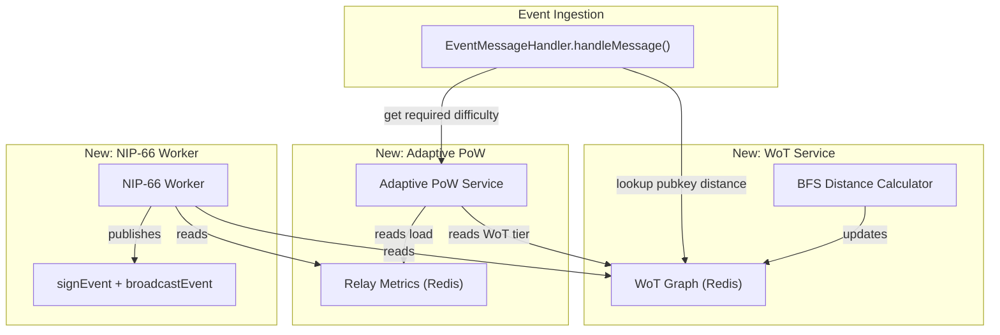
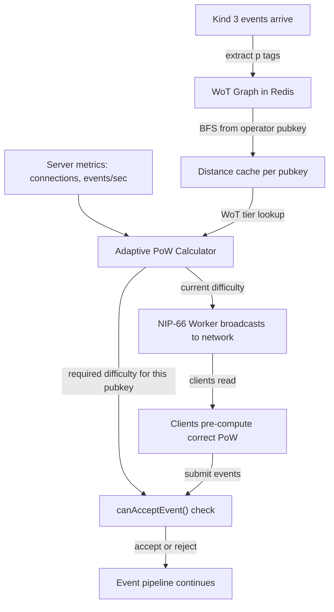

Here's a detailed breakdown of how to approach each component of this Moderation & Discovery Engine within the nostream codebase.

---

## Codebase Architecture Overview

Nostream uses a **clustered Node.js architecture** with a primary process (`App`) that forks specialized workers: client workers (`AppWorker`), a `MaintenanceWorker`, and optional `StaticMirroringWorker` instances. Events flow through `EventMessageHandler.handleMessage()`, which runs a validation pipeline (`isEventValid` → `isExpiredEvent` → `isRateLimited` → `canAcceptEvent` → `isUserAdmitted` → strategy execution). [0-cite-0](#0-cite-0) [0-cite-1](#0-cite-1) 

---

## 1. NIP-02 Web of Trust (WoT) Graph Data Structure

### What exists today

Contact list events (kind 3) are already handled as **replaceable events** via `ReplaceableEventStrategy`. They are stored in PostgreSQL but there is **no graph traversal or WoT distance computation**. [0-cite-2](#0-cite-2) [0-cite-3](#0-cite-3) [0-cite-4](#0-cite-4) 

### What to build

**a) Graph data structure (Redis-backed recommended):**

- Create a new module, e.g. `src/services/wot-service.ts`, that maintains an adjacency list representing the follow graph.
- When a kind 3 (`CONTACT_LIST`) event is persisted, extract all `p` tags (pubkeys the author follows) and update the graph. The `p` tag identifier is already defined as `EventTags.Pubkey = 'p'`. [0-cite-5](#0-cite-5) 

- Use Redis sorted sets or hash maps via the existing `ICacheAdapter` / `RedisAdapter`. The adapter already supports `setKey`, `getKey`, `addToSortedSet`, `setHKey`, `getHKey`, and `eval` (for Lua scripts). [0-cite-6](#0-cite-6) [0-cite-7](#0-cite-7) 

- **Key schema example:** `wot:follows:<pubkey>` → Redis SET of followed pubkeys. `wot:distance:<pubkey>` → cached BFS distance from the relay operator's pubkey.

**b) BFS distance computation:**

- Seed the graph from the relay operator's pubkey (configured in `settings.info.pubkey`). [0-cite-8](#0-cite-8) 

- Run BFS/Dijkstra periodically (in the maintenance worker or a new dedicated worker) to compute WoT distances (hop count from the operator). Cache results in Redis with a TTL.

**c) Hook into the event pipeline:**

- Intercept incoming events in `EventMessageHandler.canAcceptEvent()` or add a new check step in `handleMessage()` between the existing checks. Look up the event's `pubkey` WoT distance and reject/penalize unknown pubkeys. [0-cite-9](#0-cite-9) 

**d) Populate on startup:**

- Query PostgreSQL for all existing kind 3 events and build the initial graph. The `EventRepository` can be extended with a method like `findAllContactLists()`.

---

## 2. Adaptive NIP-13 Proof of Work Pipeline

### What exists today

PoW validation is **static** — `minLeadingZeroBits` is read from `settings.limits.event.eventId` and `settings.limits.event.pubkey` and compared against the event's leading zero bits using `getLeadingZeroBits()`. [0-cite-10](#0-cite-10) [0-cite-11](#0-cite-11) [0-cite-12](#0-cite-12) 

### What to build

**a) Real-time metrics collector:**

- Track server load metrics: connected clients count (available via `IWebSocketServerAdapter.getConnectedClients()`), events/second, CPU usage, memory pressure. [0-cite-13](#0-cite-13) 

- Store these metrics in Redis (e.g. `relay:metrics:events_per_second`, `relay:metrics:connections`).

**b) Dynamic difficulty calculator:**

- Create `src/services/adaptive-pow-service.ts` that computes a target difficulty based on current load. For example:
  - Low load → difficulty 0 (no PoW required)
  - Medium load → difficulty 8
  - High load → difficulty 16+
  - Scale linearly or use a step function.

**c) WoT-tier integration:**

- Combine WoT distance with PoW requirements:
  - **Distance 1 (direct follow):** bypass PoW entirely
  - **Distance 2:** reduced difficulty
  - **Distance 3+:** standard difficulty
  - **Unknown/not in graph:** maximum difficulty
- Modify `canAcceptEvent()` to call the adaptive PoW service instead of reading the static `minLeadingZeroBits` from settings.

**d) Replace static check:**

- In `EventMessageHandler.canAcceptEvent()`, replace the block at lines 179-191 with a call to the adaptive service that factors in both server load and WoT tier.

---

## 3. NIP-66 Relay Discovery Background Worker

### What exists today

There is **no NIP-66 implementation**. However, the codebase has all the primitives needed:

- **Relay private key & signing:** `getRelayPrivateKey()`, `getPublicKey()`, `signEvent()`, `identifyEvent()`, and `broadcastEvent()` are all available. The `PaymentsService.sendInvoiceUpdateNotification()` is a working example of creating, signing, and broadcasting relay-authored events. [0-cite-14](#0-cite-14) [0-cite-15](#0-cite-15) 

- **Worker pattern:** The `MaintenanceWorker` runs on a `setInterval` loop and is forked by `App` with `WORKER_TYPE: 'maintenance'`. [0-cite-16](#0-cite-16) [0-cite-17](#0-cite-17) 

### What to build

**a) New worker: `src/app/nip66-worker.ts`**

- Follow the `MaintenanceWorker` pattern: implement `IRunnable`, use `setInterval` for periodic execution.
- On each tick:
  1. Read current relay metrics from Redis (connections, events/sec, current PoW difficulty, WoT graph size).
  2. Construct a NIP-66 relay discovery event (kind 30166 — parameterized replaceable) with tags describing the relay's operating conditions.
  3. Sign it with the relay's private key using the `identifyEvent` → `signEvent` → `broadcastEvent` pipeline.

**b) Register the worker in `App.run()`:**

- Add a new `createWorker({ WORKER_TYPE: 'nip66' })` call in `src/app/app.ts`. [0-cite-18](#0-cite-18) 

**c) Register in `src/index.ts`:**

- Add a case for `WORKER_TYPE === 'nip66'` in the entry point, similar to how `maintenance` and `static-mirroring` workers are dispatched.

**d) Event structure (NIP-66):**

```typescript
const nip66Event: UnidentifiedEvent = {
  pubkey: relayPubkey,
  kind: 30166, // NIP-66 relay discovery
  created_at: Math.floor(Date.now() / 1000),
  content: '',
  tags: [
    ['d', relayUrl],
    ['rtt', 'open', currentOpenConnections.toString()],
    ['rtt', 'pow', currentPowDifficulty.toString()],
    // ... other relay condition tags per NIP-66 spec
  ],
}
```

---

## 4. Suggested File Layout

```
src/
├── services/
│   ├── wot-service.ts              # WoT graph + BFS distance
│   └── adaptive-pow-service.ts     # Dynamic PoW difficulty
├── app/
│   └── nip66-worker.ts             # NIP-66 background broadcaster
├── handlers/
│   └── event-message-handler.ts    # Modified: WoT + adaptive PoW checks
├── @types/
│   └── settings.ts                 # Extended: WoT + NIP-66 config
└── factories/
    └── worker-factory.ts           # Extended: nip66 worker creation
```

---

## 5. Configuration Extensions

Add new sections to `resources/default-settings.yaml` and `src/@types/settings.ts`: [0-cite-19](#0-cite-19) [0-cite-20](#0-cite-20) 

```yaml
wot:
  enabled: true
  seedPubkey: "replace-with-operator-pubkey"
  maxDistance: 3           # max hops to consider "trusted"
  refreshIntervalMs: 300000  # rebuild graph every 5 min

adaptivePow:
  enabled: true
  tiers:
    - wotDistance: 1
      difficulty: 0
    - wotDistance: 2
      difficulty: 4
    - wotDistance: 3
      difficulty: 8
    - wotDistance: -1       # unknown
      difficulty: 16
  loadScaling:
    lowThreshold: 100       # connections
    highThreshold: 500
    maxDifficulty: 24

nip66:
  enabled: true
  broadcastIntervalMs: 60000
```

---

## Summary of Integration Points



The key insight is that nostream's existing architecture — clustered workers, Redis caching, event signing primitives, and the `canAcceptEvent()` validation pipeline — provides solid foundations for all four components. The main work is building the WoT graph service, making the PoW check dynamic instead of static, and adding a new periodic worker for NIP-66 broadcasting.


-----


## How and Why Each Component Works

### The Core Problem: Spam on Open Relays

Nostream currently has a **linear validation pipeline** in `handleMessage()`. Every incoming event passes through a chain of checks — signature validity, expiration, rate limiting, static PoW, admission/payment, NIP-05 verification — and if any check fails, the event is rejected. [1-cite-0](#1-cite-0) 

The problem is that these checks are **binary and static**. The PoW difficulty is a fixed number from the config file: [1-cite-1](#1-cite-1) 

If you set it to 0, anyone can post freely (spam). If you set it to 16, legitimate users are burdened with expensive hash computation even when the relay is idle. There's no middle ground, and no way to distinguish a trusted community member from a random stranger.

---

### 1. Why Web of Trust (WoT) Works

**The insight:** In Nostr, kind 3 (`CONTACT_LIST`) events are public follow lists. If Alice follows Bob, and Bob follows Carol, that's a social graph. The relay operator is the "root of trust" — people they follow (distance 1) are highly trusted, people those people follow (distance 2) are somewhat trusted, and so on. [1-cite-2](#1-cite-2) 

**How it works mechanically:**

1. Kind 3 events are already stored by nostream as **replaceable events** — when a user publishes a new contact list, it replaces the old one. This is handled by `ReplaceableEventStrategy`. [1-cite-3](#1-cite-3) 

2. Each kind 3 event contains `p` tags listing the pubkeys the author follows. The `p` tag is already defined as `EventTags.Pubkey`. [1-cite-4](#1-cite-4) 

3. You build an **adjacency list** from these: `pubkeyA -> [pubkeyB, pubkeyC, ...]`. Then you run **BFS (breadth-first search)** starting from the relay operator's pubkey (configured in `settings.info.pubkey`). [1-cite-5](#1-cite-5) 

4. BFS naturally computes the shortest path (hop count) from the operator to every reachable pubkey. This is the "WoT distance."

**Why BFS specifically?** BFS explores all nodes at distance N before moving to distance N+1. This guarantees you find the *shortest* path, which is what you want — if someone is reachable via 2 hops through one path and 5 hops through another, you want to classify them as distance 2.

**Why Redis?** The existing `RedisAdapter` already supports hash maps (`setHKey`/`getHKey`), sorted sets, and even Lua scripting via `eval()`. You'd store the follow graph as Redis sets (e.g., `wot:follows:abc123` → set of followed pubkeys) and cache computed distances (e.g., `wot:distance:abc123` → `"2"`). Redis is ideal because it's shared across all worker processes — nostream uses Node.js clustering where multiple workers are forked, and they all need to see the same WoT data. [1-cite-6](#1-cite-6) [1-cite-7](#1-cite-7) 

**Why it stops spam:** Spammers are, by definition, not part of the social graph of real users. They won't be followed by anyone the operator trusts. So they'll have WoT distance = infinity (unreachable), and you can treat them differently — require more PoW, rate-limit them harder, or reject them outright.

---

### 2. Why Adaptive Proof of Work Works

**The current system** checks PoW like this: [1-cite-8](#1-cite-8) 

It calls `getEventProofOfWork(event.id)`, which calls `getLeadingZeroBits()`: [1-cite-9](#1-cite-9) 

This function counts how many leading zero bits the event ID hash has. Each additional zero bit doubles the expected computation time (it's exponential). So difficulty 8 means ~256 hash attempts on average, difficulty 16 means ~65,536, difficulty 24 means ~16 million.

**Why make it adaptive?** Consider two scenarios:
- **Relay is idle (10 connections):** Requiring PoW is pointless overhead. Let everyone post freely.
- **Relay is under load (500 connections, possible spam attack):** Now you *need* PoW to make spam expensive.

The connected client count is already available via `IWebSocketServerAdapter.getConnectedClients()`. [1-cite-10](#1-cite-10) 

An adaptive system reads current metrics (connections, events/second) and computes a difficulty target. The formula could be as simple as:

```
difficulty = floor((currentConnections / maxConnections) * maxDifficulty)
```

**Why it works against spam:** PoW is an **economic defense**. Each event costs the sender real CPU time. A legitimate user posting 5 notes/day barely notices difficulty 16. A spammer trying to post 10,000 notes/day would need to burn massive CPU. Making it adaptive means you only impose this cost when the relay actually needs protection.

---

### 3. Why Combining WoT + PoW Works (Tiered Defense)

This is where the two systems multiply each other's effectiveness. Instead of one flat difficulty for everyone, you create tiers:

| WoT Distance | Relay Idle | Relay Under Load |
|---|---|---|
| 1 (direct follow) | 0 (no PoW) | 0 (still bypassed) |
| 2 (friend-of-friend) | 0 | 4 (trivial) |
| 3+ (distant) | 0 | 12 (moderate) |
| Unknown (not in graph) | 8 (light) | 24 (very expensive) |

**Why this is powerful:** It creates an asymmetry. Trusted users experience the relay as fast and frictionless. Spammers face an exponentially expensive barrier that scales up precisely when they're most likely attacking. The relay operator's community is protected without being inconvenienced.

The integration point is `canAcceptEvent()` — currently lines 179-191 do a flat comparison. You'd replace that with a call that:
1. Looks up the event's `pubkey` WoT distance from Redis
2. Reads current server load metrics from Redis
3. Computes the required difficulty for that specific user at that specific moment
4. Compares it against the event's actual PoW [1-cite-11](#1-cite-11) 

The relay's own events are already exempted from checks (line 136), so relay-authored NIP-66 events would pass through freely.

---

### 4. Why NIP-66 Broadcasting Closes the Loop

Without NIP-66, clients have no way to know what PoW difficulty a relay currently requires. A client might compute difficulty 8, submit the event, get rejected because the relay just raised it to 16, and have to redo the work. This is wasteful.

**How it works:** You create a background worker (following the `MaintenanceWorker` pattern) that periodically:
1. Reads the current adaptive difficulty and relay metrics from Redis
2. Constructs a NIP-66 event (kind 30166, a parameterized replaceable event)
3. Signs it with the relay's private key and broadcasts it

The signing/broadcasting pipeline already exists and is proven — `PaymentsService.sendInvoiceUpdateNotification()` does exactly this pattern: [1-cite-12](#1-cite-12) 

It uses `identifyEvent` → `signEvent(relayPrivkey)` → `persistEvent` → `broadcastEvent`, chained with `pipe`. The relay's private key is derived from the relay URL via `getRelayPrivateKey()`. [1-cite-13](#1-cite-13) 

The `MaintenanceWorker` shows the worker pattern — it implements `IRunnable`, uses `setInterval` for periodic execution, and is forked by the primary process with a `WORKER_TYPE` environment variable: [1-cite-14](#1-cite-14) [1-cite-15](#1-cite-15) 

**Why it matters:** NIP-66 turns the relay from a black box into a transparent participant in the network. Clients can:
- Pre-compute the right PoW difficulty before submitting
- Route events to relays that are currently less loaded
- Discover relays that match their trust profile

---

### Putting It All Together

Here's the causal chain that makes this a coherent anti-spam system:



The reason this works as a *system* rather than just individual features:

1. **WoT alone** can't handle the case where a legitimate-but-unknown user wants to post. You'd have to either block them entirely or let them in with no protection. PoW gives them a path in.
2. **PoW alone** can't distinguish friends from strangers. Everyone pays the same cost. WoT lets you waive the cost for trusted users.
3. **Neither works well without NIP-66**, because clients would be guessing at the required difficulty, leading to wasted computation or rejected events.

The three components form a feedback loop: the WoT graph informs the PoW requirements, the PoW requirements respond to server load, and NIP-66 communicates those requirements back to clients so they can comply efficiently.
