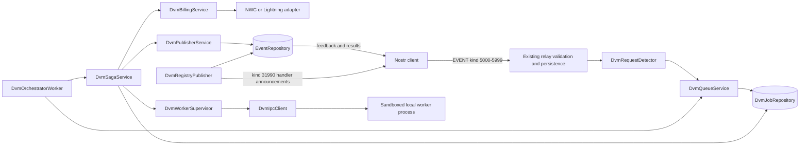
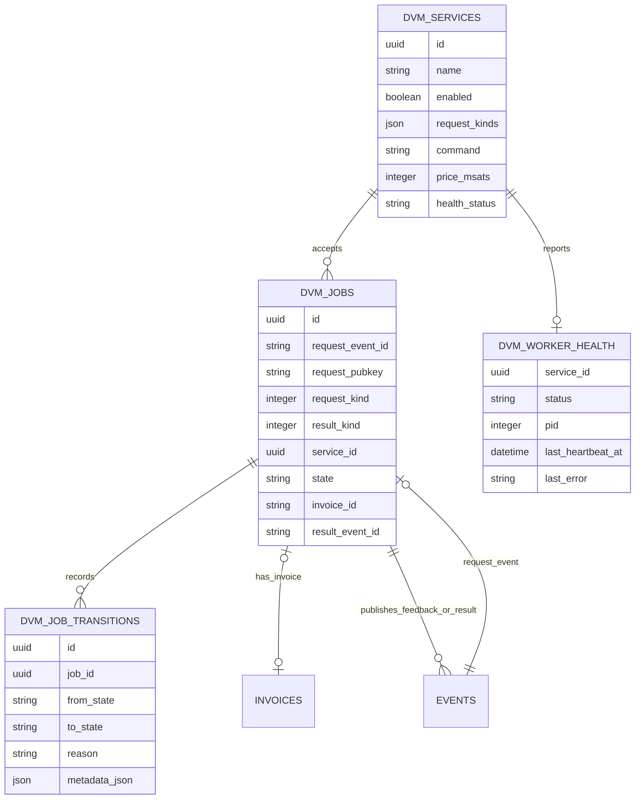
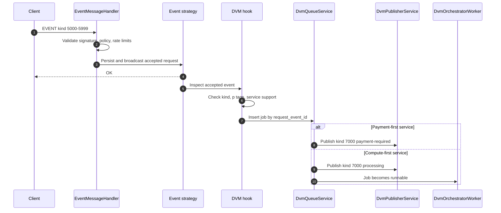
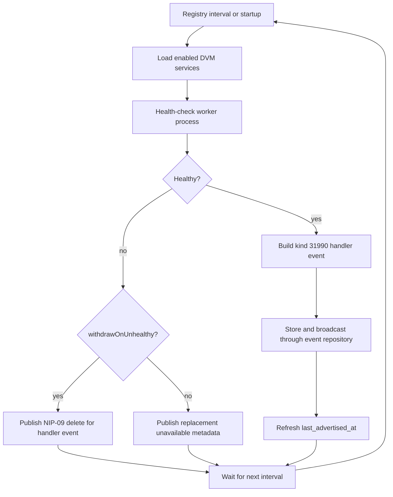
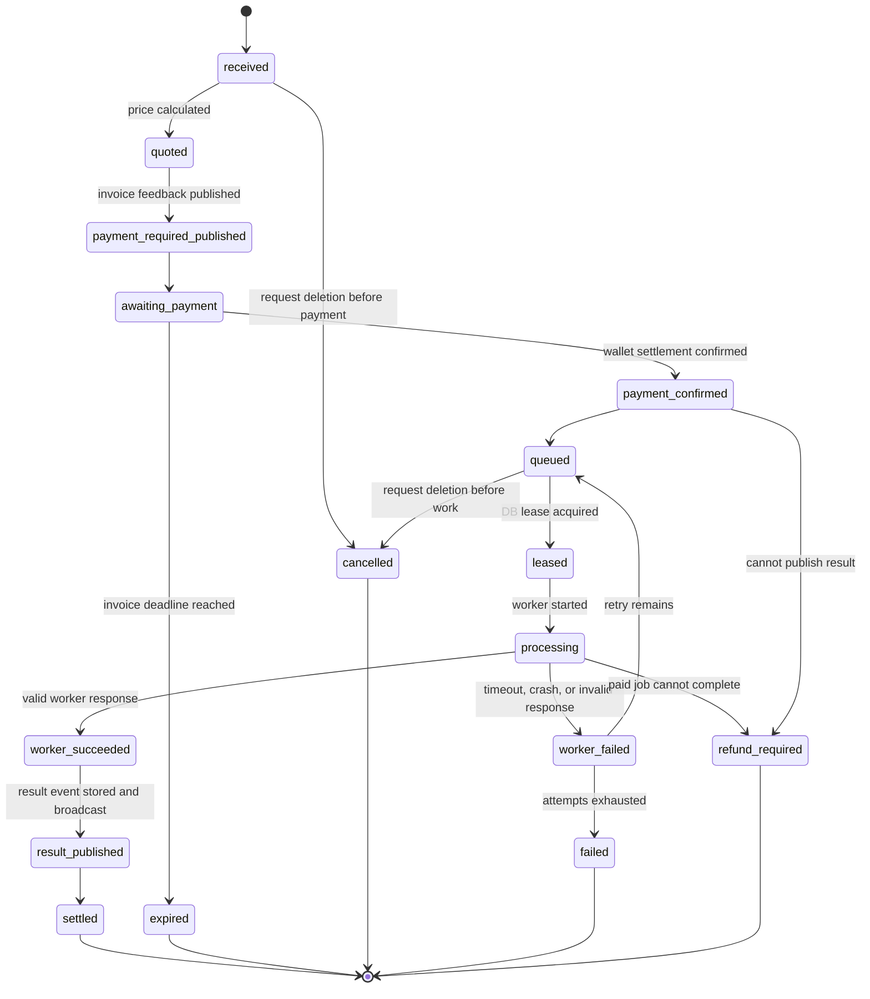

# Autonomous DVM Orchestrator & Billing Gateway Plan

## Purpose

This document is a planning artifact only. It does not change application behavior.

The goal is to evolve Nostream from a Nostr relay with pay-to-relay support into a commercial-grade Data Vending Machine gateway that can:

1. Detect NIP-90 job request events.
2. Route accepted jobs to sandboxed local worker processes over IPC.
3. Advertise available DVM services through NIP-89 handler announcements.
4. Use a durable saga state machine to coordinate asynchronous compute results with Lightning settlement.
5. Keep billing accurate even when the relay, wallet connection, or local worker crashes.

Relevant references:

- NIP-90: https://github.com/nostr-protocol/nips/blob/master/90.md
- DVM kind registry: https://github.com/nostr-protocol/data-vending-machines
- NIP-89: https://github.com/nostr-protocol/nips/blob/master/89.md
- NIP-47: https://github.com/nostr-protocol/nips/blob/master/47.md
- Node.js child processes: https://nodejs.org/api/child_process.html

## Standards Summary

NIP-90 defines DVM job request kinds in the `5000-5999` range, job result kinds in the `6000-6999` range, and job feedback as `kind:7000`. A result kind is the request kind plus `1000`. A service provider can publish feedback such as `payment-required`, `processing`, `error`, `partial`, or `success`, and payment information can be attached through an `amount` tag with a millisat amount and optionally a BOLT11 invoice.

NIP-89 defines handler discovery events. For this project, the relay should publish `kind:31990` Application Handler information events with `k` tags for each supported DVM request kind. NIP-90 explicitly points service providers at NIP-89 for DVM discoverability.

NIP-47 defines Nostr Wallet Connect. A client talks to a remote Lightning wallet service through encrypted Nostr events. Important event kinds are `13194` for wallet info, `23194` for requests, `23195` for responses, and `23197` for notifications. For this project, NWC should be treated as the wallet adapter that can create invoices, inspect invoice state, and receive settlement notifications without coupling DVM orchestration to one Lightning backend.

## Current Codebase Fit

Nostream already has several useful extension points:

- Client `EVENT` messages enter through `src/handlers/event-message-handler.ts`.
- Event routing is delegated through `src/factories/event-strategy-factory.ts`.
- Event persistence and querying are behind `src/repositories/event-repository.ts`.
- Relay-authored events are already signed and broadcast in `src/services/payments-service.ts`.
- Background work currently runs through `src/app/maintenance-worker.ts`.
- Cluster worker startup is controlled by `src/app/app.ts` and `src/factories/worker-factory.ts`.
- Settings are typed in `src/@types/settings.ts` and loaded from `resources/default-settings.yaml`.
- Existing invoice persistence lives in the `invoices` table and `src/repositories/invoice-repository.ts`.
- Existing payment processors are behind `IPaymentsProcessor` in `src/@types/clients.ts`.

Important caveat: this checkout has Lightning payment processor support, but no obvious NWC-specific processor module. If the target branch has an NWC integration elsewhere, the DVM billing adapter should reuse it. If not, this project should add an NWC adapter behind the same style of interface instead of embedding NWC calls directly in orchestration code.

## Key Product Decisions

Decide these before implementation:

1. Billing policy:
   - Recommendation: payment-first for expensive jobs.
   - Optional mode: compute-first with delayed full-result delivery for low-cost jobs or trusted customers.
2. Job durability:
   - Recommendation: persist every accepted job and every saga transition in PostgreSQL.
   - Reason: Nostream runs multiple Node cluster workers, and process-local queues alone cannot survive restarts or prevent duplicate execution.
3. Worker isolation:
   - Recommendation: only one dedicated `dvm-orchestrator` cluster worker leases and executes jobs.
   - Reason: WebSocket workers should stay focused on relay traffic and should not each manage their own external process pool.
4. IPC protocol:
   - Recommendation: JSON Lines over stdin/stdout first, with an optional TCP mode later.
   - Reason: stdio is easy to supervise, easy to test, and naturally fits local scripts in Python, Node, or other runtimes.
5. Service advertisement:
   - Recommendation: publish one `kind:31990` event per service profile, not one huge global event.
   - Reason: each service can have its own `d` identifier, `k` tags, pricing metadata, health state, and shutdown behavior.
6. Failure billing:
   - Recommendation: do not mark a job billable until both payment confirmation and successful result publication are recorded.
   - Reason: the gateway must avoid charging users for jobs that never produced a Nostr-visible result.

## Proposed Architecture

Add a DVM subsystem with clear boundaries:

- `DvmRequestDetector`: identifies NIP-90 request kinds and extracts normalized input, output, bid, relays, target service provider tags, and encryption markers.
- `DvmJobRepository`: persists jobs, leases, attempts, worker results, invoice references, and state transitions.
- `DvmQueueService`: accepts jobs, deduplicates by request event ID, and exposes lease/ack/retry operations.
- `DvmWorkerSupervisor`: starts local external processes and enforces memory, timeout, output-size, and exit-code rules.
- `DvmIpcClient`: speaks JSON Lines or TCP to local workers and returns typed results.
- `DvmBillingService`: creates and checks Lightning invoices through NWC or the configured Lightning adapter.
- `DvmSagaService`: owns the state machine and is the only module allowed to move jobs between business states.
- `DvmPublisherService`: signs and stores/broadcasts NIP-90 feedback and result events.
- `DvmRegistryPublisher`: publishes and refreshes NIP-89 handler information.
- `DvmOrchestratorWorker`: background cluster worker that leases jobs, drives the saga, and performs health checks.

This architecture keeps relay ingestion, worker execution, registry advertisement, and billing separated. That matters because each part fails differently: Nostr relay traffic is high-volume, worker execution is CPU/memory-risky, and Lightning payment is asynchronous and externally controlled.



## Data Model Plan

Add new tables rather than overloading `invoices` or `events`.

### `dvm_services`

Stores configured local DVM capabilities.

Columns:

- `id`
- `name`
- `description`
- `enabled`
- `request_kinds` as JSON or normalized child table
- `tags` for NIP-89 `t` tags
- `command`
- `args`
- `cwd`
- `env_allowlist`
- `transport` such as `stdio` or `tcp`
- `timeout_ms`
- `max_memory_mb`
- `max_output_bytes`
- `price_msats`
- `health_status`
- `last_healthy_at`
- `last_advertised_at`
- `created_at`
- `updated_at`

### `dvm_jobs`

Stores one durable saga per accepted request event.

Columns:

- `id`
- `request_event_id` with a unique index
- `request_pubkey`
- `request_kind`
- `result_kind`
- `service_id`
- `state`
- `input_json`
- `params_json`
- `output_format`
- `bid_msats`
- `price_msats`
- `invoice_id`
- `bolt11`
- `payment_hash`
- `worker_attempts`
- `last_error`
- `lease_owner`
- `lease_expires_at`
- `result_event_id`
- `feedback_event_ids`
- `created_at`
- `updated_at`
- `completed_at`

### `dvm_job_transitions`

Append-only audit log for debuggability and billing disputes.

Columns:

- `id`
- `job_id`
- `from_state`
- `to_state`
- `reason`
- `metadata_json`
- `created_at`

### `dvm_worker_health`

Stores heartbeat and crash information for local worker processes.

Columns:

- `service_id`
- `status`
- `pid`
- `started_at`
- `last_heartbeat_at`
- `last_exit_code`
- `last_signal`
- `last_error`



## NIP-90 Request Handling Plan

Add NIP-90 detection after normal event validation and before normal event persistence strategy completes.

Recommended flow:

1. A client publishes an event with kind `5000-5999`.
2. `EventMessageHandler` performs the existing signature, rate, admission, NIP-05, and policy checks.
3. The normal event strategy persists/broadcasts the request as a relay event.
4. A DVM hook inspects the accepted event.
5. If DVM support is disabled, do nothing.
6. If the request kind is unsupported, do nothing.
7. If the request has `p` tags and none target this relay's service pubkey, do nothing unless settings allow open competition.
8. Insert a `dvm_jobs` row with `request_event_id` unique.
9. Publish a `kind:7000` feedback event:
   - `status=payment-required` if billing is required before compute.
   - `status=processing` if this service computes before collecting payment.

Why this works:

- Existing relay semantics remain intact: the job request is still just an event.
- The unique `request_event_id` protects against duplicate submissions across cluster workers.
- Using a background orchestrator means WebSocket workers do not block while Python or Node worker scripts run.



## Queue And Worker Plan

Use a hybrid queue:

- PostgreSQL stores the durable queue and leases.
- The `DvmOrchestratorWorker` runs an in-process async scheduler to process leased jobs concurrently.

The scheduler should support:

- `maxConcurrentJobs` globally.
- `maxConcurrentJobs` per service.
- FIFO ordering by `created_at`, with priority support possible later.
- Lease extension while a worker is alive.
- Automatic retry on transient errors.
- Dead-lettering after `maxAttempts`.

Lease query shape:

1. Find jobs in runnable states.
2. Require `lease_expires_at IS NULL OR lease_expires_at < now()`.
3. Atomically set `lease_owner` and `lease_expires_at`.
4. Return the leased rows.

Why this works:

- Node's in-process queue gives efficient concurrency control.
- PostgreSQL leases make the queue restart-safe and cluster-safe.
- If the orchestrator crashes, leases expire and another orchestrator can recover the work.

## IPC Worker Protocol

Start with JSON Lines over stdio.

Request envelope:

```json
{
  "version": 1,
  "jobId": "uuid",
  "requestEventId": "hex",
  "kind": 5000,
  "input": [
    {
      "value": "text or reference",
      "type": "text",
      "relay": "",
      "marker": ""
    }
  ],
  "params": {
    "model": "local-model",
    "max_tokens": "512"
  },
  "output": "text/plain",
  "deadlineMs": 30000
}
```

Response envelope:

```json
{
  "version": 1,
  "jobId": "uuid",
  "status": "success",
  "content": "worker output",
  "contentType": "text/plain",
  "metadata": {
    "tokens": 123
  }
}
```

Error envelope:

```json
{
  "version": 1,
  "jobId": "uuid",
  "status": "error",
  "code": "MODEL_TIMEOUT",
  "message": "worker exceeded deadline"
}
```

Why this works:

- JSON Lines is language-neutral and easy for Python and Node scripts.
- One request/response envelope gives strict validation at the boundary.
- The worker process does not need access to relay internals, database credentials, wallet credentials, or private signing keys.

## Sandboxing And Safeguards

Implement safeguards in layers.

### Process limits

- Spawn with a restricted environment allowlist.
- Set `cwd` to a configured worker directory.
- Kill the process on timeout.
- Limit stdout/stderr bytes.
- Reject responses larger than `max_output_bytes`.
- Track process exit code and signal.
- On Linux, prefer running workers through a wrapper that applies `ulimit`, cgroups, or container limits.

### Job limits

- Validate maximum input size before enqueue.
- Enforce per-kind and per-service parameter schemas.
- Cap retries.
- Apply user/pubkey rate limits for DVM requests.
- Reject unsupported `url` inputs unless an explicit fetch allowlist exists.

### Network limits

- Default local workers to no network.
- If URL fetching is required, fetch inside Nostream through a controlled fetcher rather than letting arbitrary worker code fetch URLs.
- Add host allowlists, content-length caps, and fetch timeouts.

### Secret limits

- Never pass NWC connection secrets, relay private keys, database URLs, or payment processor keys to worker processes.
- Pass only the normalized job payload.

Why this works:

- External worker code is the riskiest part of the feature.
- Layered controls mean one missed validation does not automatically expose the wallet or relay process.
- Keeping signing and billing in Nostream preserves a narrow trust boundary.

## NIP-89 Registry Publisher Plan

Create a background publisher that owns service discovery.

Startup behavior:

1. Load enabled `dvm.services` from settings and/or `dvm_services`.
2. Start or health-check each configured worker.
3. Publish a `kind:31990` handler event for each healthy service.
4. Persist and broadcast the event through the existing event repository and cluster broadcast path.

Handler event shape:

- `kind`: `31990`
- `pubkey`: relay/service pubkey
- `content`: JSON metadata with name, about, picture/icon if configured, pricing note, and supported outputs.
- tags:
  - `["d", "<stable-service-id>"]`
  - `["k", "5000"]`, one per supported request kind
  - optional `["t", "..."]` topic tags
  - optional `["web", "<service-url>", "nevent"]` if the relay has a web handler

Heartbeat behavior:

- Re-check local worker health every configured interval.
- Refresh `kind:31990` before clients consider it stale.
- If a worker becomes unhealthy:
  - stop advertising it by publishing a replacement `kind:31990` with disabled/unavailable metadata, or
  - publish a NIP-09 delete event for the handler event if the team prefers withdrawal semantics.

Why this works:

- NIP-89 is parameterized replaceable, so a new event can update the service's advertised status.
- Health-driven advertisement prevents clients from routing paid work to dead local processes.
- Keeping this in a background worker avoids tying discovery freshness to incoming WebSocket traffic.



## Billing Saga Plan

Use an explicit state machine. The state machine should be implemented as code plus database constraints, not as scattered `if` statements.

Recommended states:

- `received`: request accepted and normalized.
- `quoted`: price calculated.
- `payment_required_published`: NIP-90 feedback with invoice published.
- `awaiting_payment`: invoice exists but is unpaid.
- `payment_confirmed`: wallet confirmed settlement.
- `queued`: ready for compute.
- `leased`: assigned to this orchestrator instance.
- `processing`: external worker is running.
- `worker_succeeded`: worker returned a valid result.
- `worker_failed`: worker failed but retry may still be possible.
- `result_published`: NIP-90 result event stored and broadcast.
- `settled`: payment and result are both complete.
- `expired`: invoice or request deadline expired.
- `cancelled`: customer deleted the job request with a kind `5` delete event.
- `failed`: terminal failure.
- `refund_required`: payment arrived but the relay cannot publish a result.

Payment-first happy path:

1. `received`
2. `quoted`
3. Create invoice through NWC or configured wallet adapter.
4. Publish `kind:7000` feedback with `status=payment-required` and `amount`.
5. `awaiting_payment`
6. Wallet notification or poll confirms payment.
7. `payment_confirmed`
8. `queued`
9. `leased`
10. `processing`
11. Worker returns output.
12. Publish result event with kind `request_kind + 1000`.
13. `result_published`
14. `settled`

Compute-first optional happy path:

1. `received`
2. `quoted`
3. `queued`
4. `processing`
5. Worker returns output.
6. Publish partial or locked feedback if payment is required before full result.
7. Create invoice.
8. Confirm payment.
9. Publish full result.
10. `settled`

Why this works:

- Payment and compute are both asynchronous. A saga models that reality directly.
- Every transition is idempotent and persisted, so retries after crash do not double-charge or double-run jobs.
- The relay can explain exactly what happened for each job by reading `dvm_job_transitions`.



## NWC Integration Plan

Create a wallet adapter boundary:

- `IDvmWalletClient.createInvoice(job): Promise<DvmInvoice>`
- `IDvmWalletClient.lookupInvoice(invoiceId): Promise<DvmInvoiceStatus>`
- `IDvmWalletClient.subscribeNotifications(callback): Promise<void>`
- `IDvmWalletClient.close(): Promise<void>`

If existing NWC code is available in the target branch, wrap it with this interface.

If NWC must be added:

1. Parse `nostr+walletconnect://` settings.
2. Fetch wallet `kind:13194` info.
3. Prefer NIP-44 encryption when the wallet advertises it.
4. Send `make_invoice` requests for payment-first DVM jobs.
5. Use `lookup_invoice` polling as a fallback.
6. Subscribe to `payment_received` notifications where supported.
7. Persist request event IDs and response event IDs for auditability.

Why this works:

- DVM billing should not care whether settlement comes from NWC notifications, lookup polling, or a legacy processor.
- NWC notifications reduce latency, while polling provides recovery if a notification is missed.
- A narrow adapter makes future Lightning backends replaceable.

## Result Publishing Plan

For successful jobs, publish:

- `kind`: request kind plus `1000`
- `content`: worker output, encrypted if the request used encrypted params and the service can support encrypted output
- tags:
  - `["request", "<stringified-original-request-event>"]`
  - `["e", "<request-event-id>", "<relay-hint>"]`
  - `["p", "<request-pubkey>"]`
  - `["amount", "<price-msats>", "<bolt11-if-relevant>"]`
  - selected `i` tags if safe to echo
  - `["encrypted"]` if applicable

For progress and failures, publish `kind:7000` feedback:

- `status=processing` when compute starts.
- `status=error` for terminal failures.
- `status=partial` only if the product supports samples.
- `status=success` can accompany final result publication when useful.

Why this works:

- NIP-90 clients already know how to follow `e`, `p`, `amount`, and feedback status tags.
- Storing result events through the normal event repository keeps relay query behavior consistent.
- Broadcasting through the existing adapter path lets subscribed clients receive results live.

## Cancellation And Expiration Plan

Support cancellation by watching for kind `5` delete events that tag known request event IDs.

Rules:

- If the job has not been paid, move to `cancelled` and stop work.
- If paid but not started, move to `refund_required` or `cancelled_after_payment` depending on policy.
- If processing has started, attempt to terminate the worker and then apply the configured refund/partial policy.
- If result is already published, leave the job `settled`.

Expiration:

- Expire unpaid invoices after wallet expiration.
- Expire stale leases after `lease_expires_at`.
- Expire jobs whose request deadline or service timeout has passed.

Why this works:

- NIP-90 explicitly allows cancellation through NIP-09 delete events.
- Clear cancellation rules prevent ambiguous billing outcomes.

## Settings Plan

Add a new `dvm` settings namespace.

Example:

```yaml
dvm:
  enabled: false
  orchestrator:
    enabled: true
    pollIntervalMs: 1000
    leaseMs: 60000
    maxConcurrentJobs: 2
    maxAttempts: 3
  billing:
    mode: payment-first
    wallet: nwc
    requirePaymentBeforeCompute: true
    invoiceMemoPrefix: "Nostream DVM"
  registry:
    enabled: true
    publishIntervalMs: 300000
    healthIntervalMs: 30000
    withdrawOnUnhealthy: true
  services:
    - id: summarize
      enabled: true
      name: "Local Summarizer"
      about: "Summarizes text with a local model."
      requestKinds: [5001]
      priceMsats: 1000
      command: "python3"
      args: ["workers/summarize.py"]
      cwd: "./dvm-workers"
      timeoutMs: 30000
      maxMemoryMb: 512
      maxOutputBytes: 65536
      transport: stdio
      tags: ["summarization"]
```

Why this works:

- Operators can turn DVM behavior on without changing core relay behavior.
- Service definitions are auditable and can be deployed gradually.
- Defaults can keep the feature disabled until explicitly configured.

## Implementation Phases

### Phase 0: Design Validation

Work:

1. Confirm exact NIP-90 job kinds to support first.
2. Confirm whether the target branch has existing NWC code.
3. Decide payment-first versus compute-first default.
4. Decide whether service definitions live only in YAML at first or are editable in DB.
5. Create a minimal worker protocol contract and sample worker fixture.

Deliverables:

- Final interface definitions.
- Database migration draft.
- One example service config.

### Phase 1: Durable Job Queue

Work:

1. Add DVM settings types and defaults.
2. Add DVM database tables and repository.
3. Add NIP-90 event kind constants.
4. Add request detection and normalized parsing.
5. Add enqueue-on-accepted-event behavior.
6. Add unit tests for detection, parsing, deduplication, and disabled mode.

Deliverables:

- Accepted DVM requests create one durable job.
- Duplicate event submissions do not create duplicate jobs.
- No external worker execution yet.

### Phase 2: Orchestrator Worker

Work:

1. Add a dedicated `WORKER_TYPE=dvm-orchestrator`.
2. Add lease-based queue polling.
3. Add in-process concurrency scheduler.
4. Add retry and dead-letter behavior.
5. Add graceful shutdown that stops leasing and waits briefly for active jobs.

Deliverables:

- Jobs can move through queue states without compute or billing.
- Lease expiry recovers interrupted work.

### Phase 3: IPC Worker Execution

Work:

1. Implement JSON Lines stdio client.
2. Add process supervisor with timeout, output limits, env allowlist, and kill behavior.
3. Add sample Python or Node worker for tests.
4. Validate worker responses with schema.
5. Record stdout/stderr snippets only within safe size limits.

Deliverables:

- A queued job can run in a sandboxed local process.
- Worker failures are converted into saga transitions and feedback events.

### Phase 4: NIP-90 Feedback And Result Publishing

Work:

1. Add relay-authored DVM feedback publisher.
2. Add result event publisher.
3. Store and broadcast these events through existing repository and adapter paths.
4. Add support for request relays and relay hints where useful.
5. Add tests for event shape, tags, result kind mapping, and signing.

Deliverables:

- Clients see `kind:7000` feedback and `kind:6000-6999` results.
- Published events are queryable from the relay after publication.

### Phase 5: Billing Adapter And Saga

Work:

1. Implement `IDvmWalletClient`.
2. Wire existing NWC integration if available, or add an NWC client adapter.
3. Create invoices for payment-first jobs.
4. Confirm invoices through notification and polling paths.
5. Implement the full saga transition table.
6. Add idempotency guards around invoice creation, confirmation, worker execution, and result publication.

Deliverables:

- Paid jobs proceed to compute.
- Unpaid jobs stay in `awaiting_payment` until expiry.
- Paid jobs that cannot publish a result move to `refund_required` instead of `settled`.

### Phase 6: NIP-89 Registry And Health

Work:

1. Add service health checker.
2. Publish `kind:31990` handler events for healthy services.
3. Refresh announcements periodically.
4. Withdraw or mark unavailable when health checks fail.
5. Add tests for announcement shape and unhealthy withdrawal behavior.

Deliverables:

- The relay advertises active DVM capabilities.
- Dead local workers are removed from discovery.

### Phase 7: Hardening And Operations

Work:

1. Add metrics and structured logs for queue depth, state counts, worker crashes, invoice latency, and result latency.
2. Add admin-facing documentation for worker setup and security warnings.
3. Add load tests for bursty NIP-90 requests.
4. Add migration rollback checks.
5. Add recovery tests for process crash at each critical saga state.

Deliverables:

- Operators can monitor the feature.
- Recovery behavior is tested instead of assumed.

## Testing Strategy

Unit tests:

- NIP-90 kind detection.
- DVM tag parsing for `i`, `output`, `param`, `bid`, `relays`, `p`, and `encrypted`.
- Service selection.
- Queue deduplication.
- Lease acquisition and expiry.
- Saga transition legality.
- IPC response validation.
- NIP-89 event generation.
- NIP-90 feedback/result event generation.

Integration tests:

- Publish a job request and observe `payment-required` feedback.
- Simulate invoice payment and observe worker execution.
- Simulate worker success and observe result publication.
- Simulate worker timeout and observe error feedback.
- Simulate orchestrator crash after payment confirmation and verify recovery.
- Simulate duplicate request delivery and verify single invoice/job.
- Simulate unhealthy worker and verify NIP-89 withdrawal.

Security tests:

- Worker cannot receive disallowed environment variables.
- Oversized input is rejected.
- Oversized output is killed/rejected.
- Timeout kills child process.
- Unsupported URL input is rejected.
- Malformed worker JSON cannot advance the saga.

## Operational Risks And Mitigations

Risk: duplicate billing.

Mitigation: unique job rows, idempotent invoice creation, persisted invoice IDs, and transition guards.

Risk: duplicate compute.

Mitigation: DB leases, lease expiry, worker attempt counters, and single dedicated orchestrator by default.

Risk: paid job fails after payment.

Mitigation: terminal `refund_required` state, audit trail, and no `settled` state until result publication succeeds.

Risk: local worker compromises relay secrets.

Mitigation: no secrets in child process environment, restricted cwd, output caps, timeouts, OS-level memory limits, and optional container execution.

Risk: stale NIP-89 advertisement routes users to dead services.

Mitigation: health checks, periodic refresh, and withdrawal/unavailable replacement events.

Risk: NWC notification is missed.

Mitigation: combine notifications with lookup polling and persist all wallet request/response event IDs.

Risk: cluster workers all try to run DVM jobs.

Mitigation: add a dedicated orchestrator worker and enforce DB leases.

## Why This Plan Should Work

This plan works because it respects Nostream's current architecture instead of replacing it. NIP-90 requests are still normal relay events, so existing validation, persistence, and broadcast behavior continue to apply. The DVM feature is added as a post-acceptance orchestration path for a specific event-kind range.

The durable queue is necessary because DVM work is slower and riskier than normal relay event handling. WebSocket handlers should acknowledge valid events quickly, while a background worker handles local process execution, payment waiting, retries, and result publication.

The saga state machine is necessary because payment and compute are independent asynchronous systems. A user may pay after a delay, a worker may crash after payment, the relay may restart after creating an invoice, or the result event may fail to publish. Persisting each state transition makes those cases recoverable and auditable.

The IPC boundary is useful because it lets Nostream become a commercial task router without becoming a machine-learning runtime. Python models, Node scripts, and other local tools can be plugged in behind a small protocol while Nostream retains control over billing, signing, validation, and publication.

The NIP-89 publisher closes the discovery loop. NIP-90 defines how jobs and results flow, but clients need to know which service providers can handle which job kinds. Publishing health-aware `kind:31990` events lets the relay advertise only capabilities that are actually available.

The billing adapter boundary keeps the system flexible. If existing NWC code is present, it can be wrapped. If not, NWC can be added as one wallet adapter. Either way, the DVM saga should not depend on the details of NWC encryption, wallet response events, or fallback polling.

The result is a system where Nostream can accept open Nostr job requests, collect Lightning payment, run local sandboxed compute, and publish standards-compatible results while preserving operator control and a clear audit trail.
