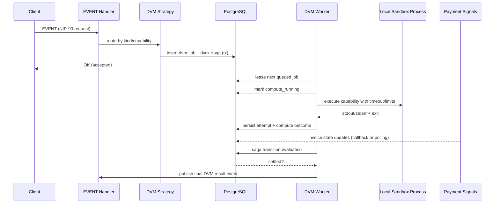
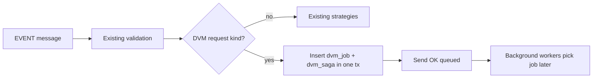
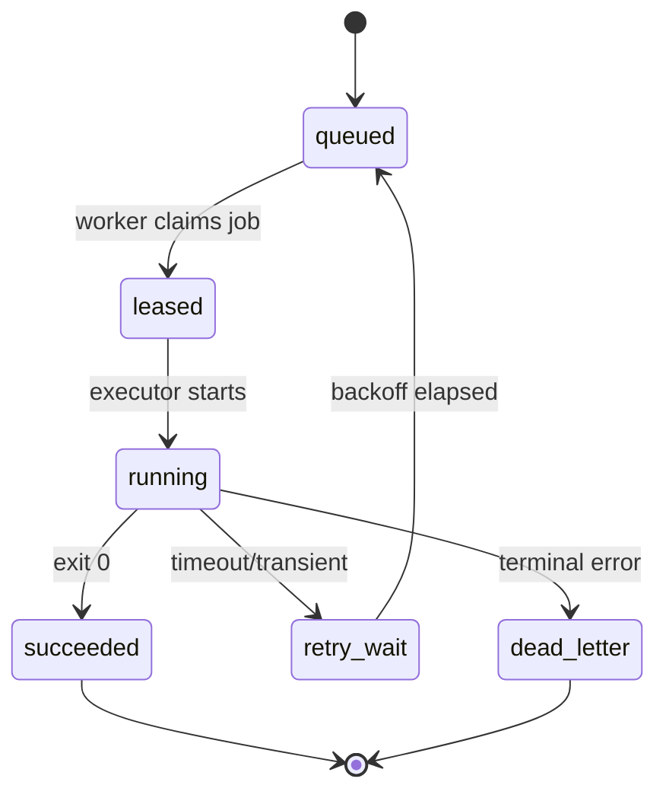
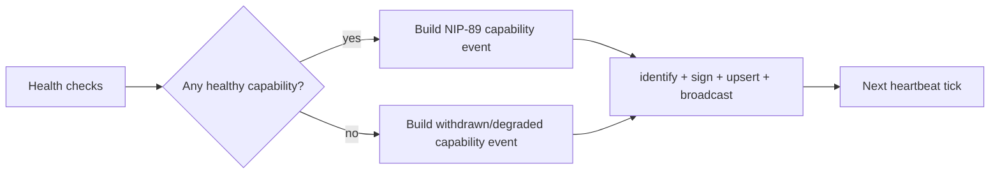
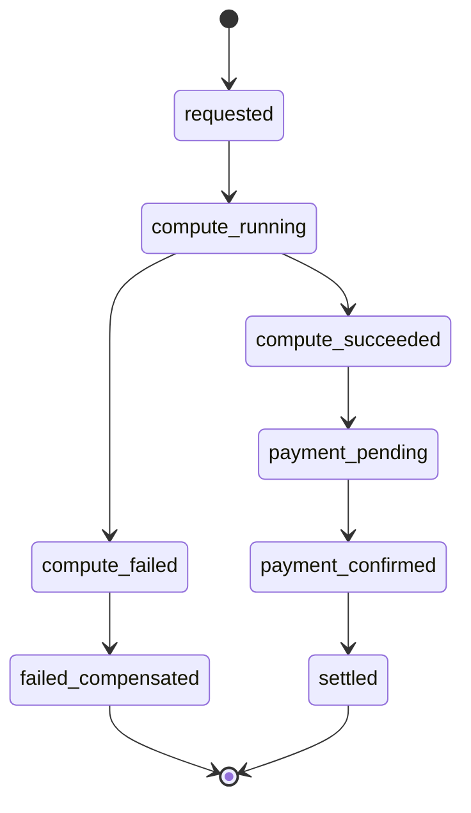

# Autonomous DVM Orchestrator and Billing Gateway

## Plan

### Goal
Transform nostream into a commercial-grade DVM task router that:
- routes NIP-90 jobs to sandboxed local processes,
- advertises active capabilities through NIP-89,
- and coordinates asynchronous compute plus Lightning settlement via a saga state machine.

### Workstream 1: NIP-90 Intake and Durable Queue
1. Extend event strategy routing to detect DVM request kinds and route to a dedicated DVM strategy.
2. Persist each request as a durable job record instead of executing inline in websocket handling.
3. Store job metadata needed for retries and billing correlation:
- request event id,
- requester pubkey,
- requested capability,
- payload hash,
- status,
- attempt count,
- lock lease information,
- timeout deadline.
4. Acknowledge request quickly and process compute asynchronously.

### Workstream 2: IPC Execution with Sandboxing
1. Build IPC adapters for:
- child process stdio,
- optional local TCP socket mode.
2. Add strict safeguards per execution:
- hard wall-clock timeout,
- output size limit for stdout and stderr,
- executable allowlist,
- process kill escalation,
- bounded concurrency.
3. Persist execution outcome and structured errors for each attempt.
4. Retry transient failures with backoff and move terminal failures to dead-letter status.

### Workstream 3: NIP-89 Capability Publisher and Heartbeat
1. Create a background publisher that emits Application Handler events describing active DVM capabilities.
2. Publish at startup and periodically refresh as a heartbeat.
3. If local DVM workers become unhealthy, withdraw or update capability events so discovery stays accurate.
4. Reuse relay signing and broadcast patterns already used for internal relay-generated events.

### Workstream 4: Billing Saga (Compute plus Lightning)
1. Introduce a dedicated saga table to track transactional progress.
2. Suggested states:
- requested,
- compute_running,
- compute_succeeded,
- compute_failed,
- payment_pending,
- payment_confirmed,
- settled,
- failed_compensated.
3. Drive transitions from two asynchronous signal sources:
- IPC compute completion,
- payment updates (polling and callbacks).
4. Enforce idempotent transitions and transactional updates so duplicates and out-of-order signals are safe.
5. Publish final result only after settlement rules pass.

### Implementation Sequence
1. Add schema and repositories for jobs, attempts, and saga state.
2. Add DVM intake strategy and enqueue behavior.
3. Add worker loop for job leasing and IPC execution.
4. Add NIP-89 capability publisher with health checks.
5. Add billing saga coordinator integrating existing payment service paths.
6. Add unit and integration tests for retries, crash recovery, duplicate callbacks, and timeout behavior.

### Acceptance Criteria
- NIP-90 requests are durably queued and not blocked by long compute.
- IPC runs are sandboxed with strict timeout and resource guardrails.
- NIP-89 capability events accurately reflect live local worker availability.
- Billing correctness holds under retries, duplicates, restarts, and partial failures.

## Explanation: Why This Works

### 1) It matches current nostream architecture
nostream already has:
- event ingestion and validation,
- strategy-based event routing,
- background worker scheduling,
- asynchronous payment confirmation and callbacks.

This project extends those existing control points rather than replacing them, lowering integration risk.

### 2) It separates fast protocol handling from slow compute
DVM jobs can be slow and memory-heavy. If compute runs inside websocket request handling, latency and failure risk increase for all clients. A durable queue lets the relay accept quickly and execute safely in the background.

### 3) It improves reliability through durable state
Keeping jobs and saga state in the database allows restart-safe recovery. If a process crashes, leased work can be reclaimed and resumed by another worker without losing billing context.

### 4) It makes external process execution safer
Running third-party scripts or models is high-risk. Sandboxing, timeouts, output caps, and executable allowlists reduce denial-of-service and runaway process risks.

### 5) It ensures discovery correctness
NIP-89 publication with periodic heartbeat prevents stale announcements. If a DVM worker crashes, advertised capabilities are withdrawn or downgraded, so network clients do not route to unavailable services.

### 6) It ensures billing correctness with asynchronous events
Compute completion and Lightning settlement are independent asynchronous timelines. A saga state machine provides deterministic coordination with idempotent transitions, preventing double-charge, double-settlement, or unpaid result publication.

### 7) It supports commercial-grade operations
The combination of durable queueing, controlled IPC execution, truthful capability broadcast, and idempotent billing orchestration is what enables predictable behavior under production load, retries, and failures.

----

# Autonomous DVM Orchestrator and Billing Gateway (Reviewed)

Last reviewed: 2026-04-22

## Goal

Transform nostream into a production-grade DVM orchestration layer that:

1. Accepts NIP-90 jobs without blocking websocket ingest.
2. Executes jobs safely in sandboxed local workers.
3. Publishes live capabilities via NIP-89.
4. Coordinates compute and Lightning settlement using a durable saga.

## Review Summary: What Is Correct and What Needed Tightening

The original plan direction is correct. The following clarifications make it implementation-safe for this codebase.

1. Correct: strategy-based intake extension is the right seam.
	 - Event routing already happens in src/factories/event-strategy-factory.ts.
	 - Validation and ACK path already happen in src/handlers/event-message-handler.ts.

2. Correct: asynchronous processing is required.
	 - Long compute cannot run inline in strategy execution without harming websocket latency.

3. Required addition: explicit cluster worker wiring.
	 - New worker type must be added to src/index.ts and started from src/app/app.ts.
	 - Existing worker model already supports this pattern (worker, maintenance, static-mirroring).

4. Required addition: queue lease and idempotency details.
	 - Durable enqueue alone is insufficient without lease expiry/reclaim and compare-and-set transitions.

5. Correct with detail: NIP-89 publication should reuse relay signing and fanout.
	 - Existing primitives identifyEvent/signEvent/broadcastEvent already support this in src/utils/event.ts.
	 - Parameterized replaceable upsert behavior already exists for kinds 30000-39999 in src/repositories/event-repository.ts.

6. Required addition: payment integration must consume both callback and polling paths.
	 - callbacks/* controllers update invoices immediately.
	 - maintenance worker continues polling pending invoices.
	 - Saga must accept duplicate/out-of-order signals from both.

## Why This Fits Current nostream Architecture

This plan extends existing control points instead of replacing them:

1. Ingest + validation stays in current EVENT handler path.
2. Routing stays in current strategy factory.
3. Durable state uses existing knex migration/repository patterns.
4. Background loops follow existing maintenance-worker scheduling model.
5. Payment signals plug into existing PaymentsService plus callbacks routes.

This minimizes integration risk and preserves current operational behavior.

## End-to-End Target Flow



## Workstream 1: NIP-90 Intake and Durable Queue

### 1.1 Route DVM request kinds to dedicated strategy

Explanation:
Use the existing strategy factory to divert only DVM request events into a DVM intake strategy. This keeps non-DVM event behavior unchanged and avoids side effects on core relay operation.

Code example:

```ts
// src/utils/event.ts (example)
export const isDvmRequestEvent = (event: Event, requestKinds: Set<number>): boolean => {
	return requestKinds.has(event.kind)
}
```

```ts
// src/factories/event-strategy-factory.ts (example)
if (isDvmRequestEvent(event, new Set(createSettings().dvm?.requestKinds ?? []))) {
	return new DvmRequestEventStrategy(adapter, dvmJobRepository, dvmSagaRepository, createSettings)
}
```

### 1.2 Persist each request as a durable job record

Explanation:
The websocket request path must only validate + enqueue + ACK. Compute runs later in worker context. This guarantees fast response and restart-safe handling.

Code example:

```js
// migrations/20260422_120000_create_dvm_jobs_table.js (example)
exports.up = function (knex) {
	return knex.schema
		.createTable('dvm_jobs', function (table) {
			table.uuid('id').primary().defaultTo(knex.raw('uuid_generate_v4()'))
			table.binary('request_event_id').notNullable().unique()
			table.binary('requester_pubkey').notNullable().index()
			table.text('capability').notNullable().index()
			table.text('payload_hash').notNullable()
			table.enum('status', ['queued', 'leased', 'running', 'succeeded', 'failed', 'dead_letter']).notNullable()
			table.integer('attempt_count').notNullable().defaultTo(0)
			table.timestamp('lease_expires_at', { useTz: true }).nullable().index()
			table.timestamp('timeout_at', { useTz: true }).notNullable()
			table.timestamp('next_attempt_at', { useTz: true }).notNullable().defaultTo(knex.fn.now()).index()
			table.timestamp('created_at', { useTz: true }).notNullable().defaultTo(knex.fn.now())
			table.timestamp('updated_at', { useTz: true }).notNullable().defaultTo(knex.fn.now())
		})
		.createTable('dvm_job_attempts', function (table) {
			table.uuid('id').primary().defaultTo(knex.raw('uuid_generate_v4()'))
			table.uuid('job_id').notNullable().references('id').inTable('dvm_jobs').onDelete('CASCADE')
			table.integer('attempt_no').notNullable()
			table.enum('outcome', ['success', 'transient_error', 'terminal_error', 'timeout']).notNullable()
			table.integer('exit_code').nullable()
			table.text('error_code').nullable()
			table.text('error_message').nullable()
			table.integer('stdout_bytes').notNullable().defaultTo(0)
			table.integer('stderr_bytes').notNullable().defaultTo(0)
			table.timestamp('started_at', { useTz: true }).notNullable()
			table.timestamp('ended_at', { useTz: true }).notNullable()
			table.unique(['job_id', 'attempt_no'])
		})
}
```

### 1.3 Store metadata needed for retries and billing correlation

Explanation:
request_event_id, capability, payload_hash, and requester_pubkey are required to dedupe, retry safely, and tie compute to settlement. Without these, duplicate events and replay handling become ambiguous.

### 1.4 ACK quickly, compute asynchronously

Explanation:
Do not block EVENT response on execution or billing. The strategy should ACK immediately after successful enqueue transaction.

Code example:

```ts
// src/handlers/event-strategies/dvm-request-event-strategy.ts (example)
public async execute(event: Event): Promise<void> {
	const tx = new Transaction(this.dbClient)
	await tx.begin()
	try {
		await this.dvmJobRepository.enqueueFromEvent(event, tx.transaction)
		await this.dvmSagaRepository.createRequested(event.id, event.pubkey, tx.transaction)
		await tx.commit()
		this.webSocket.emit(WebSocketAdapterEvent.Message, createCommandResult(event.id, true, 'queued'))
	} catch (error) {
		await tx.rollback()
		this.webSocket.emit(WebSocketAdapterEvent.Message, createCommandResult(event.id, false, 'error: enqueue failed'))
	}
}
```

### Workstream 1 diagram



## Workstream 2: IPC Execution with Sandboxing

### 2.1 Provide IPC adapters (child process and optional local TCP)

Explanation:
Use a common executor interface so strategy and worker logic stay independent of transport details. Start with child process mode for simplest local isolation. Keep TCP mode optional for specialized local model servers.

Code example:

```ts
// src/services/dvm-executor.ts (example)
export interface DvmExecutor {
	execute(input: {
		executable: string
		args: string[]
		payload: string
		timeoutMs: number
		maxOutputBytes: number
	}): Promise<{
		exitCode: number | null
		stdout: Buffer
		stderr: Buffer
	}>
}
```

### 2.2 Enforce strict safeguards per execution

Explanation:
This is the critical safety boundary. The worker must enforce hard timeout, output caps, executable allowlist, kill escalation, and bounded parallelism regardless of caller input.

Code example:

```ts
// src/services/child-process-dvm-executor.ts (example)
import { spawn } from 'child_process'

const DEFAULT_KILL_GRACE_MS = 1500

export async function runSandboxed(input: {
	executable: string
	args: string[]
	payload: string
	timeoutMs: number
	maxOutputBytes: number
	allowedExecutables: Set<string>
}): Promise<{ exitCode: number | null; stdout: Buffer; stderr: Buffer }> {
	if (!input.allowedExecutables.has(input.executable)) {
		throw new Error('terminal_error: executable_not_allowed')
	}

	const child = spawn(input.executable, input.args, {
		stdio: ['pipe', 'pipe', 'pipe'],
		detached: false,
	})

	const stdout: Buffer[] = []
	const stderr: Buffer[] = []
	let stdoutBytes = 0
	let stderrBytes = 0

	const onChunk = (target: Buffer[], countRef: 'stdout' | 'stderr') => (chunk: Buffer) => {
		if (countRef === 'stdout') {
			stdoutBytes += chunk.length
			if (stdoutBytes > input.maxOutputBytes) {
				child.kill('SIGTERM')
				setTimeout(() => child.kill('SIGKILL'), DEFAULT_KILL_GRACE_MS)
				return
			}
		} else {
			stderrBytes += chunk.length
			if (stderrBytes > input.maxOutputBytes) {
				child.kill('SIGTERM')
				setTimeout(() => child.kill('SIGKILL'), DEFAULT_KILL_GRACE_MS)
				return
			}
		}
		target.push(chunk)
	}

	child.stdout.on('data', onChunk(stdout, 'stdout'))
	child.stderr.on('data', onChunk(stderr, 'stderr'))
	child.stdin.end(input.payload)

	const timeout = setTimeout(() => {
		child.kill('SIGTERM')
		setTimeout(() => child.kill('SIGKILL'), DEFAULT_KILL_GRACE_MS)
	}, input.timeoutMs)

	const exitCode = await new Promise<number | null>((resolve) => child.on('close', resolve))
	clearTimeout(timeout)

	return {
		exitCode,
		stdout: Buffer.concat(stdout),
		stderr: Buffer.concat(stderr),
	}
}
```

### 2.3 Persist execution outcome and structured errors

Explanation:
Attempt rows provide forensic traceability and deterministic retry decisions. Status-only logs are not enough for production debugging.

### 2.4 Retry transient failures with backoff, dead-letter terminal failures

Explanation:
Retries should be policy-driven by error class. Timeouts and temporary transport errors retry; malformed input and allowlist violations go terminal immediately.

Code example:

```ts
// src/services/dvm-retry-policy.ts (example)
export const classifyOutcome = (exitCode: number | null, errorCode?: string) => {
	if (errorCode === 'executable_not_allowed' || errorCode === 'invalid_payload') {
		return 'terminal_error'
	}
	if (errorCode === 'timeout' || exitCode === null) {
		return 'transient_error'
	}
	return exitCode === 0 ? 'success' : 'transient_error'
}

export const nextBackoffMs = (attempt: number): number => {
	const base = 1000
	const cap = 30000
	return Math.min(cap, base * Math.pow(2, Math.max(0, attempt - 1)))
}
```

### Workstream 2 diagram



## Workstream 3: NIP-89 Capability Publisher and Heartbeat

### 3.1 Emit Application Handler events for active capabilities

Explanation:
NIP-89 is the discovery contract. Clients should see what this relay can execute right now, not static marketing metadata.

### 3.2 Publish on startup and periodic heartbeat

Explanation:
Startup publish removes cold-start invisibility. Heartbeats prevent stale data and naturally repair transient relay/network failures.

### 3.3 Withdraw or update capabilities when workers are unhealthy

Explanation:
Discovery correctness matters more than availability appearance. Advertising dead capability endpoints causes avoidable client failures and repeated retries.

### 3.4 Reuse relay signing and broadcast patterns

Explanation:
Use existing identifyEvent/signEvent/broadcastEvent to keep cryptographic and fanout behavior consistent with current internal event publication.

Code example:

```ts
// src/services/dvm-capability-publisher.ts (example)
import { identifyEvent, signEvent, broadcastEvent, getRelayPrivateKey, getPublicKey } from '../utils/event'

const NIP89_APP_HANDLER_KIND = 31990

export async function publishCapabilities(input: {
	relayUrl: string
	appId: string
	capabilities: string[]
	eventRepository: IEventRepository
}): Promise<void> {
	const relayPrivkey = getRelayPrivateKey(input.relayUrl)
	const relayPubkey = getPublicKey(relayPrivkey)

	const unsigned = {
		pubkey: relayPubkey,
		kind: NIP89_APP_HANDLER_KIND,
		created_at: Math.floor(Date.now() / 1000),
		tags: [['d', input.appId]],
		content: JSON.stringify({
			name: 'nostream-dvm',
			capabilities: input.capabilities,
			healthy: input.capabilities.length > 0,
		}),
	}

	const event = await signEvent(relayPrivkey)(await identifyEvent(unsigned))
	await input.eventRepository.upsert(event)
	await broadcastEvent(event)
}
```

### Workstream 3 diagram



## Workstream 4: Billing Saga (Compute Plus Lightning)

### 4.1 Introduce dedicated saga table

Explanation:
Saga state must be isolated from jobs and invoices so each subsystem can evolve independently while preserving a single truth for orchestration.

Code example:

```js
// migrations/20260422_121000_create_dvm_sagas_table.js (example)
exports.up = function (knex) {
	return knex.schema.createTable('dvm_sagas', function (table) {
		table.uuid('id').primary().defaultTo(knex.raw('uuid_generate_v4()'))
		table.binary('request_event_id').notNullable().unique()
		table.uuid('job_id').notNullable().references('id').inTable('dvm_jobs').onDelete('CASCADE')
		table.text('invoice_id').nullable().index()
		table.enum('state', [
			'requested',
			'compute_running',
			'compute_succeeded',
			'compute_failed',
			'payment_pending',
			'payment_confirmed',
			'settled',
			'failed_compensated',
		]).notNullable().index()
		table.jsonb('context').notNullable().defaultTo('{}')
		table.timestamp('updated_at', { useTz: true }).notNullable().defaultTo(knex.fn.now())
		table.timestamp('created_at', { useTz: true }).notNullable().defaultTo(knex.fn.now())
	})
}
```

### 4.2 Use explicit states

Explanation:
The state list in the original plan is correct. Keep transitions explicit and reject illegal jumps to avoid hidden side effects.

### 4.3 Drive transitions from compute completion plus payment updates

Explanation:
Payment updates can come from callback controllers or maintenance polling. Saga logic must consume both and remain deterministic.

### 4.4 Enforce idempotent transactional transitions

Explanation:
Use compare-and-set updates to ensure the same signal can be safely replayed and out-of-order signals do not corrupt state.

Code example:

```ts
// src/repositories/dvm-saga-repository.ts (example)
public async transition(
	requestEventId: string,
	from: DvmSagaState,
	to: DvmSagaState,
	patch: Record<string, unknown>,
	client: DatabaseClient = this.dbClient,
): Promise<boolean> {
	const count = await client('dvm_sagas')
		.where({ request_event_id: toBuffer(requestEventId), state: from })
		.update({
			state: to,
			context: client.raw('context || ?::jsonb', [JSON.stringify(patch)]),
			updated_at: new Date(),
		})

	return Number(count) > 0
}
```

### 4.5 Publish final result only after settlement rules pass

Explanation:
Keep compute output private until settlement criteria are met. This prevents unpaid result leakage.

Code example:

```ts
// src/services/dvm-result-publisher.ts (example)
if (saga.state === 'compute_succeeded' && settlementPolicy === 'require_payment') {
	await sagaRepository.transition(eventId, 'compute_succeeded', 'payment_pending', { reason: 'awaiting_payment' })
	return
}

if (saga.state === 'payment_confirmed' || settlementPolicy === 'no_payment_required') {
	await publishDvmResultEvent(...)
	await sagaRepository.transition(eventId, saga.state, 'settled', { publishedAt: new Date().toISOString() })
}
```

### Workstream 4 diagram



## Implementation Sequence (With Explanation)

1. Schema and repositories for dvm_jobs, dvm_job_attempts, dvm_sagas.
	 - Explanation: durable data model is prerequisite for retries, lease recovery, and idempotency.

2. DVM intake strategy and enqueue behavior.
	 - Explanation: route and ACK semantics define the external contract first.

3. DVM worker type and lease loop.
	 - Explanation: add WORKER_TYPE=dvm and spawn workers from primary process.

4. IPC executors and sandbox guards.
	 - Explanation: enforce safety boundaries before enabling high-throughput execution.

5. NIP-89 publisher with startup + heartbeat + health gating.
	 - Explanation: discovery should reflect true runtime capabilities.

6. Saga coordinator integrating existing invoice callbacks and poller.
	 - Explanation: both payment signal sources must converge on one idempotent transition path.

7. Tests for retries, duplicate callbacks, crash recovery, and timeout/kill behavior.
	 - Explanation: correctness here depends on failure-path behavior, not only happy path.

## Test Plan and Acceptance Criteria

### Functional acceptance

1. NIP-90 requests are durably queued and ACKed quickly.
2. Compute runs only in background workers.
3. Sandbox limits terminate runaway jobs safely.
4. NIP-89 capability events track health accurately.
5. Final DVM result publication obeys settlement policy.

### Reliability acceptance

1. Worker crash during lease: job is reclaimed after lease expiry.
2. Duplicate request event: no duplicate job/saga rows.
3. Duplicate callback payload: idempotent no-op transition.
4. Out-of-order signals: invalid transitions are rejected safely.
5. Restart during payment_pending: saga resumes and settles correctly.

### Observability acceptance

1. Each attempt has structured outcome row.
2. Saga transition logs include from_state, to_state, signal_source.
3. Health heartbeat logs include published capability count.

## Why This Works

1. It keeps websocket ingest fast by moving heavy compute out of the hot path.
2. It provides restart-safe durability for both compute and billing orchestration.
3. It reuses nostream-native strategy, worker, repository, and relay-signing patterns.
4. It hardens untrusted local execution with explicit safety controls.
5. It prevents stale discovery metadata through heartbeat-driven NIP-89 publication.
6. It handles asynchronous payment uncertainty with idempotent saga transitions.
7. It is operationally testable with deterministic failure injection points.
