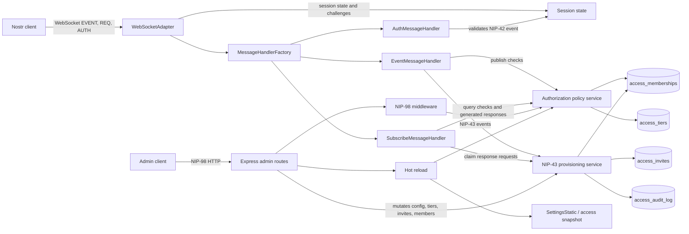
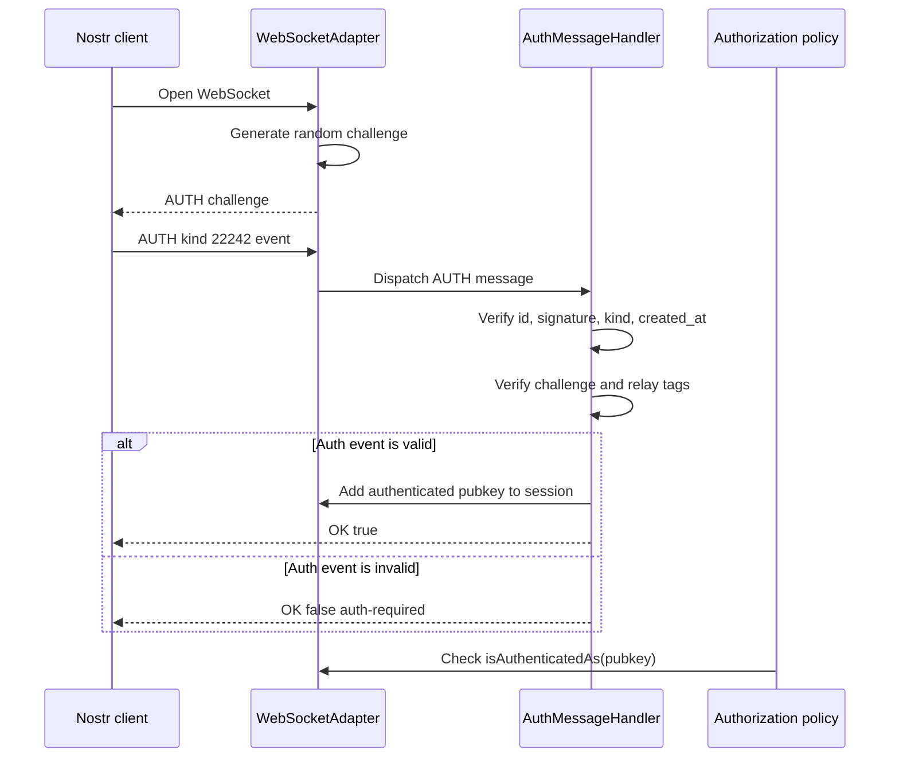
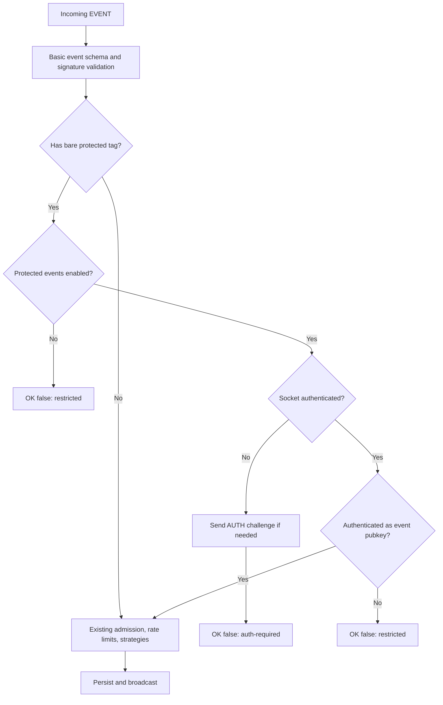
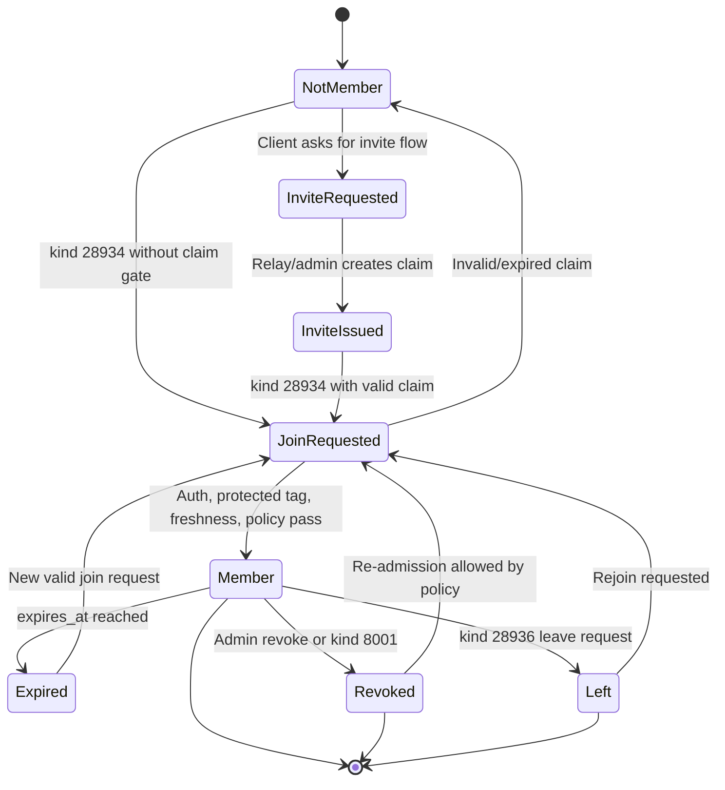
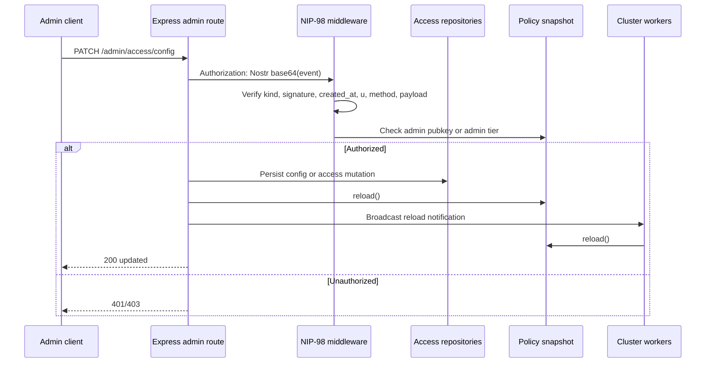
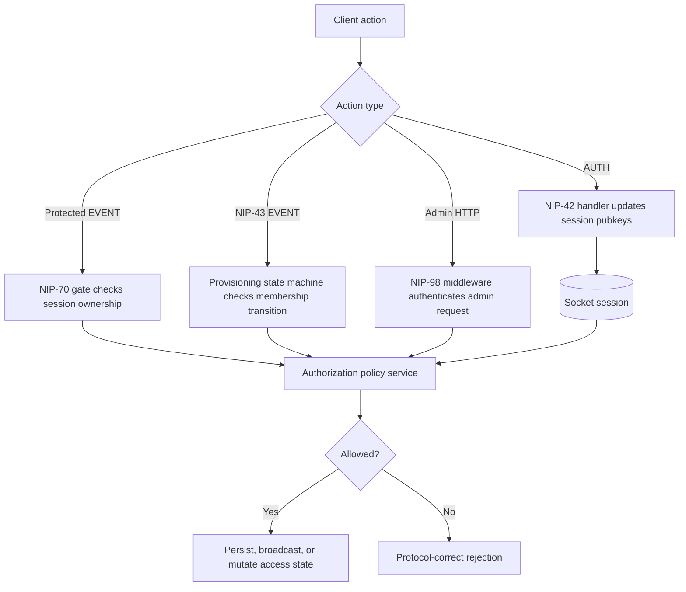

# Enterprise Provisioning & Access Engine Plan

Date: 2026-04-22

This document is a planning artifact only. It describes how to add NIP-42, NIP-70, NIP-43, and NIP-98 support to nostream without making source-code changes yet.

## Scope

Build a permissioned, stateful access layer inside nostream that can:

- Track authenticated WebSocket sessions using NIP-42 challenge-response authentication.
- Enforce NIP-70 protected-event publication rules at the event ingestion boundary.
- Support NIP-43 relay access metadata and request flows for commercial relay membership.
- Add a NIP-98-authenticated HTTP admin API for hot-reloading access and configuration rules without dropping active WebSocket connections.

Primary spec references:

- NIP-42: https://github.com/nostr-protocol/nips/blob/master/42.md
- NIP-70: https://github.com/nostr-protocol/nips/blob/master/70.md
- NIP-43: https://github.com/nostr-protocol/nips/blob/master/43.md
- NIP-98: https://github.com/nostr-protocol/nips/blob/master/98.md

## Current Codebase Context

nostream is already well positioned for this work:

- WebSocket clients are wrapped by `WebSocketAdapter` in `src/adapters/web-socket-adapter.ts`.
- Incoming client messages are validated through `src/schemas/message-schema.ts`.
- Message dispatch happens in `src/factories/message-handler-factory.ts`.
- Event ingestion is centralized in `src/handlers/event-message-handler.ts`.
- Subscriptions are centralized in `src/handlers/subscribe-message-handler.ts`.
- NIP-11 relay metadata is returned from `src/handlers/request-handlers/root-request-handler.ts`.
- HTTP routing is Express-based through `src/routes/index.ts` and `src/factories/web-app-factory.ts`.
- Settings are cached and already file-watchable through `src/utils/settings.ts`.
- Users, balances, and admission state already exist in `src/repositories/user-repository.ts` and the `users` table.

The implementation should extend these existing boundaries instead of introducing a parallel server or separate access-control path.

## Important Spec Decision

The task description says to handle "kind 843 access requests." Current official NIP-43, checked on 2026-04-22, defines:

- `kind 13534`: relay membership list
- `kind 8000`: member added
- `kind 8001`: member removed
- `kind 28934`: join/admission request
- `kind 28935`: invite claim response
- `kind 28936`: leave request

Before implementation, confirm whether "kind 843" is a course-specific requirement, an older draft, or a typo. The plan below assumes the official current NIP-43 kinds unless the project owner explicitly requires compatibility with kind `843`.

## Architecture

The access engine should have four layers:

1. Session state

   Add a session-state object owned by each `WebSocketAdapter`. It should track the relay-issued challenge, authenticated pubkeys, authentication timestamps, and optionally per-pubkey authorization claims or tier snapshots.

2. Authorization policy

   Add a small policy service that answers questions like:

   - Is this socket authenticated as this event pubkey?
   - Is this pubkey admitted to publish?
   - Does this pubkey have the required tier for this event kind?
   - May this pubkey request invite claims or admin actions?

3. Provisioning state machine

   Add a NIP-43 service that processes access-request events, updates persistent membership/access state, emits relay-signed metadata events where appropriate, and returns protocol-correct `OK` responses.

4. Admin configuration API

   Add Express routes under an admin namespace, guarded by NIP-98 middleware. Admin requests should update an in-memory/durable access configuration store and trigger `SettingsStatic` reload or a new access-policy reload without closing WebSocket connections.

This separation keeps the WebSocket adapter responsible for connection state, the event handler responsible for event admission, and the admin API responsible for operator control.

## Phase 1: Data Model And Configuration

Define the domain model before touching protocol flow.

Planned additions:

- `access_tiers` table: tier id/name, allowed event kinds or kind ranges, rate limits, admission rules, active flag, timestamps.
- `access_memberships` table: pubkey, tier id, status, source, granted_at, expires_at, revoked_at, metadata.
- `access_invites` table: claim code hash, tier id, max uses, use count, expires_at, created_by, status.
- `access_audit_log` table: actor pubkey, action, target pubkey, previous state, new state, request id, timestamp.

Settings should gain an `access` section in `Settings` and `default-settings.yaml`, for example:

- `access.enabled`
- `access.requireAuthForWrites`
- `access.allowProtectedEvents`
- `access.defaultTier`
- `access.adminPubkeys`
- `access.nip43.enabled`
- `access.nip98.enabled`
- `access.auth.challengeTtlSeconds`
- `access.auth.createdAtToleranceSeconds`

Why this works:

Persistent tables make access decisions restart-safe and auditable. Settings preserve nostream's existing operator configuration style, while tables hold dynamic commercial state that should not require editing YAML for every member.

## Phase 2: NIP-42 Session State

Implement NIP-42 at the WebSocket protocol boundary.

Planned work:

- Add `AUTH` to `MessageType`, incoming schemas, outgoing message types, and message utilities.
- Generate a cryptographically random challenge when a WebSocket connects.
- Send `["AUTH", "<challenge>"]` either immediately on connection or lazily when a protected action needs auth.
- Add an `AuthMessageHandler` for incoming `["AUTH", <event>]`.
- Validate auth events:
  - `kind` must be `22242`.
  - Event id and signature must be valid.
  - `created_at` must be within the configured tolerance.
  - `challenge` tag must match the socket's current challenge.
  - `relay` tag must match the configured relay URL, with documented normalization rules.
- Store successful auth as an authenticated pubkey on the socket for the lifetime of that connection.
- Reply with `OK` for every client `AUTH` event, as NIP-42 requires.

Integration points:

- `src/adapters/web-socket-adapter.ts`: own challenge/session state and expose read methods on `IWebSocketAdapter`.
- `src/@types/messages.ts`: add `AUTH` message shapes.
- `src/schemas/message-schema.ts`: validate `AUTH`.
- `src/factories/message-handler-factory.ts`: route `AUTH` to the auth handler.
- `src/utils/messages.ts`: create outgoing auth challenge messages.

Why this works:

NIP-42 authenticates a connection, not just an event. Keeping auth state inside the WebSocket adapter makes authorization checks cheap and avoids querying persistent storage for every protected-event ownership check. Allowing multiple authenticated pubkeys per connection follows the NIP-42 flow and supports clients that authenticate more than one identity on the same socket.

## Phase 3: NIP-70 Protected Event Enforcement

Enforce NIP-70 as early as possible in event ingestion.

Planned work:

- Add a helper such as `isProtectedEvent(event)` that detects a bare `["-"]` tag.
- In `EventMessageHandler.handleMessage`, after basic event validation and before rate limits, admission checks, persistence, or broadcast:
  - If protected events are disabled, reject any event with `["-"]`.
  - If enabled and the socket is not authenticated, send an `AUTH` challenge if needed and reject with `OK false "auth-required: ..."` .
  - If enabled and authenticated, require the event `pubkey` to be one of the socket's authenticated pubkeys.
  - If authenticated as a different pubkey, reject with `OK false "restricted: ..."` .
- Ensure relay-generated protected events can still be persisted by trusted internal paths or by authenticating as the relay pubkey through an internal bypass.

Integration points:

- `src/handlers/event-message-handler.ts`: protected-event gate.
- `src/utils/event.ts`: protected-tag helper.
- `src/@types/adapters.ts`: expose authenticated pubkey lookup.

Why this works:

NIP-70's security value depends on stopping protected events before third-party publication. The event handler is the right boundary because every client `EVENT` write passes through it before strategy execution, database writes, or cluster broadcast.

## Phase 4: NIP-43 Access Metadata And Requests

Implement the NIP-43 access lifecycle as a state machine.

Planned state machine:

- `NotMember`
- `InviteRequested`
- `InviteIssued`
- `JoinRequested`
- `Member`
- `Expired`
- `Revoked`
- `Left`

Event handling:

- `kind 28934` join request:
  - Require NIP-70 `["-"]`.
  - Require NIP-42 auth as the same pubkey.
  - Validate `created_at` freshness.
  - Validate `claim` tag against `access_invites`.
  - On success, create or update membership and return `OK true`.
  - On invalid claim, return `OK false "restricted: ..."` .
  - On duplicate membership, return `OK true "duplicate: ..."` .
- `kind 28936` leave request:
  - Require NIP-70 `["-"]`.
  - Require NIP-42 auth as the same pubkey.
  - Mark membership as `Left` or `Revoked`.
  - Return `OK true`.
- `kind 28935` invite request response:
  - Generate relay-signed ephemeral claim events when clients request `kind 28935`.
  - Do not persist ephemeral invite responses unless an audit trail is explicitly needed.
- `kind 13534` membership list:
  - Generate relay-signed protected membership-list events from current active memberships.
  - Keep it non-authoritative as the NIP states; the database remains the local source of truth.
- `kind 8000` and `kind 8001`:
  - Optionally publish relay-signed add/remove member events after membership changes.

Integration points:

- `src/constants/base.ts`: add NIP-43 event kinds and protected tag constants.
- `src/handlers/event-message-handler.ts`: route NIP-43 events to a dedicated service before normal strategy execution.
- `src/handlers/subscribe-message-handler.ts`: intercept `REQ` for `kind 28935` and generate claim events on demand.
- `src/services`: add an access/provisioning service.
- `src/repositories`: add access repositories.
- `src/handlers/request-handlers/root-request-handler.ts` and `package.json`: advertise NIP-42, NIP-43, NIP-70, and NIP-98 only when enabled and implemented.

Why this works:

NIP-43 is not just storage; it is a membership workflow. Modeling it as a state machine prevents accidental transitions, makes duplicate/expired/revoked cases explicit, and gives operators a clear audit trail for paid or permissioned access.

## Phase 5: NIP-98 Admin API

Add cryptographic HTTP authentication for operator APIs.

Planned middleware:

- Read `Authorization: Nostr <base64-event>`.
- Decode and parse the event.
- Validate:
  - `kind` is `27235`.
  - Event id and signature are valid.
  - `created_at` is within a short time window, defaulting to 60 seconds.
  - `u` tag exactly matches the absolute request URL, including query string.
  - `method` tag matches the HTTP method.
  - For body methods, require or optionally verify a `payload` SHA-256 tag depending on endpoint sensitivity.
  - Pubkey is listed in `access.adminPubkeys` or has an admin tier.
- Attach authenticated Nostr pubkey to the Express request for audit logging.

Planned admin routes:

- `GET /admin/access/config`: read effective access config.
- `PATCH /admin/access/config`: update hot-reloadable access rules.
- `GET /admin/access/tiers`: list tiers.
- `POST /admin/access/tiers`: create tier.
- `PATCH /admin/access/tiers/:id`: update tier.
- `POST /admin/access/invites`: create invite claim.
- `POST /admin/access/members/:pubkey`: grant/update membership.
- `DELETE /admin/access/members/:pubkey`: revoke membership.
- `POST /admin/reload`: reload settings/access policy from disk and database.

Hot reload behavior:

- Settings reload should reuse `SettingsStatic`'s existing cache invalidation pattern.
- Access-policy reload should update an in-memory snapshot used by handlers.
- Active WebSockets should stay open because handlers call settings/policy factories per message instead of holding stale immutable config.
- In clustered mode, one worker should broadcast reload notifications to sibling workers through the existing cluster message channel, similar to event broadcasts.

Why this works:

NIP-98 provides stateless HTTP authentication using the same Nostr signing model as the relay. That avoids passwords and API keys, gives every admin action a pubkey identity, and fits the existing Express routing architecture.

## Phase 6: Authorization Policy Integration

After protocol support exists, centralize access decisions.

Planned service methods:

- `isAuthenticatedAs(socket, pubkey)`
- `requireAuthenticatedAs(socket, pubkey)`
- `canPublish(socket, event)`
- `canSubscribe(socket, filters)`
- `getMembership(pubkey)`
- `getTier(pubkey)`
- `reload()`

Use this service from:

- `EventMessageHandler` for protected events, tiered writes, and admission checks.
- `SubscribeMessageHandler` for restricted read/query tiers if enabled.
- NIP-43 service for membership transitions.
- NIP-98 admin API for operator authorization.

Why this works:

A single policy service avoids scattering authorization checks across handlers. It also makes tests easier because each protocol handler can assert that it calls the same policy contract.

## Phase 7: Testing Strategy

Unit tests:

- `AuthMessageHandler` accepts valid NIP-42 auth and rejects wrong challenge, wrong relay, stale timestamp, bad signature, and wrong kind.
- `EventMessageHandler` rejects NIP-70 protected events without auth.
- `EventMessageHandler` rejects protected events authenticated as a different pubkey.
- `EventMessageHandler` accepts protected events authenticated as the event pubkey.
- NIP-43 state machine handles invalid claim, expired claim, duplicate membership, successful join, and leave request.
- NIP-98 middleware rejects missing auth, malformed base64, wrong method, wrong URL, stale timestamp, bad signature, unauthorized pubkey, and body hash mismatch.

Integration tests:

- WebSocket flow: connect, receive auth challenge, publish protected event before auth, authenticate, publish protected event successfully.
- NIP-43 flow: request claim, submit join request, verify membership and optional add-member event.
- Admin API flow: signed NIP-98 request changes a tier, reloads policy, and affects subsequent WebSocket writes without reconnecting.
- Cluster flow: admin reload in one worker propagates to other workers.

Regression tests:

- Existing NIPs and payment admission behavior still pass.
- Existing NIP-11 response remains valid.
- Existing public writes still work when access engine is disabled.

Why this works:

The risky parts are protocol correctness and authorization regressions. Tests should focus on wire-level behavior and state transitions rather than only internal method coverage.

## Rollout Plan

1. Add types, constants, schemas, and message utilities for `AUTH` and new event kinds.
2. Add socket session state and NIP-42 handler.
3. Add NIP-70 enforcement behind a disabled-by-default setting.
4. Add access tables and repositories.
5. Add NIP-43 provisioning service and event/subscription integration.
6. Add NIP-98 middleware and admin routes.
7. Add hot-reload propagation for clustered workers.
8. Update NIP-11 advertised `supported_nips` only after each NIP is complete.
9. Add documentation and example settings.
10. Run unit, integration, build, and lint checks.

## Operational Considerations

- Default all new access features to disabled to preserve existing relay behavior.
- Treat relay URL normalization carefully. NIP-42 auth and NIP-98 URL matching are security-sensitive.
- Store invite codes hashed, not in plaintext, because claim strings become credentials.
- Keep audit logs for admin actions and automated membership changes.
- Avoid storing auth session state in Redis unless cross-worker session transfer becomes necessary; WebSocket connections are worker-local.
- Use short TTLs for NIP-42 challenges and NIP-98 HTTP auth windows.
- Do not advertise NIP support in NIP-11 until the corresponding behavior is implemented and tested.

## Why This Overall Design Works

This design follows nostream's existing architecture instead of bypassing it. WebSocket authentication lives with the WebSocket adapter, event authorization lives at the event ingestion handler, HTTP admin authentication lives as Express middleware, and durable access state lives in repositories.

That division gives the project a clear chain of enforcement:

1. NIP-42 proves which pubkey controls the current WebSocket session.
2. NIP-70 uses that session proof to prevent third-party publication of protected events.
3. NIP-43 uses protected, authenticated events to mutate membership state safely.
4. NIP-98 lets operators change access rules over HTTP with signed, auditable requests.

The result is a permissioned layer that remains compatible with Nostr's cryptographic identity model and with nostream's current message, settings, repository, and Express boundaries.
