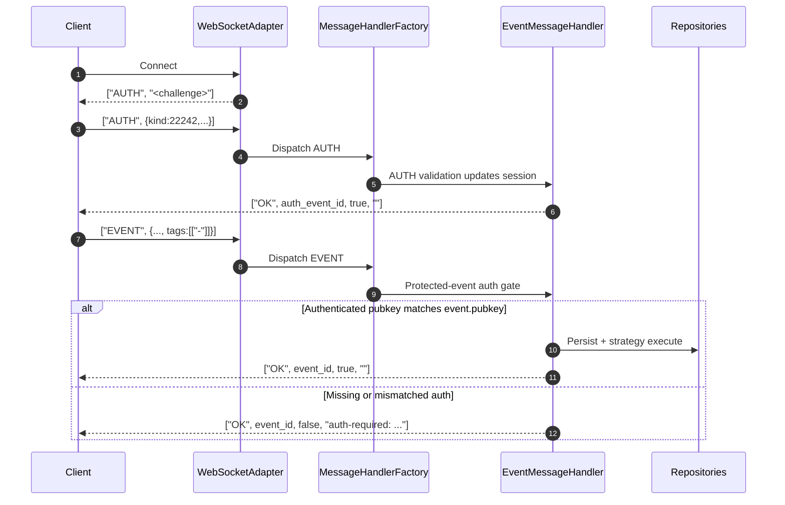
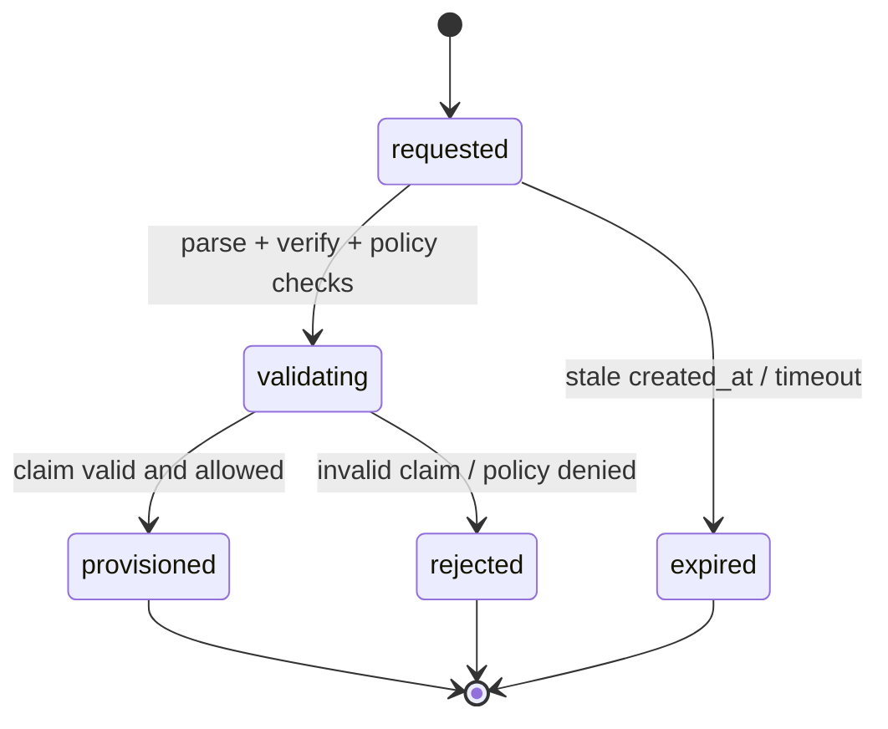
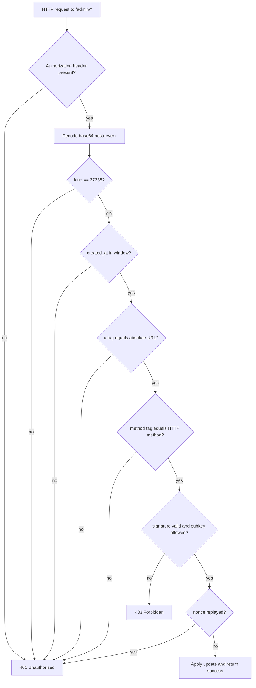

# Enterprise Provisioning and Access Engine

Date: 2026-04-22
Repository: nostream

## Goal
Build a permissioned, stateful, dynamically configurable layer in nostream by implementing:
- NIP-42 challenge-response authentication with robust WebSocket session state.
- NIP-70 protected-event enforcement in the ingestion pipeline.
- NIP-43 metadata and automated access provisioning state machine for kind 843 requests.
- NIP-98 cryptographically verified admin HTTP API for hot-reloadable rules and dynamic access control.

---

## Why This Approach Works

This works because it extends the exact control points where nostream already makes protocol and policy decisions.

1. WebSocket messages already pass through a single adapter and message dispatch path.
2. Event accept/reject policy already centralizes in the event message handler.
3. HTTP routes already exist for external control surfaces.
4. Settings already support runtime reloading.
5. Admission and payment-related user state already exists and can be reused.

Result: minimal disruption, lower regression risk, and clear ownership boundaries.

---

## How It Works End-to-End

1. A client opens a WebSocket connection.
2. Relay issues an auth challenge and stores pending auth context for that socket.
3. Client sends AUTH event.
4. Relay verifies signature, challenge binding, and freshness; socket session becomes authenticated.
5. Client sends EVENT.
6. If event is protected (NIP-70), relay checks socket auth session first.
7. Unauthorized protected events are dropped before storage and broadcast.
8. Kind 843 events trigger NIP-43 provisioning state machine transitions.
9. State machine updates access tier and user admission state.
10. Operator updates policy over HTTP using NIP-98 signed request.
11. Relay verifies signature, timestamp, and nonce, then hot-reloads rules.
12. New decisions use updated rules without dropping active connections.

---

## Implementation Plan

### Phase 1: NIP-42 Session State Manager

Scope:
- Add AUTH protocol support to message types and schema validation.
- Add per-socket session state fields:
  - challenge
  - authenticated pubkey
  - authenticated_at
  - auth_expires_at
  - access tier snapshot
- Add an AUTH message handler.
- Emit challenge on connect and after auth reset/expiry.

Design notes:
- Keep auth state socket-local for fast checks.
- Include challenge TTL and one-time-use semantics.
- Reset state on socket close.

Acceptance criteria:
- AUTH messages parse and validate.
- Valid AUTH marks session authenticated.
- Invalid or stale challenge is rejected.
- Session expires correctly and requires re-auth.

### Phase 2: NIP-70 Protected Event Enforcement

Scope:
- Add protected-event detection logic.
- Enforce protected-event authorization early in event ingestion.
- Require session auth for protected events.
- Require pubkey/session consistency for protected publish.

Design notes:
- Enforcement must occur before persistence and fan-out.
- Keep existing behavior unchanged for non-protected events.

Acceptance criteria:
- Protected events from unauthenticated sockets are rejected.
- Protected events from mismatched session pubkey are rejected.
- Protected events from valid auth session are accepted.
- Non-protected events preserve current behavior.

### Phase 3: NIP-43 Provisioning and Access State Machine

Scope:
- Add NIP-43 relay metadata endpoints.
- Add kind 843 request handling path.
- Implement automated provisioning state machine.
- Persist state transitions and outcomes.
- Update user access tiers/admission based on transitions.

Recommended state model:
- requested
- validating
- provisioned
- rejected
- expired

Design notes:
- Reuse existing admission/user primitives where possible.
- Make transitions idempotent and auditable.

Acceptance criteria:
- Metadata endpoints expose capability and policy info.
- Kind 843 requests trigger deterministic transitions.
- Provisioned state updates access tier and effective admission.
- Invalid requests transition to rejected with reason.

### Phase 4: NIP-98 Admin API and Hot Reload

Scope:
- Add NIP-98 verification middleware for admin routes.
- Add admin endpoints for:
  - reading current rules
  - updating access tiers
  - updating auth/session policy
  - applying config reload
- Apply updates without dropping active WebSocket connections.

Security notes:
- Verify signature, created_at window, and nonce replay protection.
- Keep a nonce cache with bounded TTL.
- Return explicit 401/403 reasons for failed verification.

Acceptance criteria:
- Unsigned or invalidly signed admin requests are denied.
- Valid signed requests are accepted.
- Updated policy is observable immediately for new decisions.
- Existing sockets remain connected during reload.

---

## File-Level Integration Map

Expected integration points in current codebase:
- WebSocket parsing and session lifecycle: src/adapters/web-socket-adapter.ts
- Message dispatch: src/factories/message-handler-factory.ts
- Message schema/types: src/schemas/message-schema.ts, src/@types/messages.ts
- Event authorization and ingestion checks: src/handlers/event-message-handler.ts
- Event strategy routing: src/factories/event-strategy-factory.ts
- HTTP route composition: src/routes/index.ts
- Relay capability metadata response: src/handlers/request-handlers/root-request-handler.ts
- Runtime settings reload hooks: src/utils/settings.ts
- Existing admission/user persistence: src/repositories/user-repository.ts
- Existing invoice/admission flow to reuse: src/controllers/invoices/post-invoice-controller.ts

---

## Testing Strategy

Unit tests:
- AUTH challenge validation and expiry.
- Session transition correctness.
- Protected-event allow/deny matrix.
- NIP-98 signature and replay checks.
- NIP-43 state transition table tests.

Integration tests:
- connect -> challenge -> AUTH -> protected EVENT success.
- protected EVENT rejection when unauthenticated.
- protected EVENT rejection when pubkey mismatched.
- kind 843 request transitions to provisioned/rejected as expected.
- admin rule update applies live without socket disconnect.

Regression tests:
- Existing REQ/CLOSE/COUNT paths unaffected.
- Existing non-protected EVENT path unchanged.
- Existing payment/admission functions remain operational.

---

## Delivery Sequence

1. Implement protocol surface and socket session model (NIP-42).
2. Wire protected-event gate in ingestion path (NIP-70).
3. Add provisioning domain model + state machine + kind 843 routing (NIP-43).
4. Add signed admin API + replay-safe middleware + hot reload (NIP-98).
5. Update relay metadata to advertise capabilities and constraints.
6. Complete test matrix and run full regression suite.

---

## Risks and Mitigations

Risk: auth bypass due to path gaps.
Mitigation: enforce NIP-70 in a single early gate in event ingestion before storage/fan-out.

Risk: replay attacks on admin API.
Mitigation: NIP-98 nonce cache, strict time window, and signature verification.

Risk: inconsistent provisioning state.
Mitigation: explicit finite state machine, idempotent transitions, transactional updates.

Risk: runtime instability on config updates.
Mitigation: atomic config swap with rollback-on-parse-failure and compatibility validation.

---

## Operational Outcome

After these phases, nostream supports:
- Stateful authenticated WebSocket sessions.
- Strict protected-event enforcement.
- Automated access provisioning driven by protocol events.
- Cryptographically controlled live operations without connection drops.

This makes the relay commercially viable while preserving protocol compliance and operational safety.


# Enterprise Provisioning and Access Engine (Reviewed, Corrected, and Explained)

Date: 2026-04-22
Repository: nostream

## Goal
Build a permissioned, stateful, dynamically configurable layer in nostream by implementing:
- NIP-42 challenge-response authentication with WebSocket session state.
- NIP-70 protected-event enforcement in the event ingestion path.
- NIP-43 relay access metadata and access request handling.
- NIP-98 cryptographically verified admin HTTP API for dynamic policy updates.

This document is both:
- A corrected implementation plan.
- A teaching guide that explains why each step exists and how it maps to the current code.

---

## Plan Review Summary (What Is Correct and What Needed Fixes)

### What was already correct
- The architecture assumptions are strong.
- The selected integration points map to real files in the codebase.
- The phased sequence (auth -> enforcement -> provisioning -> admin API) is low-risk and practical.

### Critical corrections applied
1. NIP-70 protected tag format:
  - Correct tag: `["-"]`.
  - Not a tag named `"protected"`.

2. NIP-43 request kinds:
  - Join request is kind `28934`.
  - Invite request is kind `28935`.
  - Leave request is kind `28936`.
  - Relay metadata/member events include kinds `13534`, `8000`, and `8001`.
  - `kind 843` is not a NIP-43 standard kind.

3. NIP-98 auth event details:
  - Auth event kind is `27235`.
  - Required tags: `u` (absolute URL) and `method`.
  - Optional tag: `payload` (sha256 of request body).

4. NIP-42 challenge semantics:
  - Challenge is valid for the connection (or until replaced by a new challenge).
  - One-time challenge use can be a stricter local policy, but it is not required by the NIP.

---

## Current-State Baseline (Before Changes)

These are the real control points already present in nostream:

1. WebSocket ingress and message validation:
  - `src/adapters/web-socket-adapter.ts`
  - Parses JSON, validates with Zod message schema, dispatches to message handlers.

2. Message dispatch factory:
  - `src/factories/message-handler-factory.ts`
  - Routes `EVENT`, `REQ`, `CLOSE`, `COUNT`.

3. Event acceptance gate:
  - `src/handlers/event-message-handler.ts`
  - Signature/id validation, limits, vanish checks, admission checks, NIP-05 checks.

4. Event strategy routing:
  - `src/factories/event-strategy-factory.ts`
  - Routes events to strategy implementations by kind/range.

5. HTTP routing and metadata response:
  - `src/routes/index.ts`
  - `src/handlers/request-handlers/root-request-handler.ts`

6. Runtime settings loading/reload foundation:
  - `src/utils/settings.ts`

7. Existing user/admission persistence:
  - `src/repositories/user-repository.ts`
  - `src/controllers/invoices/post-invoice-controller.ts`

Important status note:
- NIP-42, NIP-43, NIP-70, NIP-98 are not implemented yet.
- `package.json` `supportedNips` currently does not include `42`, `43`, `70`, or `98`.

---

## End-to-End Design (Explained)

### High-level sequence



Explanation:
- The WebSocket adapter is still the single ingress point.
- AUTH must be integrated as a normal message type, not a side channel.
- Protected event checks happen before persistence and before broadcast.

---

## Protocol-Correct Implementation Plan

## Phase 1: NIP-42 Session State Manager

### What this phase does
Adds authenticated connection state so later authorization decisions are cheap and deterministic.

### Why this is needed
Without socket-level auth state, NIP-70 cannot safely enforce "author must be authenticated".

### Files and changes
1. `src/@types/messages.ts`
  - Add `MessageType.AUTH`.
  - Extend incoming message union with auth message tuple.

2. `src/schemas/message-schema.ts`
  - Add `authMessageSchema`.
  - Enforce `kind === 22242` for client-auth events.
  - Add schema into `messageSchema` union.

3. `src/factories/message-handler-factory.ts`
  - Route `MessageType.AUTH` to new handler.

4. `src/handlers/auth-message-handler.ts` (new)
  - Validate signature, timestamp window, `challenge` tag, `relay` tag.
  - Mark pubkey as authenticated on current socket.
  - Emit `OK` result for AUTH event.

5. `src/adapters/web-socket-adapter.ts`
  - Add per-connection auth session state and helper methods.
  - Send initial relay challenge on connect.
  - Clear auth state on close.

6. `src/@types/adapters.ts`
  - Extend `IWebSocketAdapter` contract with auth-session methods used by handlers.

### Implementation example (aligned to existing factory/schema style)

```ts
// src/@types/messages.ts
export enum MessageType {
  REQ = 'REQ',
  EVENT = 'EVENT',
  AUTH = 'AUTH',
  CLOSE = 'CLOSE',
  NOTICE = 'NOTICE',
  EOSE = 'EOSE',
  OK = 'OK',
  COUNT = 'COUNT',
  CLOSED = 'CLOSED',
}

export type IncomingAuthMessage = [MessageType.AUTH, Event]

export type IncomingMessage = (
  | SubscribeMessage
  | IncomingEventMessage
  | IncomingAuthMessage
  | UnsubscribeMessage
  | CountMessage
) & {
  [ContextMetadataKey]?: ContextMetadata
}
```

```ts
// src/schemas/message-schema.ts
export const authMessageSchema = z.tuple([z.literal(MessageType.AUTH), eventSchema]).superRefine((val, ctx) => {
  const [, event] = val
  if (event.kind !== 22242) {
   ctx.addIssue({
    code: z.ZodIssueCode.custom,
    message: 'AUTH message event kind must be 22242',
   })
  }
})

export const messageSchema = z.union([
  eventMessageSchema,
  authMessageSchema,
  reqMessageSchema,
  closeMessageSchema,
  countMessageSchema,
])
```

### Acceptance criteria
- `AUTH` messages parse and route successfully.
- Valid NIP-42 event authenticates socket for that pubkey.
- Invalid challenge/relay/stale timestamp returns failed `OK`.
- Session auth is cleaned up on disconnect.

---

## Phase 2: NIP-70 Protected Event Enforcement

### What this phase does
Rejects protected events unless the current socket is authenticated for the same pubkey.

### Why this is needed
NIP-70 default stance is reject protected events. If relay supports protected publishing, it must require NIP-42 auth and pubkey consistency.

### Protocol details that must be enforced
1. Protected indicator tag is exactly `["-"]`.
2. Gate must run before strategy execution/persistence/broadcast.
3. Error reason should use machine-readable NIP-42 style prefix when auth is missing (`auth-required: ...`).

### Important compatibility note for this codebase
`TagBase` in `src/@types/base.ts` currently requires `tag[1]` to exist. NIP-70 uses one-item tags.
So this phase should also adjust tag typing to allow one-item tags safely.

### Files and changes
1. `src/@types/base.ts`
  - Make tag second element optional (`1?: string`) to reflect Nostr reality.

2. `src/handlers/event-message-handler.ts`
  - Add protected event check before existing `canAcceptEvent`/strategy execution boundary.

3. `src/utils/event.ts`
  - Ensure generic tag-query matching handles one-item tags safely where `tag[1]` is read.

### Implementation example

```ts
// src/handlers/event-message-handler.ts
private isProtectedEvent(event: Event): boolean {
  return event.tags.some((tag) => tag.length === 1 && tag[0] === '-')
}

private checkProtectedEventAuth(event: Event): string | undefined {
  if (!this.isProtectedEvent(event)) {
   return
  }

  if (!this.webSocket.isPubkeyAuthenticated(event.pubkey)) {
   return 'auth-required: this event may only be published by its author'
  }
}

// in handleMessage, before strategy.execute(event):
reason = this.checkProtectedEventAuth(event)
if (reason) {
  this.webSocket.emit(WebSocketAdapterEvent.Message, createCommandResult(event.id, false, reason))
  return
}
```

### Acceptance criteria
- Protected events from unauthenticated sockets are rejected.
- Protected events from mismatched authenticated pubkey are rejected.
- Protected events from matching authenticated pubkey are accepted.
- Non-protected events are behaviorally unchanged.

---

## Phase 3: NIP-43 Provisioning and Access State Machine

### What this phase does
Implements relay access request lifecycle and updates membership/admission outcomes.

### Why this is needed
It converts "manual access operations" into a protocol-visible, auditable workflow.

### Correct NIP-43 event model
- Join request: kind `28934`.
- Invite request: kind `28935` (ephemeral generation path).
- Leave request: kind `28936`.
- Relay member list publication: kind `13534`.
- Relay add member event: kind `8000`.
- Relay remove member event: kind `8001`.

If internal business logic still needs kind `843`, keep it as a relay-specific extension, not as the NIP-43 standard kind.

### State machine



Explanation:
- `requested`: event accepted as syntactically valid input.
- `validating`: deterministic rules are applied.
- `provisioned`: user admitted / access tier granted.
- `rejected`: request denied with explicit reason.
- `expired`: request too old to trust.

### Files and changes
1. `src/constants/base.ts`
  - Add missing event kind constants for NIP-43 kinds.

2. `src/factories/event-strategy-factory.ts`
  - Route `kind 28934` (and optionally 28936) to provisioning strategy.

3. `src/handlers/event-strategies/provisioning-event-strategy.ts` (new)
  - Implement transition function and persistence of outcomes.

4. `src/repositories/user-repository.ts`
  - Reuse/adapt `admitUser` and `upsert` flows for final access updates.

5. `src/handlers/request-handlers/root-request-handler.ts`
  - Update NIP-11 payload fields to advertise capabilities and restrictions.

### Implementation example

```ts
// src/factories/event-strategy-factory.ts
if (event.kind === EventKinds.RELAY_JOIN_REQUEST) {
  return new ProvisioningEventStrategy(adapter, eventRepository, userRepository)
}
```

```ts
// src/handlers/event-strategies/provisioning-event-strategy.ts
type ProvisioningState = 'requested' | 'validating' | 'provisioned' | 'rejected' | 'expired'

export class ProvisioningEventStrategy implements IEventStrategy<Event, Promise<void>> {
  public async execute(event: Event): Promise<void> {
   const state = this.transition(event)

   if (state === 'provisioned') {
    await this.userRepository.admitUser(event.pubkey, new Date())
   }

   await this.eventRepository.create(event)
  }

  private transition(event: Event): ProvisioningState {
   // deterministic validation logic here
   return 'provisioned'
  }
}
```

### Acceptance criteria
- Kind `28934` requests drive deterministic transitions.
- Final state updates user admission/access outcomes.
- Rejections return stable machine-readable reason text.
- Metadata/relay capability output reflects NIP-43 support.

---

## Phase 4: NIP-98 Admin API and Hot Reload

### What this phase does
Secures admin HTTP operations with Nostr signatures and applies policy changes live.

### Why this is needed
It enables operations teams to modify access/auth policy safely without restarting relay or dropping clients.

### NIP-98 rules to enforce
1. `Authorization: Nostr <base64-encoded event json>` header is required.
2. Event kind must be `27235`.
3. `created_at` must be within configured clock window.
4. `u` tag must equal absolute request URL.
5. `method` tag must equal HTTP method.
6. If request has body and client includes `payload` tag, verify body hash.

### Extra hardening (recommended)
- Nonce replay cache with short TTL.
- Explicit `401` vs `403` response reasons.
- Allowlist of admin pubkeys.

### Files and changes
1. `src/handlers/request-handlers/nip98-auth-middleware.ts` (new)
2. `src/routes/index.ts` and new `src/routes/admin.ts`
3. `src/utils/settings.ts` integration for atomic policy update/reload
4. `src/handlers/request-handlers/root-request-handler.ts` reflect auth requirements in NIP-11 limitation fields

### Middleware flow



### Implementation example

```ts
// src/handlers/request-handlers/nip98-auth-middleware.ts
export const nip98AuthMiddleware = async (req: Request, res: Response, next: NextFunction) => {
  const header = req.header('authorization') ?? ''
  const encoded = header.startsWith('Nostr ') ? header.slice(6) : ''
  if (!encoded) {
   res.status(401).send('missing nostr authorization')
   return
  }

  const event = JSON.parse(Buffer.from(encoded, 'base64').toString('utf8')) as Event
  if (event.kind !== 27235) {
   res.status(401).send('invalid nip98 event kind')
   return
  }

  if (!(await isEventSignatureValid(event))) {
   res.status(401).send('invalid signature')
   return
  }

  next()
}
```

---

## File-Level Integration Map (Explained)

1. `src/adapters/web-socket-adapter.ts`
  - Owns per-client connection lifecycle, ideal place for challenge issuance and socket auth state.

2. `src/factories/message-handler-factory.ts`
  - Single switch-based router for incoming messages, clean extension point for AUTH.

3. `src/schemas/message-schema.ts` and `src/@types/messages.ts`
  - Protocol surface contract. Add AUTH here first so invalid messages fail early.

4. `src/handlers/event-message-handler.ts`
  - Existing central allow/deny path. Add NIP-70 gate here before strategy execution.

5. `src/factories/event-strategy-factory.ts`
  - Existing kind routing; add NIP-43 strategy branch here.

6. `src/routes/index.ts`
  - Existing HTTP composition point. Mount admin router + NIP-98 middleware here.

7. `src/handlers/request-handlers/root-request-handler.ts`
  - NIP-11 output and capability metadata; update advertised NIPs and auth limitation flags.

8. `src/utils/settings.ts`
  - Existing reload foundation; use for safe runtime policy updates.

9. `src/repositories/user-repository.ts`
  - Existing admission persistence; reuse for provisioning outcomes.

10. `src/controllers/invoices/post-invoice-controller.ts`
   - Existing admission business flow that provisioning can integrate with or mirror.

---

## Testing Strategy (Concrete and Mapped to Existing Test Layout)

### Unit tests (Mocha style under `test/unit`)
1. `test/unit/handlers/auth-message-handler.spec.ts` (new)
  - challenge match, relay tag match, timestamp window, signature validity.

2. `test/unit/factories/message-handler-factory.spec.ts` (extend)
  - `AUTH` routing returns `AuthMessageHandler`.

3. `test/unit/handlers/event-message-handler.spec.ts` (extend)
  - protected event matrix for `["-"]`: unauthenticated/mismatched/matched.

4. `test/unit/handlers/request-handlers/nip98-auth-middleware.spec.ts` (new)
  - invalid header, stale event, URL mismatch, method mismatch, replay.

5. `test/unit/handlers/event-strategies/provisioning-event-strategy.spec.ts` (new)
  - deterministic state transitions and idempotency checks.

### Integration tests (Cucumber style under `test/integration/features`)
1. Add `test/integration/features/nip-42/` scenarios.
2. Add `test/integration/features/nip-70/` scenarios.
3. Add `test/integration/features/nip-43/` scenarios.
4. Add `test/integration/features/nip-98/` scenarios.

Required scenario matrix:
- connect -> challenge -> AUTH -> protected EVENT accepted.
- protected EVENT rejected when no AUTH.
- protected EVENT rejected on pubkey mismatch.
- join request (`28934`) transitions to provisioned/rejected deterministically.
- signed admin policy update becomes effective without disconnecting existing sockets.

### Regression checks
- Existing `REQ`, `CLOSE`, `COUNT` behavior unchanged.
- Non-protected `EVENT` path unchanged.
- Existing invoice/admission flow still functional.

---

## Delivery Sequence (Recommended)

1. Add protocol surface for AUTH (types, schemas, factory route).
2. Add socket auth-session model + AUTH handler.
3. Add NIP-70 protected gate in event ingestion.
4. Implement NIP-43 strategy + state machine + metadata updates.
5. Implement NIP-98 middleware + admin routes + replay protections.
6. Update supported NIPs in `package.json` and NIP-11 output.
7. Complete unit, integration, and regression suite.

---

## Risks and Mitigations

Risk: auth bypass due to split checks.
Mitigation: keep a single protected-event auth gate in `event-message-handler` before strategy execution.

Risk: replay attacks on admin API.
Mitigation: NIP-98 timestamp window + nonce cache + strict URL/method binding.

Risk: incorrect NIP-43 semantics.
Mitigation: use standard kinds (`28934`, `28935`, `28936`, `13534`, `8000`, `8001`) and treat custom kinds as extensions.

Risk: runtime instability during policy updates.
Mitigation: parse+validate new config before swapping active settings object.

Risk: tag-shape regressions due to `["-"]`.
Mitigation: make tag typing and tag-index reads robust for one-item tags.

---

## Operational Outcome

After this plan is implemented, nostream will support:
- Stateful authenticated WebSocket sessions (NIP-42).
- Correct protected-event enforcement using `["-"]` tags (NIP-70).
- Standards-compliant relay access request lifecycle (NIP-43).
- Signed, replay-resistant admin operations over HTTP (NIP-98).

This provides a production-grade enterprise access layer while preserving compatibility with existing relay architecture.
