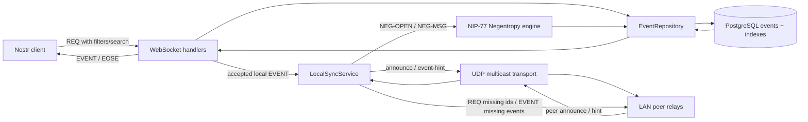
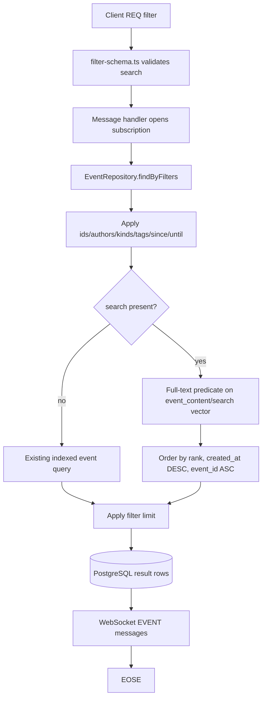
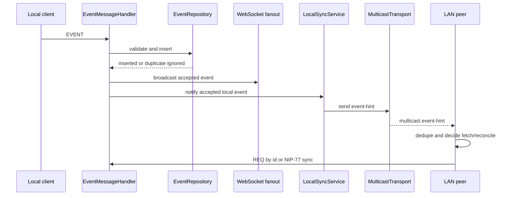
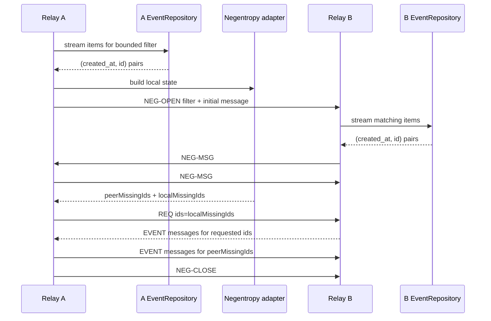
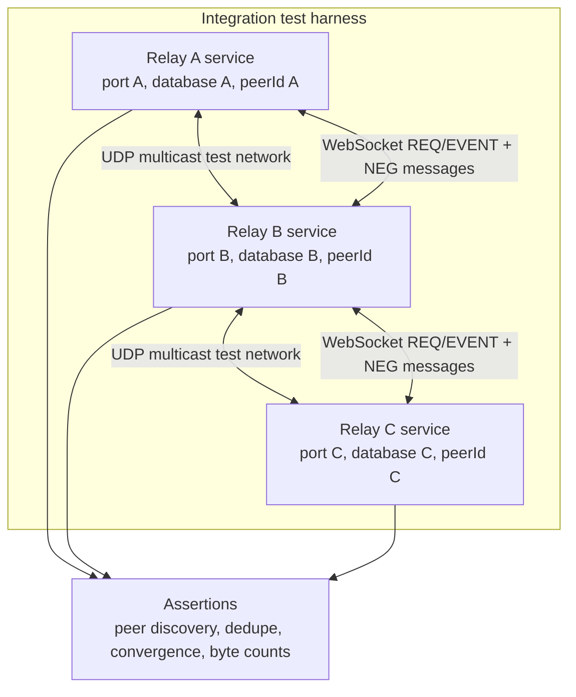
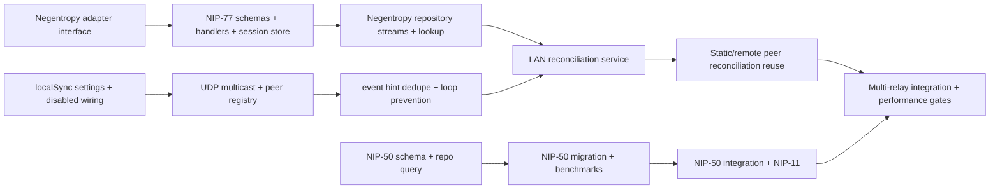

# Local-First Sync & Performance Engine Plan

## Purpose

This document is a planning artifact only. It does not change application behavior.

The goal is to evolve Nostream from a WebSocket relay with PostgreSQL-backed event storage into a local-first relay that can:

1. Serve NIP-50 full-text search efficiently from PostgreSQL.
2. Discover nearby relays over a LAN using UDP multicast.
3. Reconcile missing events with discovered peers using NIP-77 Negentropy.
4. Prove correctness and performance with integration tests that simulate multiple relays on one local network.

Relevant references:

- NIP-50: https://github.com/nostr-protocol/nips/blob/master/50.md
- NIP-77: https://github.com/nostr-protocol/nips/blob/master/77.md
- Negentropy protocol: https://github.com/hoytech/negentropy
- Notedeck repository: https://github.com/damus-io/notedeck

## Current Codebase Fit

Nostream already has most of the seams needed for this work:

- Event storage lives in `src/repositories/event-repository.ts`.
- Event queries already flow through `findByFilters()` and `countByFilters()`.
- Client message validation lives in `src/schemas/message-schema.ts` and `src/schemas/filter-schema.ts`.
- WebSocket message routing lives in `src/factories/message-handler-factory.ts`.
- Live fanout uses `WebSocketAdapterEvent.Broadcast` through `src/adapters/web-socket-adapter.ts` and `src/adapters/web-socket-server-adapter.ts`.
- App startup wires workers in `src/factories/worker-factory.ts` and `src/app/app.ts`.
- Database changes use Knex migrations in `migrations/`.
- Integration tests use Cucumber features under `test/integration/features/`.

The plan should therefore extend existing repository, schema, handler, adapter, and worker patterns rather than introducing an unrelated sync subsystem.

### System Shape



## Important Product Decisions To Make First

Before implementation, the team should explicitly decide:

1. Whether NIP-50 is always enabled or controlled by a `nip50.enabled` setting.
2. Whether multicast and Negentropy are opt-in by default. Recommendation: opt-in, because LAN gossip changes network behavior.
3. The multicast protocol envelope and version. Recommendation: version every packet from day one.
4. Whether LAN-discovered peers may push events directly over UDP or whether UDP is discovery-only. Recommendation: discovery plus small announcements only; use WebSocket and Negentropy for reliable transfer.
5. Which Negentropy JavaScript binding to use. If no mature binding is acceptable, isolate it behind an interface so a native/WASM binding can replace an initial implementation.

## Phase 0: Baseline Measurements And Design Validation

### Work

1. Capture current query plans for common relay filters:
   - by `ids`
   - by `authors`
   - by `kinds`
   - by tags through `event_tags`
   - by `since` and `until`
   - combinations of the above
2. Add a baseline benchmark scenario for text search once a candidate migration is drafted.
3. Inspect the current Notedeck multicast implementation location. The provided reference name is `multicast.rs`, but the repository path should be confirmed at implementation time because it may move.
4. Evaluate Negentropy libraries:
   - native Node binding
   - WASM binding
   - pure TypeScript implementation
   - external process fallback, only if necessary

### Why This Works

This task is performance-sensitive. Starting with query plans prevents adding indexes that look correct but are unused. The current repo already includes `scripts/benchmark-queries.ts` and `scripts/verify-index-impact.ts`, so the project has precedent for database proof harnesses.

## Phase 1: NIP-50 Search Support

### Database Plan

Add a Knex migration that prepares PostgreSQL for full-text search:

1. Enable required extensions if chosen:
   - `pg_trgm` for trigram matching and typo-tolerant fallback.
   - Built-in `tsvector` support for full-text ranking.
2. Add a generated or maintained search vector for `events.event_content`.
   - Preferred shape: a generated `tsvector` column if the supported PostgreSQL version allows the expression cleanly.
   - Alternative: expression index directly on `to_tsvector('english', event_content)`.
3. Add a GIN index for full-text search:
   - `CREATE INDEX CONCURRENTLY ... USING GIN (...)`
4. Consider a trigram GIN index on `event_content` only if benchmarked queries need substring or fuzzy search.
5. Keep the migration non-transactional if using `CREATE INDEX CONCURRENTLY`, matching the existing hot-path migration pattern.

### Query Plan

Extend the subscription filter type and schema:

- Add optional `search?: string` to `SubscriptionFilter`.
- Add `search` to `knownFilterKeys` in `filter-schema.ts`.
- Validate length and reject empty strings.

Extend `EventRepository.applyFilterConditions()`:

- If `search` is present, add a full-text predicate against `event_content`.
- Sort by search rank first, then use deterministic tie breakers such as `event_created_at DESC` and `event_id ASC`.
- Apply `limit` after rank ordering, as NIP-50 expects.
- Preserve ordinary filter restrictions such as `kinds`, `authors`, `ids`, tags, `since`, and `until`.

Expose support:

- Add `50` to `package.json.supportedNips`.
- Confirm NIP-11 relay info returns the updated list.

### Search Request Flow



### Tests

Unit tests:

- `filterSchema` accepts `search`.
- unknown filter behavior still rejects unsupported keys.
- `EventRepository.findByFilters()` builds the expected SQL for search-only and search-plus-kind queries.
- search queries preserve limits and ordering.

Integration tests:

- A client can subscribe with `{ "search": "phrase" }` and receive matching text notes.
- Non-matching content is not returned.
- Search combined with `kinds` and `authors` restricts results.
- Relay info advertises NIP-50.

### Why This Works

NIP-50 is intentionally a filter extension. Nostream already centralizes filter parsing and query generation, so adding `search` at that layer lets normal `REQ` behavior, streaming, EOSE handling, rate limits, and WebSocket delivery continue working. PostgreSQL GIN-backed full-text search keeps matching inside the database, where it can use indexes instead of scanning every event row in Node.

## Phase 2: UDP Multicast Discovery And LAN Gossip

### Architecture

Create a new transport module rather than embedding UDP handling inside WebSocket classes:

- `src/local-sync/multicast-transport.ts`
- `src/local-sync/local-peer-registry.ts`
- `src/local-sync/local-sync-service.ts`
- `src/@types/local-sync.ts`

Settings should live under a new namespace:

```yaml
localSync:
  enabled: false
  multicast:
    enabled: false
    address: "224.0.0.251"
    port: 1971
    interface: null
    ttl: 1
    announceIntervalMs: 5000
    peerTtlMs: 30000
  gossip:
    announceEvents: true
    maxPacketBytes: 1200
```

### Packet Model

Use compact JSON first unless benchmark results require binary packets. A versioned envelope is more important than binary optimization at the start:

```json
{
  "protocol": "nostream-local-sync",
  "version": 1,
  "relayId": "stable-random-node-id",
  "relayUrl": "ws://192.168.1.10:8008",
  "type": "announce",
  "timestamp": 1760000000
}
```

Packet types:

- `announce`: peer identity and relay URL.
- `event-hint`: event ID, created_at, kind, pubkey, optional short tag summary.
- `goodbye`: graceful shutdown.

### Loop Prevention

Use several safeguards together:

1. Stable local `relayId`, generated once and persisted.
2. Drop packets from the same `relayId`.
3. Track recently seen packet IDs or event IDs in a TTL cache.
4. Do not rebroadcast a LAN event hint received from multicast unless policy explicitly allows it.
5. Insert events with existing `onConflict().ignore()` / upsert behavior so duplicate delivery stays idempotent.
6. Keep multicast TTL at `1` by default so packets stay on the local network.

### Event Flow

For newly accepted local events:

1. Existing `EventMessageHandler` validates and stores the event.
2. Existing strategy broadcasts to connected WebSocket clients.
3. New local sync service receives an internal notification.
4. Multicast sends an `event-hint`, not the full event by default.
5. Peers that need the event fetch it through WebSocket `REQ` or through NIP-77 reconciliation.



### Tests

Unit tests:

- UDP packet validation accepts only supported protocol/version/type.
- packets from the local `relayId` are ignored.
- repeated packet IDs are ignored within TTL.
- malformed or oversized packets are ignored without crashing.

Integration tests:

- Start multiple local sync service instances on different UDP ports or isolated multicast settings.
- Relay A announces itself and Relay B records it.
- Relay A emits an event hint and Relay B schedules reconciliation/fetch.
- Duplicate hints do not trigger duplicate inserts or infinite rebroadcast.

### Why This Works

UDP multicast is well-suited for discovery because every local relay can announce itself without a central registry. It is not reliable enough for guaranteed event transfer, so it should only coordinate peers and wake up synchronization. This keeps multicast simple, limits packet size, avoids privacy surprises, and lets the reliable WebSocket plus database path remain the source of truth.

## Phase 3: NIP-77 Negentropy Reconciliation

### Protocol Support

Extend message types and schemas:

- Add `NEG-OPEN`, `NEG-MSG`, `NEG-CLOSE`, and `NEG-ERR` types.
- Add incoming schemas for:
  - `["NEG-OPEN", subscriptionId, filter, initialMessageHex]`
  - `["NEG-MSG", subscriptionId, messageHex]`
  - `["NEG-CLOSE", subscriptionId]`
- Add outgoing types for `NEG-MSG` and `NEG-ERR`.

Add handlers:

- `src/handlers/neg-open-message-handler.ts`
- `src/handlers/neg-msg-message-handler.ts`
- `src/handlers/neg-close-message-handler.ts`

Add session tracking:

- `src/local-sync/negentropy-session-store.ts`
- Sessions keyed by WebSocket connection plus Negentropy subscription ID.
- Time out inactive sessions to avoid unbounded memory growth.

### Repository Support

Add repository methods behind `IEventRepository`:

- `findNegentropyItems(filter): AsyncIterable<{ id: string; created_at: number }>`
- `findByIds(ids): Promise<Event[]>`
- possibly `hasIds(ids): Promise<Set<string>>`

The Negentropy item query must:

- apply the same filter semantics as normal subscriptions;
- exclude deleted and expired events;
- order by `event_created_at ASC, event_id ASC`, matching the NIP-77 item ordering requirement.

Add an index if needed:

- `(event_created_at, event_id)` partial index for active events, if existing indexes do not satisfy the reconciliation scan.

### Reconciliation Flow

When syncing with a peer:

1. Select a filter, usually bounded by time and kind to keep sessions reasonable.
2. Build local Negentropy state from matching `(created_at, id)` pairs.
3. Send `NEG-OPEN`.
4. Exchange `NEG-MSG` until the library reports:
   - IDs we have and peer lacks.
   - IDs peer has and we lack.
5. For IDs we lack, issue normal Nostr `REQ` filters by `ids`.
6. For IDs peer lacks, send normal `EVENT` messages.
7. Close with `NEG-CLOSE`.



### Local Peer Integration

The local sync service should use NIP-77 after multicast discovery:

- On new peer announcement, schedule a bounded reconciliation.
- On `event-hint` for an unknown event, either fetch that event by ID or schedule a small Negentropy sync window around the event timestamp.
- Apply backoff per peer to avoid reconciling constantly.
- Store peer health metadata in memory first; persistent peer cache can come later.

### Remote Peer Integration

The same Negentropy client can support configured static mirrors:

- For `mirroring.static`, optionally use Negentropy if the remote relay advertises NIP-77.
- Fall back to existing mirror behavior if unsupported.
- This makes LAN and clearnet/i2p/tor sync share one reconciliation engine.

### Tests

Unit tests:

- message schemas validate NIP-77 messages.
- session store opens, replaces duplicate IDs, times out, and closes sessions.
- repository item query orders by timestamp then ID.
- handler emits `NEG-ERR` for unsupported or oversized filters.

Integration tests:

- Two relays with different events reconcile until both have the union.
- A peer missing only one event fetches only that event.
- Duplicate existing events are ignored safely.
- Session timeout frees resources.
- A too-large filter is rejected with a `blocked:` error.

### Why This Works

Negentropy solves the expensive part of sync: identifying differences between two event sets without transferring every event ID. NIP-77 deliberately separates reconciliation from transfer. That matches Nostream well because event validation, insertion, duplicate handling, and WebSocket transfer already exist. The new code only needs to determine which IDs are missing, then reuse normal `REQ` and `EVENT` paths.

## Phase 4: End-To-End Local Network Tests

### Test Harness

Create a test helper that can start multiple relay instances in one process or in child processes:

- distinct `RELAY_PORT`
- distinct database schema or database name
- distinct local sync settings
- isolated peer IDs

Recommended first target:

- process-level services with dependency injection, because this is faster and easier to assert than Docker-only tests.



Add Cucumber scenarios such as:

1. `local-sync/discovery.feature`
   - Relay A and Relay B start with multicast enabled.
   - Each discovers the other.
2. `local-sync/event-hint.feature`
   - Relay A accepts an event.
   - Relay B learns about it and fetches it.
3. `local-sync/negentropy.feature`
   - Relay A has events 1 and 2.
   - Relay B has events 2 and 3.
   - After reconciliation both have 1, 2, and 3.
4. `local-sync/loop-prevention.feature`
   - A relayed event does not bounce indefinitely.
   - duplicate packets do not create duplicate DB rows.

### Performance Checks

Add measurable acceptance gates:

- NIP-50 search query plan uses the intended GIN index for seeded test data.
- Search with `limit` returns bounded results without full table scans at target scale.
- Multicast event hint processing remains bounded under duplicate packet bursts.
- Negentropy transfers fewer bytes than fetching all IDs for a partially overlapping dataset.

### Why This Works

This project crosses database, network, and protocol boundaries. Unit tests alone will miss failures in startup wiring, socket behavior, WebSocket transfer, and database idempotency. A multi-relay integration harness exercises the actual behavior the feature promises: local relays discover each other, compare state, and converge.

## Suggested Implementation Order

1. NIP-50 schema and repository query support.
2. NIP-50 migration and benchmarks.
3. NIP-50 integration tests and NIP-11 supported NIPs update.
4. Local sync settings and disabled-by-default service wiring.
5. UDP multicast transport and peer registry.
6. Event hint loop prevention.
7. Negentropy library adapter interface.
8. NIP-77 message schemas, handlers, and session store.
9. Repository methods for Negentropy item streams and event lookup by ID.
10. LAN reconciliation service using multicast-discovered peers.
11. Static/remote peer reconciliation reuse.
12. Full multi-relay integration suite and performance gates.



## Main Risks

1. Search index bloat.
   - Mitigation: benchmark `tsvector` expression vs generated column vs trigram index before committing to all indexes.

2. Unbounded Negentropy sessions.
   - Mitigation: session TTLs, max item limits, filter limits, and `blocked:` errors.

3. Multicast network surprises.
   - Mitigation: disabled by default, TTL 1, explicit interface config, packet size limits, and strict schema validation.

4. Sync loops.
   - Mitigation: stable relay IDs, packet dedupe, no default rebroadcast of received hints, idempotent inserts.

5. Native binding complexity.
   - Mitigation: hide Negentropy behind a small adapter interface and write contract tests against it.

6. Privacy expectations.
   - Mitigation: clear configuration docs; do not broadcast full events over UDP by default; allow operators to disable LAN discovery independently from remote Negentropy.

## Definition Of Done

The task is complete when:

1. Relay info advertises NIP-50 and NIP-77 when enabled.
2. `REQ` filters with `search` return ranked, limited, matching events.
3. PostgreSQL migrations create search indexes without blocking production tables unnecessarily.
4. Local relays discover each other through UDP multicast when enabled.
5. Event hints are deduplicated and cannot cause infinite rebroadcast.
6. NIP-77 sessions reconcile missing event IDs and transfer missing events through normal Nostr messages.
7. Multi-relay integration tests prove convergence from divergent initial states.
8. Performance tests show indexed search and efficient reconciliation at representative scale.

## Short Explanation

This approach works because it uses each mechanism for the job it is good at.

PostgreSQL handles search because the events already live there, and GIN-backed full-text indexes let the database answer text queries without pulling all content into Node. NIP-50 fits naturally into the existing filter pipeline, so existing subscription streaming and EOSE behavior stay intact.

UDP multicast handles discovery because local peers need a lightweight way to find each other without configuration. It should not be responsible for reliable delivery. By sending only announcements and event hints, the system gets fast local awareness without depending on UDP for correctness.

Negentropy handles correctness because it can compare two relay event sets mathematically and identify only the missing IDs. After that, Nostream can reuse normal WebSocket `REQ` and `EVENT` flows to move actual events, preserving validation, deduplication, replaceable-event behavior, and existing database constraints.

Together, these layers create a local-first sync engine: multicast finds peers, Negentropy finds differences, WebSockets transfer missing events, and PostgreSQL serves both normal subscriptions and search efficiently.
