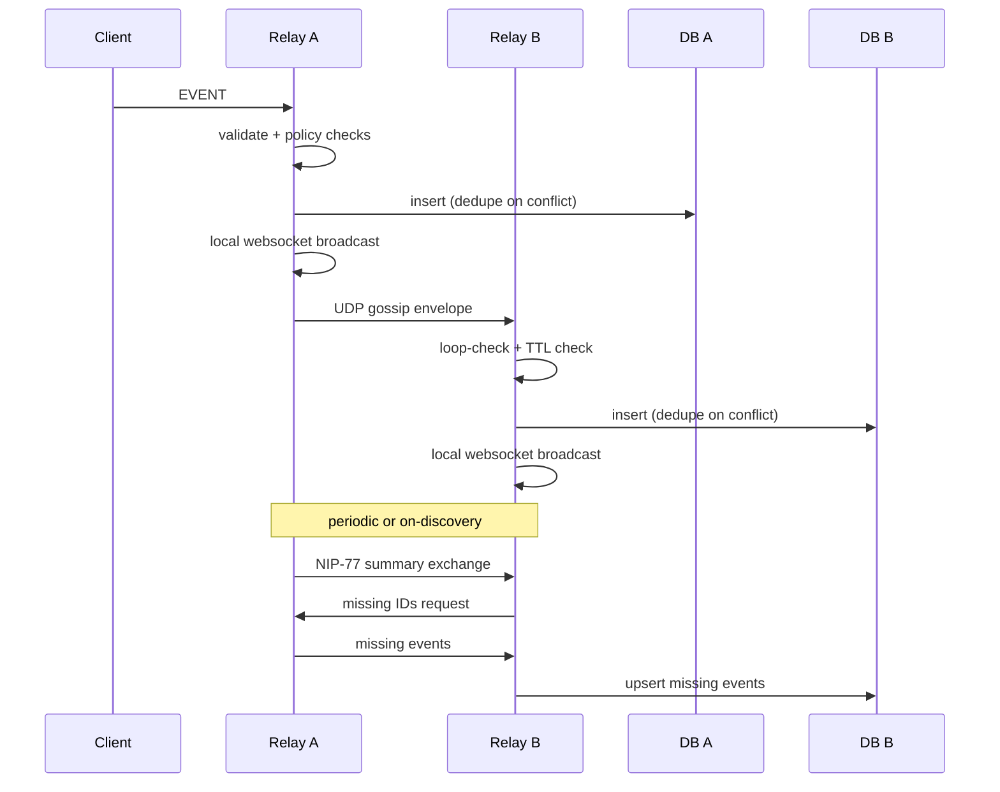
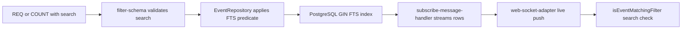
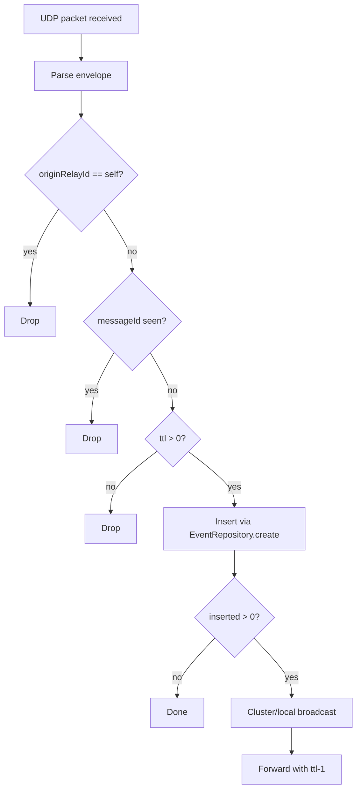
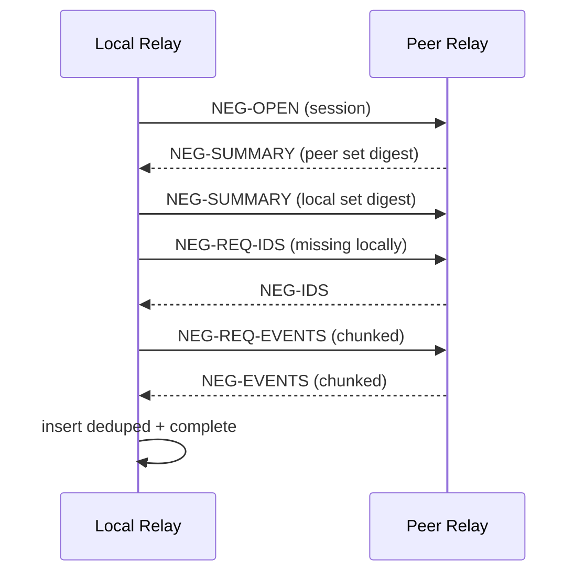
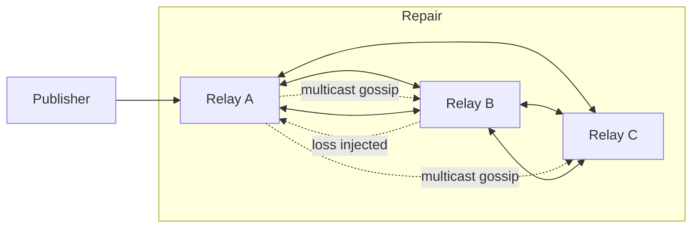

# Local-First Sync & Performance Engine

## Objective
Overhaul nostream data distribution from basic WebSocket pub/sub into a local-first sync engine with:

1. High-throughput, index-backed search (NIP-50).
2. LAN-native relay discovery and propagation (UDP multicast gossip).
3. Efficient eventual consistency repair (NIP-77 Negentropy).

## Why this works
This architecture works because each layer addresses a different failure mode:

1. NIP-50 + PostgreSQL indexing solves query scalability and response latency.
2. UDP multicast gossip solves low-latency, zero-config LAN propagation.
3. NIP-77 negentropy solves correctness after loss, restart, or partition.

If only one layer is added, a core requirement is still missing:

- Only DB optimization: fast local queries, but no better peer sync.
- Only gossip: realtime delivery, but packet loss and drift remain.
- Only negentropy: converges eventually, but poor realtime UX by itself.

Stacking all three gives both speed and correctness.

## How it works end-to-end
When a new event is published to Relay A:

1. Relay A validates and stores it.
2. Relay A broadcasts it to local clients and worker peers.
3. Relay A gossips the event over UDP multicast to LAN relays.
4. Relay B receives gossip, deduplicates, stores, and rebroadcasts.
5. If Relay B missed anything, negentropy reconciliation requests only missing events and converges state.

Result:

- Gossip provides realtime propagation.
- Negentropy guarantees eventual consistency.
- Search/indexing keeps read paths fast as volume grows.

## Current codebase anchors
Implementation should extend existing seams rather than replace architecture:

- Event query core: `src/repositories/event-repository.ts`
- Subscription flow: `src/handlers/subscribe-message-handler.ts`
- Event ingest flow: `src/handlers/event-message-handler.ts`
- Broadcast fanout: `src/adapters/web-socket-adapter.ts`, `src/adapters/web-socket-server-adapter.ts`
- Cluster worker fanout: `src/app/app.ts`
- Existing relay-to-relay mirroring worker: `src/app/static-mirroring-worker.ts`
- Migration/index pattern: `migrations/20260420_120000_add_hot_path_indexes.js`
- Query plan benchmark harness: `src/scripts/benchmark-queries.ts`

## Expected outcomes

- Add DB migrations and logic for optimized full-text search indexes (NIP-50).
- Build UDP multicast transport to broadcast and ingest local events with loop prevention.
- Integrate NIP-77 negentropy for efficient peer reconciliation over local and remote transports.
- Add integration tests that simulate multi-relay broadcast and reconciliation behavior.

## Phased implementation plan

### Phase 1: NIP-50 search and database optimization

Scope:

1. Extend subscription filter types to include a search term field.
2. Extend message/filter validation schema to accept the NIP-50 search field.
3. Extend `EventRepository.findByFilters` and `countByFilters` to apply search criteria.
4. Add migration(s) for full-text search support:
   - `tsvector` generated column (or equivalent maintained field).
   - GIN index over search vector.
   - Optional secondary index strategy if query patterns justify it.
5. Extend benchmark script with NIP-50 search query shapes.
6. Update docs and supported NIP metadata after completion.

Why first:

- Search changes query cardinality and planning behavior.
- Indexing foundation is needed before adding more traffic from LAN sync.

Acceptance criteria:

1. Search filters execute with predictable low latency at realistic dataset size.
2. EXPLAIN plans show index usage for canonical NIP-50 queries.
3. Existing REQ/COUNT behavior remains correct.

### Phase 2: UDP multicast gossip transport

Scope:

1. Add a dedicated gossip worker type (parallel to existing worker roles).
2. Implement UDP multicast discovery announcements:
   - Relay identity
   - Reachability metadata
   - Heartbeat cadence with jitter
3. Implement event gossip envelopes:
   - Message id
   - Origin relay id
   - Event id/event payload
   - TTL/hop-count
4. Implement loop prevention:
   - Seen message cache (bounded + TTL)
   - Origin suppression
   - TTL depletion checks
5. Persist received events through existing repository dedupe path.
6. Rebroadcast received events through existing local broadcast path.

Why second:

- Adds LAN realtime propagation once query/storage path is ready.
- Can be isolated in worker process and rolled out incrementally.

Acceptance criteria:

1. Relays on the same LAN discover each other automatically.
2. New events propagate across peers without manual static mirror config.
3. No infinite loop or broadcast storm in multi-peer topology.

### Phase 3: NIP-77 Negentropy reconciliation

Scope:

1. Add peer sync sessions over WebSocket (LAN-discovered and remote peers).
2. Implement negentropy set-summary exchange and diff detection.
3. Request and ingest only missing events/ids.
4. Trigger reconciliation:
   - On peer discovery
   - On interval with jitter
   - On mismatch heuristics
5. Add backpressure and chunking controls for large diffs.

Why third:

- Gossip gets events there quickly; negentropy repairs inevitable misses.
- Keeps repair bandwidth lower than full replay.

Acceptance criteria:

1. After induced packet loss or peer restart, relays converge to same event set.
2. Repair traffic is significantly smaller than full history replay.
3. Reconciliation remains stable under concurrent publish load.

### Phase 4: Integration and resilience testing

Scope:

1. Add integration scenarios for:
   - Multi-relay LAN gossip
   - Packet loss/out-of-order delivery
   - Relay restart and catch-up
   - Gossip + negentropy convergence
2. Validate correctness and performance envelopes:
   - Propagation latency percentiles
   - Reconciliation completion time
   - DB query plan regressions
3. Add operational docs and tunables:
   - Multicast group/port
   - Gossip TTL/cache size
   - Reconciliation interval/chunk size

Acceptance criteria:

1. CI passes deterministic multi-relay scenarios.
2. System reaches eventual consistency under adverse network conditions.
3. Performance targets are met or documented with constraints.

## Suggested execution order and team split

1. Track A (DB/Search): NIP-50 schema, repository logic, migration, benchmark.
2. Track B (Transport): Multicast worker, gossip protocol, loop prevention.
3. Track C (Consistency): Negentropy protocol integration and sync scheduling.
4. Track D (Quality): Integration harness, chaos scenarios, observability.

Recommended order:

1. Complete Track A baseline first.
2. Run Tracks B and D in parallel.
3. Add Track C after gossip baseline is stable.
4. Finish with hardening and docs.

## Risks and mitigations

1. Risk: Search queries degrade hot paths.
   - Mitigation: Add benchmarks and EXPLAIN checks before and after migration.
2. Risk: Gossip loops or storms.
   - Mitigation: Message id cache, TTL, origin checks, bounded fanout.
3. Risk: Reconciliation overload on large divergence.
   - Mitigation: Chunking, pacing, and periodic sync windows with backpressure.
4. Risk: Worker/process complexity.
   - Mitigation: Isolate responsibilities per worker type and keep interfaces narrow.

## Definition of done
A release is done when all of the following are true:

1. NIP-50 search is functional, indexed, benchmarked, and documented.
2. LAN relays auto-discover and gossip events with no loops.
3. Negentropy reconciliation converges state after missed gossip.
4. Integration tests prove propagation + repair across multiple relays.
5. Operator-facing configuration and troubleshooting docs are updated.

---

# Local-First Sync & Performance Engine (Reviewed)

Last reviewed: 2026-04-22

## Objective

Move nostream from relay-local fanout into a local-first sync engine that is:

1. Fast to query at scale (NIP-50 search + indexes).
2. Fast to propagate on a LAN (UDP multicast gossip).
3. Correct after loss/restart/partition (NIP-77 negentropy repair).

## Review summary: what is correct and what needed adjustment

The original plan direction is correct. The following corrections make it implementation-safe for this codebase.

1. Correct: existing extension seams are accurate.
   - Query path is centralized in `src/repositories/event-repository.ts`.
   - REQ streaming path is in `src/handlers/subscribe-message-handler.ts`.
   - Ingest validation path is in `src/handlers/event-message-handler.ts`.
   - Worker fanout model is in `src/app/app.ts` + `src/index.ts`.
   - Static relay-to-relay worker pattern exists in `src/app/static-mirroring-worker.ts`.

2. Important correction for NIP-50:
   - Adding `search` only to DB query code is not enough.
   - Live event fanout uses in-memory matching in `src/utils/event.ts` (`isEventMatchingFilter`) via `src/adapters/web-socket-adapter.ts`.
   - Therefore Phase 1 must also include in-memory search matching semantics for realtime push correctness.

3. Important correction for validation:
   - `src/schemas/filter-schema.ts` currently treats unknown keys as arrays via `catchall`.
   - NIP-50 `search` is a string field, so it must be explicitly defined and added to `knownFilterKeys`.

4. Important correction for rollout:
   - `supportedNips` is served from `package.json` and reflected by `src/handlers/request-handlers/root-request-handler.ts`.
   - Only add NIP 50 and 77 to metadata after implementation is fully working.

## Why this layered approach works

Each layer fixes a different failure mode:

1. NIP-50 + indexes fix read latency and query scalability.
2. UDP gossip fixes low-latency local propagation and zero-config peer discovery.
3. NIP-77 fixes state drift and packet-loss recovery.

If only one is implemented:

- DB-only: fast local reads, no peer sync improvement.
- Gossip-only: fast delivery, but loss/drift persists.
- Negentropy-only: eventual correctness, weak realtime UX.

Together they provide fast-now plus correct-later behavior.

## End-to-end target flow



## Current codebase anchors

Use these seams instead of introducing parallel architecture:

1. Query core: `src/repositories/event-repository.ts`
2. REQ stream: `src/handlers/subscribe-message-handler.ts`
3. COUNT path: `src/handlers/count-message-handler.ts`
4. In-memory filter match: `src/utils/event.ts`
5. Local broadcast: `src/adapters/web-socket-adapter.ts`, `src/adapters/web-socket-server-adapter.ts`
6. Cluster fanout: `src/app/app.ts`, `src/app/worker.ts`
7. Worker dispatch: `src/index.ts`
8. Existing peer worker pattern: `src/app/static-mirroring-worker.ts`
9. Migration/index style: `migrations/20260420_120000_add_hot_path_indexes.js`
10. Query benchmark harness: `src/scripts/benchmark-queries.ts`

## Phase 1: NIP-50 search and DB optimization

### What this phase means

Add a `search` filter to REQ/COUNT, execute it efficiently in PostgreSQL, and keep realtime push behavior consistent with the DB path.

### Why this phase is first

All later sync work increases event volume. If query/index shape is weak first, new transport work amplifies pain instead of value.

### Required changes

1. Type system:
   - Add optional `search?: string` to `SubscriptionFilter` in `src/@types/subscription.ts`.

2. Validation:
   - Add `search` to `knownFilterKeys` in `src/schemas/filter-schema.ts`.
   - Add explicit Zod validation for non-empty bounded string.

3. Query engine:
   - Extend `EventRepository.applyFilterConditions` so `findByFilters` and `countByFilters` both apply search.

4. Live matching correctness:
   - Extend `isEventMatchingFilter` in `src/utils/event.ts` to handle `search` for immediate fanout path.

5. Migration:
   - Add FTS index migration following concurrent-index pattern already used in this repository.

6. Benchmark:
   - Add NIP-50 query shape to `src/scripts/benchmark-queries.ts` and verify index usage via EXPLAIN.

7. Metadata/docs:
   - Update documentation and `package.json` `supportedNips` only after implementation is complete.

### Code example: filter type and schema

```ts
// src/@types/subscription.ts
export interface SubscriptionFilter {
  ids?: EventId[]
  kinds?: (EventKinds | number)[]
  since?: number
  until?: number
  authors?: Pubkey[]
  search?: string
  limit?: number
  [key: `#${string}`]: string[]
}
```

```ts
// src/schemas/filter-schema.ts
const knownFilterKeys = new Set(['ids', 'authors', 'kinds', 'since', 'until', 'limit', 'search'])

export const filterSchema = z
  .object({
    ids: z.array(prefixSchema).optional(),
    authors: z.array(prefixSchema).optional(),
    kinds: z.array(kindSchema).optional(),
    since: createdAtSchema.optional(),
    until: createdAtSchema.optional(),
    limit: z.number().int().min(0).optional(),
    search: z.string().trim().min(1).max(256).optional(),
  })
  .catchall(z.array(z.string().min(1).max(1024)))
```

### Code example: repository search predicate

```ts
// src/repositories/event-repository.ts (inside applyFilterConditions)
if (typeof currentFilter.search === 'string' && currentFilter.search.trim().length > 0) {
  const term = currentFilter.search.trim()
  builder.andWhereRaw(
    `to_tsvector('simple', coalesce(events.event_content, '')) @@ plainto_tsquery('simple', ?)`,
    [term],
  )
}
```

### Code example: live-path search matching

```ts
// src/utils/event.ts (inside isEventMatchingFilter)
if (typeof filter.search === 'string') {
  const terms = filter.search
    .toLowerCase()
    .trim()
    .split(/\s+/)
    .filter(Boolean)

  const haystack = event.content.toLowerCase()

  // Require all tokens for a simple, predictable runtime match.
  if (!terms.every((t) => haystack.includes(t))) {
    return false
  }
}
```

### Code example: migration for FTS index

```sql
CREATE INDEX CONCURRENTLY IF NOT EXISTS events_content_fts_idx
ON events USING GIN (to_tsvector('simple', coalesce(event_content, '')));
```

### Diagram: Phase 1 data path



### Acceptance criteria

1. Search queries are index-backed with stable low latency at realistic volume.
2. REQ stream and live push both respect `search` semantics.
3. COUNT path returns correct values with `search` filter.

## Phase 2: UDP multicast gossip transport

### What this phase means

Add a LAN worker that discovers peers and spreads events quickly over multicast with strict loop controls.

### Why this phase is second

This gives realtime LAN propagation after read/query path is hardened. It can be rolled out incrementally because worker boundaries already exist.

### Required changes

1. Add worker type:
   - Add `gossip` case in `src/index.ts`.
   - Spawn gossip worker in `src/app/app.ts` using `WORKER_TYPE: 'gossip'`.
   - Create factory similar to static mirroring worker.

2. Add transport worker:
   - New worker using Node `dgram` multicast.
   - Emit cluster messages when new events are accepted.

3. Add envelope and loop prevention:
   - Envelope fields: `messageId`, `originRelayId`, `event`, `ttl`, `sentAt`.
   - Seen-cache with TTL and size bound.
   - Drop if origin is self, seen before, or ttl <= 0.

4. Ingest using existing dedupe seam:
   - Use `eventRepository.create(event)` and broadcast only when inserted.

5. Config and docs:
   - Add settings for multicast group/port/ttl/cache and heartbeat interval.

### Code example: worker dispatch extension

```ts
// src/index.ts
case 'gossip':
  return gossipWorkerFactory()
```

```ts
// src/app/app.ts
createWorker({
  WORKER_TYPE: 'gossip',
})
```

### Code example: gossip envelope + receive guard

```ts
type GossipEnvelope = {
  kind: 'event'
  messageId: string
  originRelayId: string
  ttl: number
  sentAt: number
  event: Event
}

if (env.originRelayId === relayId) return
if (env.ttl <= 0) return
if (seenCache.has(env.messageId)) return

seenCache.add(env.messageId)
const inserted = await eventRepository.create(env.event)

if (inserted > 0 && cluster.isWorker && typeof process.send === 'function') {
  process.send({ eventName: WebSocketServerAdapterEvent.Broadcast, event: env.event })
}
```

### Diagram: gossip loop prevention



### Acceptance criteria

1. LAN peers discover each other automatically.
2. New events appear on peers without static mirror config.
3. No infinite loops or storms under multi-peer topology.

## Phase 3: NIP-77 negentropy reconciliation

### What this phase means

Use periodic summary/diff sync so peers converge even when gossip packets were missed.

### Why this phase is third

Realtime comes first via gossip; negentropy then repairs misses with low bandwidth.

### Required changes

1. Peer session manager:
   - Reuse WS relay-to-relay style from static mirroring pattern, but for reconciliation sessions.

2. Summary exchange:
   - Exchange compact set summaries per bucket/window.

3. Targeted repair:
   - Request missing IDs only.
   - Fetch and ingest only missing events.

4. Scheduling:
   - Trigger on discovery, periodic jittered intervals, and mismatch heuristics.

5. Backpressure:
   - Chunk size limits, per-peer concurrency caps, retry budget.

### Code example: scheduler skeleton

```ts
for (const peer of peerRegistry.activePeers()) {
  if (syncBudget.exhausted(peer.id)) continue

  const summary = await negentropyClient.fetchSummary(peer)
  const diff = negentropy.diff(localSetSummary(), summary)

  for (const chunk of chunkIds(diff.missingLocally, 500)) {
    const events = await negentropyClient.fetchEvents(peer, chunk)
    await eventRepository.createMany(events)
  }
}
```

### Diagram: negentropy cycle



### Acceptance criteria

1. Packet loss or restart still converges peers to same event set.
2. Repair bytes are significantly lower than full replay.
3. Reconciliation remains stable under concurrent publish load.

## Phase 4: Integration and resilience testing

### What this phase means

Prove correctness and performance under realistic multi-relay conditions, including adverse network behavior.

### Why this phase matters

Transport systems fail at boundaries, not in unit tests. This phase validates behavior that matters in production.

### Required changes

1. Integration scenarios in existing cucumber harness (`test/integration/features`).
2. Multi-relay topology in Docker test environment.
3. Fault injection for packet loss, reordering, and restart.
4. Metrics assertions for propagation and convergence windows.

### Code example: cucumber scenario outline

```gherkin
Scenario: Gossip plus negentropy converges after packet loss
  Given three relays on the same LAN multicast group
  And relay B drops 30 percent of gossip packets for 60 seconds
  When 500 events are published to relay A
  Then relay C receives near-realtime propagation
  And relay B converges to the same event id set within 120 seconds
  And reconciliation traffic is lower than full replay
```

### Diagram: test topology



### Acceptance criteria

1. CI passes deterministic multi-relay scenarios.
2. Eventual consistency holds under packet loss and restart.
3. Performance envelope is measured and documented.

## Execution order and team split

1. Track A (DB/Search): schema, repository, validation, benchmark.
2. Track B (Transport): gossip worker, envelopes, loop prevention.
3. Track C (Consistency): NIP-77 sessions, diff/repair scheduler.
4. Track D (Quality): integration harness, chaos tests, observability.

Recommended order:

1. Finish Track A baseline first.
2. Run Track B and Track D in parallel after Track A baseline.
3. Add Track C after gossip baseline is stable.
4. Finish with hardening and docs.

## Risks and mitigations (expanded)

1. Risk: search path regresses existing hot queries.
   - Mitigation: benchmark before/after using `src/scripts/benchmark-queries.ts` and EXPLAIN plan checks.

2. Risk: gossip loops or storms.
   - Mitigation: message ID cache, bounded TTL, origin suppression, rebroadcast only on insert success.

3. Risk: large divergence overwhelms repair.
   - Mitigation: chunking, pacing, peer-level backpressure, retry budget.

4. Risk: worker complexity and operational drift.
   - Mitigation: one responsibility per worker type, explicit settings, health/metrics per worker.

5. Risk: semantics mismatch between DB search and live in-memory matching.
   - Mitigation: define and document matching contract, add integration tests that assert parity.

## Definition of done

A release is done only when all are true:

1. NIP-50 `search` works for REQ, COUNT, and live push; index-backed; benchmarked.
2. LAN relays auto-discover and gossip without loops or storms.
3. NIP-77 reconciliation converges state after packet loss/restart.
4. Integration tests demonstrate propagation plus repair across multi-relay topologies.
5. Operator docs include configuration, tuning, and troubleshooting.
6. `supportedNips` metadata includes newly implemented NIPs only after verification.
