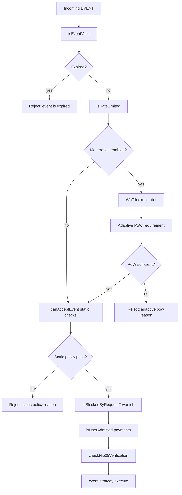
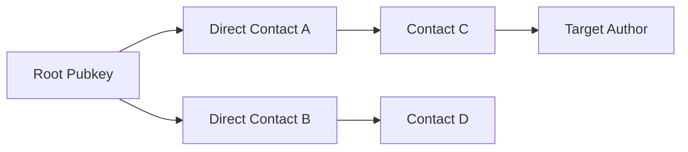
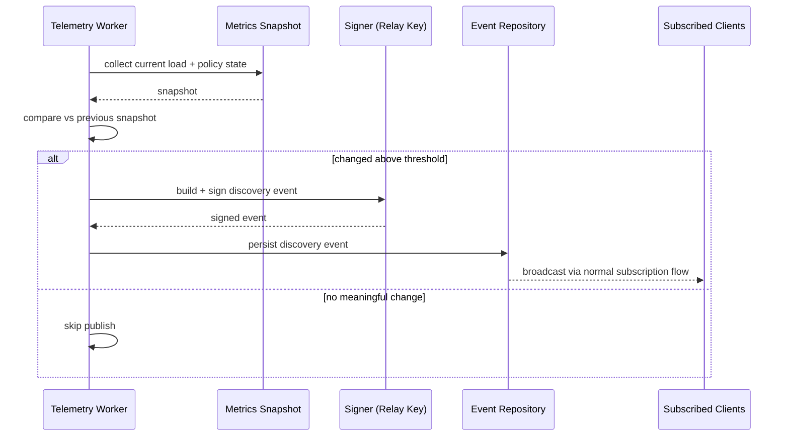

# Moderation and Discovery Engine: Reviewed Plan and Implementation Guide

## Goal

Reduce relay spam while preserving usability by combining:

1. WoT distance from NIP-02 contact-list traversal.
2. Adaptive NIP-13 proof-of-work difficulty from live load.
3. Continuous NIP-66 relay-state publishing so clients can adapt before posting.

This model keeps publishing practical for known/trusted users while making abuse increasingly expensive for unknown actors.

## Correctness review against this repository

The strategy is correct, but these implementation details must be adjusted to match current code:

1. `EventMessageHandler.canAcceptEvent` is synchronous today, so WoT + adaptive PoW should be implemented as a new async gate (or refactor `canAcceptEvent` to async everywhere).
2. Current event flow is: validation -> expiration -> rate-limit -> `canAcceptEvent` -> request-to-vanish -> admission/payment -> NIP-05 -> strategy execution. Integration should preserve this order and insert adaptive checks explicitly.
3. Kind `3` contact lists are currently handled by generic replaceable strategy, so WoT ingestion requires adding a dedicated contact-list hook/strategy.
4. Contact-list handling must respect replaceable semantics by `created_at`: stale lists from the same author must not overwrite newer graph edges.
5. Multi-worker consistency requires Redis-backed WoT state (in-memory-only mode is fine for tests/single-process).
6. Settings are file-watched and reloaded already, so moderation config can be rolled out/rolled back via settings files.
7. Fix typo in API shape: `getDistance(from, to, maxDepth)` (remove trailing `s`).

## Why this works

The design combines three reinforcing defenses:

1. Social trust (WoT tier).
2. Computational cost (PoW).
3. Live relay conditions (telemetry).

Attackers must defeat all three simultaneously. Legitimate users mainly experience friction when they are unknown and/or the relay is under pressure.

## End-to-end flow



## Milestone 1: WoT graph service (NIP-02)

Build a service that ingests kind `3` contact-list events and stores directional edges.

### Deliverables

1. In-memory adjacency implementation for local/test usage.
2. Redis-backed adjacency for multi-worker consistency.
3. Bounded BFS distance lookup with `maxDepth`.
4. Tier mapping from distance to trust class.

### API shape

1. `ingestContactList(event)`
2. `getDistance(from, to, maxDepth)`
3. `getTier(distance | undefined)`

### TypeScript example

```ts
export interface IWoTGraphService {
	ingestContactList(event: Event): Promise<void>
	getDistance(from: string, to: string, maxDepth: number): Promise<number | undefined>
	getTier(distance: number | undefined): 'self' | 'direct' | 'extended' | 'unknown'
}

export class RedisWoTGraphService implements IWoTGraphService {
	public constructor(private readonly cache: ICacheAdapter) {}

	public async ingestContactList(event: Event): Promise<void> {
		const tsKey = `wot:${event.pubkey}:ts`
		const contactsKey = `wot:${event.pubkey}:contacts`

		const prevTs = Number(await this.cache.getKey(tsKey)) || 0
		if (event.created_at <= prevTs) {
			return
		}

		const contacts = event.tags
			.filter((t) => t[0] === 'p' && typeof t[1] === 'string' && t[1].length > 0)
			.map((t) => t[1])

		await this.cache.setKey(tsKey, String(event.created_at))
		await this.cache.setKey(contactsKey, JSON.stringify(contacts))
	}

	public async getDistance(from: string, to: string, maxDepth: number): Promise<number | undefined> {
		if (from === to) return 0

		const visited = new Set<string>([from])
		let frontier: string[] = [from]

		for (let depth = 1; depth <= maxDepth; depth++) {
			const next: string[] = []

			for (const node of frontier) {
				const raw = await this.cache.getKey(`wot:${node}:contacts`)
				if (!raw) continue

				const neighbors = JSON.parse(raw) as string[]
				for (const n of neighbors) {
					if (n === to) return depth
					if (!visited.has(n)) {
						visited.add(n)
						next.push(n)
					}
				}
			}

			frontier = next
			if (frontier.length === 0) break
		}

		return undefined
	}

	public getTier(distance: number | undefined): 'self' | 'direct' | 'extended' | 'unknown' {
		if (distance === 0) return 'self'
		if (distance === 1) return 'direct'
		if (typeof distance === 'number' && distance <= 3) return 'extended'
		return 'unknown'
	}
}
```

### Graph traversal model



`distance(T) = 3` in this example.

## Milestone 2: Adaptive PoW policy service (NIP-13)

Implement a policy engine for event-specific required PoW:

$$
requiredBits = clamp(baseBits + loadPenalty + tierAdjustment, minBits, maxBits)
$$

Where:

1. `baseBits` is operator baseline.
2. `loadPenalty` grows with relay pressure.
3. `tierAdjustment` is lower (or negative) for stronger trust tiers.

### TypeScript example

```ts
export interface RelayLoadMetrics {
	connectedClients: number
	eventsPerSecond1m: number
	rateLimitHitRatio1m: number
}

export function computeRequiredBits(input: {
	baseBits: number
	minBits: number
	maxBits: number
	loadPenalty: number
	tierAdjustment: number
}): number {
	const raw = input.baseBits + input.loadPenalty + input.tierAdjustment
	return Math.max(input.minBits, Math.min(input.maxBits, raw))
}
```

## Milestone 3: Integrate WoT + Adaptive PoW in admission path

### Important integration rule

Do not weaken existing static policy. Effective required bits should be:

$$
effectiveBits = max(staticMinBits, adaptiveBits)
$$

### TypeScript example (EventMessageHandler)

```ts
protected async checkAdaptiveModeration(event: Event): Promise<string | undefined> {
	const moderation = this.settings().moderation
	if (!moderation?.enabled) return

	const distance = await this.wotGraphService.getDistance(
		moderation.wot.rootPubkeys?.[0] ?? event.pubkey,
		event.pubkey,
		moderation.wot.maxDepth,
	)

	const tier = this.wotGraphService.getTier(distance)
	const adaptiveBits = await this.adaptivePowService.getRequiredBits(event.pubkey, tier)

	const staticBits = this.settings().limits?.event?.eventId?.minLeadingZeroBits ?? 0
	const requiredBits = Math.max(staticBits, adaptiveBits ?? 0)

	if (requiredBits <= 0) return

	const actualBits = getEventProofOfWork(event.id)
	if (actualBits < requiredBits) {
		return `pow: adaptive difficulty ${actualBits}<${requiredBits} tier=${tier}`
	}
}

// In handleMessage(), call checkAdaptiveModeration() after isRateLimited()
// and before canAcceptEvent().
```

### Strategy hook for kind 3 ingestion

Use one of these patterns:

1. Add a dedicated `ContactListStrategy` and route kind `3` to it in strategy factory.
2. Keep existing `ReplaceableEventStrategy`, but add a post-persist ingestion hook when `event.kind === 3`.

Both are valid if they preserve replaceable semantics and reject stale graph updates.

## Milestone 4: Telemetry worker + NIP-66 publishing

Add a background worker using the existing `IRunnable` + `setInterval` style.

### TypeScript example

```ts
export class RelayTelemetryWorker implements IRunnable {
	private interval: NodeJS.Timeout | undefined
	private previousHash = ''

	public constructor(
		private readonly eventRepository: IEventRepository,
		private readonly settings: () => Settings,
	) {}

	public run(): void {
		const ms = this.settings().moderation?.nip66.publishIntervalMs ?? 60000
		this.interval = setInterval(() => void this.publishIfChanged(), ms)
		void this.publishIfChanged()
	}

	private async publishIfChanged(): Promise<void> {
		const payload = await this.snapshot()
		const hash = JSON.stringify(payload)

		if (hash === this.previousHash) return
		this.previousHash = hash

		const event = await this.buildSignedDiscoveryEvent(payload)
		await this.eventRepository.create(event)
	}

	public close(): void {
		if (this.interval) clearInterval(this.interval)
	}
}
```

Use the NIP-66-defined event kind/tags (plus relay-specific tags if needed), signed with relay key.

### Telemetry publish sequence



## Configuration additions

Add a dedicated moderation section:

```yaml
moderation:
	enabled: false
	wot:
		backend: redis
		maxDepth: 3
		rootPubkeys: []
	pow:
		baseBits: 16
		minBits: 0
		maxBits: 28
		loadWeights:
			mediumLoad: 1
			highLoad: 3
	tierRules:
		self:
			adjustment: -16
			bypassPow: true
		direct:
			adjustment: -4
			bypassPow: false
		extended:
			adjustment: 0
			bypassPow: false
		unknown:
			adjustment: 4
			bypassPow: false
	nip66:
		enabled: false
		publishIntervalMs: 60000
		minChangeThreshold: 0.1
```

## Testing strategy

### Unit tests

1. Contact-list ingestion keeps only latest `created_at` per pubkey.
2. BFS distance lookup is bounded and deterministic.
3. Tier mapping from distance is correct.
4. Adaptive difficulty clamping and tier/load math are correct.
5. Telemetry change-threshold logic avoids spam.

### Integration tests

1. Event acceptance under low/high load with trusted vs unknown authors.
2. Parity between local event path and static mirroring path.
3. Multi-worker consistency with Redis-backed WoT state.
4. NIP-66 events are signed, persisted, and visible to subscribers.

## Rollout sequence

1. Ship WoT graph ingestion behind feature flag.
2. Ship adaptive PoW in observe-only mode (log required bits, do not enforce).
3. Enable enforcement for unknown tier first, then tune.
4. Enable NIP-66 telemetry publishing.
5. Tune thresholds with production metrics.

This sequence minimizes regression risk and prevents policy over-tightening before real traffic feedback.

---

# Moderation and Discovery Engine: Reviewed Plan and Implementation Guide

## How to read this document

This plan is written for both design and implementation.

1. Sections named "Milestone" describe what to build.
2. "TypeScript example" blocks show implementation shape, not copy-paste final code.
3. Mermaid diagrams show control flow and data flow.
4. Acceptance and testing sections define how to prove each milestone works.

If you read this top-to-bottom once, you should understand both why this system exists and where each piece plugs into the current codebase.

## Goal

Reduce relay spam while preserving usability by combining:

1. WoT distance from NIP-02 contact-list traversal.
2. Adaptive NIP-13 proof-of-work difficulty from live load.
3. Continuous NIP-66 relay-state publishing so clients can adapt before posting.

This model keeps publishing practical for known/trusted users while making abuse increasingly expensive for unknown actors.

### Explanation

The core idea is "selective friction":

1. Trusted users keep a low-friction posting experience.
2. Unknown users can still post, but must do more work (higher PoW).
3. During high load, the relay automatically raises difficulty so spam becomes more expensive.

This is safer than a hard blocklist-only model because it adapts to traffic conditions and social trust.

## Correctness review against this repository

The strategy is correct, but these implementation details must be adjusted to match current code:

1. `EventMessageHandler.canAcceptEvent` is synchronous today, so WoT + adaptive PoW should be implemented as a new async gate (or refactor `canAcceptEvent` to async everywhere).
2. Current event flow is: validation -> expiration -> rate-limit -> `canAcceptEvent` -> request-to-vanish -> admission/payment -> NIP-05 -> strategy execution. Integration should preserve this order and insert adaptive checks explicitly.
3. Kind `3` contact lists are currently handled by generic replaceable strategy, so WoT ingestion requires adding a dedicated contact-list hook/strategy.
4. Contact-list handling must respect replaceable semantics by `created_at`: stale lists from the same author must not overwrite newer graph edges.
5. Multi-worker consistency requires Redis-backed WoT state (in-memory-only mode is fine for tests/single-process).
6. Settings are file-watched and reloaded already, so moderation config can be rolled out/rolled back via settings files.
7. Fix typo in API shape: `getDistance(from, to, maxDepth)` (remove trailing `s`).

### Explanation

This section explains what changed from the first draft to make it correct for this repository's actual architecture.

1. The existing admission code mixes sync and async checks, so adaptive moderation must be added in an async-safe place.
2. The event pipeline order is important because changing the order can cause behavioral regressions.
3. Kind `3` events are already replaceable, so WoT ingestion must follow replaceable rules.
4. Redis is required for consistency when multiple workers are running.

In short: the design is good, but integration details determine whether it is safe in production.

## Why this works

The design combines three reinforcing defenses:

1. Social trust (WoT tier).
2. Computational cost (PoW).
3. Live relay conditions (telemetry).

Attackers must defeat all three simultaneously. Legitimate users mainly experience friction when they are unknown and/or the relay is under pressure.

### Explanation

Each defense solves a different problem:

1. WoT helps classify who is socially closer to known users.
2. PoW turns abuse into direct computational cost.
3. Telemetry helps clients adapt before sending, which reduces failed publishes.

Together they create defense-in-depth rather than relying on one brittle rule.

## End-to-end flow


### Explanation

This diagram is the exact decision path for a posted event.

1. Basic validity and anti-abuse checks run first.
2. Adaptive moderation runs before static policy in this plan, but static policy still applies.
3. Existing features (vanish, payment admission, NIP-05) remain intact.
4. The event is stored/broadcast only after every gate passes.

The key safety rule is that adaptive policy adds control, it does not remove existing protections.

## Milestone 1: WoT graph service (NIP-02)

Build a service that ingests kind `3` contact-list events and stores directional edges.

### Explanation

This milestone creates a graph where each pubkey points to the pubkeys it follows.
Distance in this graph is used as trust signal:

1. Distance `0` means self.
2. Distance `1` means direct contact.
3. Larger distances mean weaker trust.
4. No path means unknown.

The graph must be bounded (`maxDepth`) so lookups are predictable in cost.

### Deliverables

1. In-memory adjacency implementation for local/test usage.
2. Redis-backed adjacency for multi-worker consistency.
3. Bounded BFS distance lookup with `maxDepth`.
4. Tier mapping from distance to trust class.

### Explanation

Deliverables are split this way to control risk:

1. In-memory mode makes local development and unit tests simple.
2. Redis mode ensures all workers share one graph state.
3. BFS with depth limit prevents runaway traversal.
4. Tier mapping converts raw distance into policy decisions.

### API shape

1. `ingestContactList(event)`
2. `getDistance(from, to, maxDepth)`
3. `getTier(distance | undefined)`

### Explanation

API responsibilities:

1. `ingestContactList` updates graph state from a validated kind `3` event.
2. `getDistance` answers trust proximity queries.
3. `getTier` converts proximity to a stable policy label.

### TypeScript example

```ts
export interface IWoTGraphService {
	ingestContactList(event: Event): Promise<void>
	getDistance(from: string, to: string, maxDepth: number): Promise<number | undefined>
	getTier(distance: number | undefined): 'self' | 'direct' | 'extended' | 'unknown'
}

export class RedisWoTGraphService implements IWoTGraphService {
	public constructor(private readonly cache: ICacheAdapter) {}

	public async ingestContactList(event: Event): Promise<void> {
		const tsKey = `wot:${event.pubkey}:ts`
		const contactsKey = `wot:${event.pubkey}:contacts`

		const prevTs = Number(await this.cache.getKey(tsKey)) || 0
		if (event.created_at <= prevTs) {
			return
		}

		const contacts = event.tags
			.filter((t) => t[0] === 'p' && typeof t[1] === 'string' && t[1].length > 0)
			.map((t) => t[1])

		await this.cache.setKey(tsKey, String(event.created_at))
		await this.cache.setKey(contactsKey, JSON.stringify(contacts))
	}

	public async getDistance(from: string, to: string, maxDepth: number): Promise<number | undefined> {
		if (from === to) return 0

		const visited = new Set<string>([from])
		let frontier: string[] = [from]

		for (let depth = 1; depth <= maxDepth; depth++) {
			const next: string[] = []

			for (const node of frontier) {
				const raw = await this.cache.getKey(`wot:${node}:contacts`)
				if (!raw) continue

				const neighbors = JSON.parse(raw) as string[]
				for (const n of neighbors) {
					if (n === to) return depth
					if (!visited.has(n)) {
						visited.add(n)
						next.push(n)
					}
				}
			}

			frontier = next
			if (frontier.length === 0) break
		}

		return undefined
	}

	public getTier(distance: number | undefined): 'self' | 'direct' | 'extended' | 'unknown' {
		if (distance === 0) return 'self'
		if (distance === 1) return 'direct'
		if (typeof distance === 'number' && distance <= 3) return 'extended'
		return 'unknown'
	}
}
```

### Explanation of the code example

What each method is demonstrating:

1. `ingestContactList` saves only the newest contact-list by comparing `created_at` to last seen timestamp.
2. Contacts are extracted from `p` tags, because those represent followed pubkeys.
3. `getDistance` uses breadth-first search to find the shortest path within `maxDepth`.
4. `visited` prevents infinite loops on cyclic graphs.
5. `getTier` turns numeric distance into semantic labels used by policy.

This snippet intentionally favors clarity over micro-optimization.

### Graph traversal model


`distance(T) = 3` in this example.

### Explanation

Read the graph from left to right:

1. `R` is the trust root.
2. `A` and `B` are one hop away.
3. `C` is two hops away from `R`.
4. `T` is three hops away from `R`.

That is why `distance(T)` equals `3`.

## Milestone 2: Adaptive PoW policy service (NIP-13)

Implement a policy engine for event-specific required PoW:

$$
requiredBits = clamp(baseBits + loadPenalty + tierAdjustment, minBits, maxBits)
$$

Where:

1. `baseBits` is operator baseline.
2. `loadPenalty` grows with relay pressure.
3. `tierAdjustment` is lower (or negative) for stronger trust tiers.

### Explanation

The formula sets required PoW bits using three components:

1. `baseBits`: your normal relay baseline.
2. `loadPenalty`: added bits when relay pressure rises.
3. `tierAdjustment`: trust-based increase or decrease.

Then `clamp` enforces safe bounds so difficulty never drops below minimum or exceeds maximum.

### TypeScript example

```ts
export interface RelayLoadMetrics {
	connectedClients: number
	eventsPerSecond1m: number
	rateLimitHitRatio1m: number
}

export function computeRequiredBits(input: {
	baseBits: number
	minBits: number
	maxBits: number
	loadPenalty: number
	tierAdjustment: number
}): number {
	const raw = input.baseBits + input.loadPenalty + input.tierAdjustment
	return Math.max(input.minBits, Math.min(input.maxBits, raw))
}
```

### Explanation of the code example

This function is intentionally small and testable.

1. It computes the raw sum from policy inputs.
2. It clamps the sum to configured min/max.
3. It has no side effects, so unit tests can cover all edge cases quickly.

Treat this function as policy math core; surrounding services provide inputs.

## Milestone 3: Integrate WoT + Adaptive PoW in admission path

### Important integration rule

Do not weaken existing static policy. Effective required bits should be:

$$
effectiveBits = max(staticMinBits, adaptiveBits)
$$

### Explanation

This rule prevents accidental security downgrade.

1. Static policy is the minimum guarantee.
2. Adaptive policy can only tighten or keep that floor, not weaken it.

If adaptive says `8` but static says `12`, effective stays `12`.

### TypeScript example (EventMessageHandler)

```ts
protected async checkAdaptiveModeration(event: Event): Promise<string | undefined> {
	const moderation = this.settings().moderation
	if (!moderation?.enabled) return

	const distance = await this.wotGraphService.getDistance(
		moderation.wot.rootPubkeys?.[0] ?? event.pubkey,
		event.pubkey,
		moderation.wot.maxDepth,
	)

	const tier = this.wotGraphService.getTier(distance)
	const adaptiveBits = await this.adaptivePowService.getRequiredBits(event.pubkey, tier)

	const staticBits = this.settings().limits?.event?.eventId?.minLeadingZeroBits ?? 0
	const requiredBits = Math.max(staticBits, adaptiveBits ?? 0)

	if (requiredBits <= 0) return

	const actualBits = getEventProofOfWork(event.id)
	if (actualBits < requiredBits) {
		return `pow: adaptive difficulty ${actualBits}<${requiredBits} tier=${tier}`
	}
}

// In handleMessage(), call checkAdaptiveModeration() after isRateLimited()
// and before canAcceptEvent().
```

### Explanation of the code example

What this method does in order:

1. Exits immediately if moderation is disabled.
2. Computes author distance from configured WoT roots.
3. Maps distance to tier, then tier to required adaptive bits.
4. Merges adaptive and static policy using `max`.
5. Compares event PoW to required bits and returns a clear rejection reason.

Returning a reason string keeps behavior consistent with existing handler style.

### Strategy hook for kind 3 ingestion

Use one of these patterns:

1. Add a dedicated `ContactListStrategy` and route kind `3` to it in strategy factory.
2. Keep existing `ReplaceableEventStrategy`, but add a post-persist ingestion hook when `event.kind === 3`.

Both are valid if they preserve replaceable semantics and reject stale graph updates.

### Explanation

You have two integration options because the repository already has a replaceable strategy.

1. Dedicated strategy gives cleaner separation.
2. Hook in existing strategy minimizes code movement.

Choose based on maintainability preference, but keep the stale-update guard either way.

## Milestone 4: Telemetry worker + NIP-66 publishing

Add a background worker using the existing `IRunnable` + `setInterval` style.

### Explanation

This worker turns internal moderation state into public relay discovery signals.

1. It samples metrics and policy state.
2. It publishes only when state changed enough.
3. It signs events using relay identity so clients can trust source authenticity.

### TypeScript example

```ts
export class RelayTelemetryWorker implements IRunnable {
	private interval: NodeJS.Timeout | undefined
	private previousHash = ''

	public constructor(
		private readonly eventRepository: IEventRepository,
		private readonly settings: () => Settings,
	) {}

	public run(): void {
		const ms = this.settings().moderation?.nip66.publishIntervalMs ?? 60000
		this.interval = setInterval(() => void this.publishIfChanged(), ms)
		void this.publishIfChanged()
	}

	private async publishIfChanged(): Promise<void> {
		const payload = await this.snapshot()
		const hash = JSON.stringify(payload)

		if (hash === this.previousHash) return
		this.previousHash = hash

		const event = await this.buildSignedDiscoveryEvent(payload)
		await this.eventRepository.create(event)
	}

	public close(): void {
		if (this.interval) clearInterval(this.interval)
	}
}
```

### Explanation of the code example

The snippet models safe periodic publishing:

1. `run` starts periodic execution and does one immediate publish check.
2. `publishIfChanged` computes a snapshot hash and skips duplicate state.
3. New state is converted to a signed discovery event and persisted.
4. `close` clears interval for clean shutdown.

In production, change-threshold logic should compare normalized metrics rather than raw JSON string equality.

Use the NIP-66-defined event kind/tags (plus relay-specific tags if needed), signed with relay key.

### Explanation

This keeps interoperability with clients that already parse NIP-66 and still allows optional relay-specific extensions.

### Telemetry publish sequence


### Explanation

The sequence diagram highlights one important optimization: only publish on meaningful state change.
That avoids turning telemetry itself into spam.

## Configuration additions

Add a dedicated moderation section:

```yaml
moderation:
	enabled: false
	wot:
		backend: redis
		maxDepth: 3
		rootPubkeys: []
	pow:
		baseBits: 16
		minBits: 0
		maxBits: 28
		loadWeights:
			mediumLoad: 1
			highLoad: 3
	tierRules:
		self:
			adjustment: -16
			bypassPow: true
		direct:
			adjustment: -4
			bypassPow: false
		extended:
			adjustment: 0
			bypassPow: false
		unknown:
			adjustment: 4
			bypassPow: false
	nip66:
		enabled: false
		publishIntervalMs: 60000
		minChangeThreshold: 0.1
```

### Explanation

How to read the new config:

1. `moderation.enabled` is a global feature flag.
2. `wot.*` controls graph backend and trust traversal depth.
3. `pow.*` sets adaptive difficulty boundaries and load weighting.
4. `tierRules` maps trust tiers into PoW behavior.
5. `nip66.*` controls telemetry cadence and noise filtering.

Recommended rollout start:

1. Keep `enabled: false` while deploying code.
2. Enable observe-only mode in code path.
3. Turn on enforcement gradually after metric review.

## Testing strategy

### Unit tests

1. Contact-list ingestion keeps only latest `created_at` per pubkey.
2. BFS distance lookup is bounded and deterministic.
3. Tier mapping from distance is correct.
4. Adaptive difficulty clamping and tier/load math are correct.
5. Telemetry change-threshold logic avoids spam.

### Explanation

Unit tests validate isolated logic components:

1. Data correctness (graph updates and distance math).
2. Policy correctness (difficulty computation).
3. Worker correctness (publish cadence and dedup behavior).

### Integration tests

1. Event acceptance under low/high load with trusted vs unknown authors.
2. Parity between local event path and static mirroring path.
3. Multi-worker consistency with Redis-backed WoT state.
4. NIP-66 events are signed, persisted, and visible to subscribers.

### Explanation

Integration tests validate real system behavior across boundaries:

1. Handler path integration.
2. Storage/cache consistency across workers.
3. End-user observable behavior through subscriptions.

## Rollout sequence

1. Ship WoT graph ingestion behind feature flag.
2. Ship adaptive PoW in observe-only mode (log required bits, do not enforce).
3. Enable enforcement for unknown tier first, then tune.
4. Enable NIP-66 telemetry publishing.
5. Tune thresholds with production metrics.

This sequence minimizes regression risk and prevents policy over-tightening before real traffic feedback.

### Explanation

The rollout is phased to reduce operational risk:

1. Ship infrastructure first.
2. Observe policy outputs before enforcing.
3. Enforce on lowest-trust traffic first.
4. Publish telemetry so clients can adapt.
5. Iterate thresholds using measured outcomes.

This order maximizes safety while still delivering anti-spam improvements quickly.
