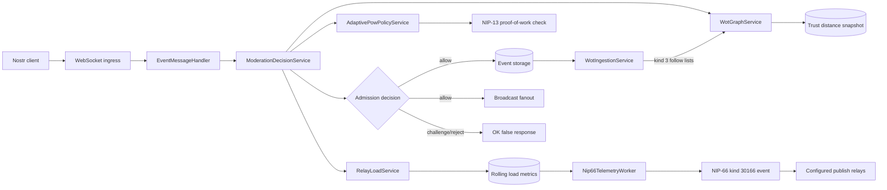
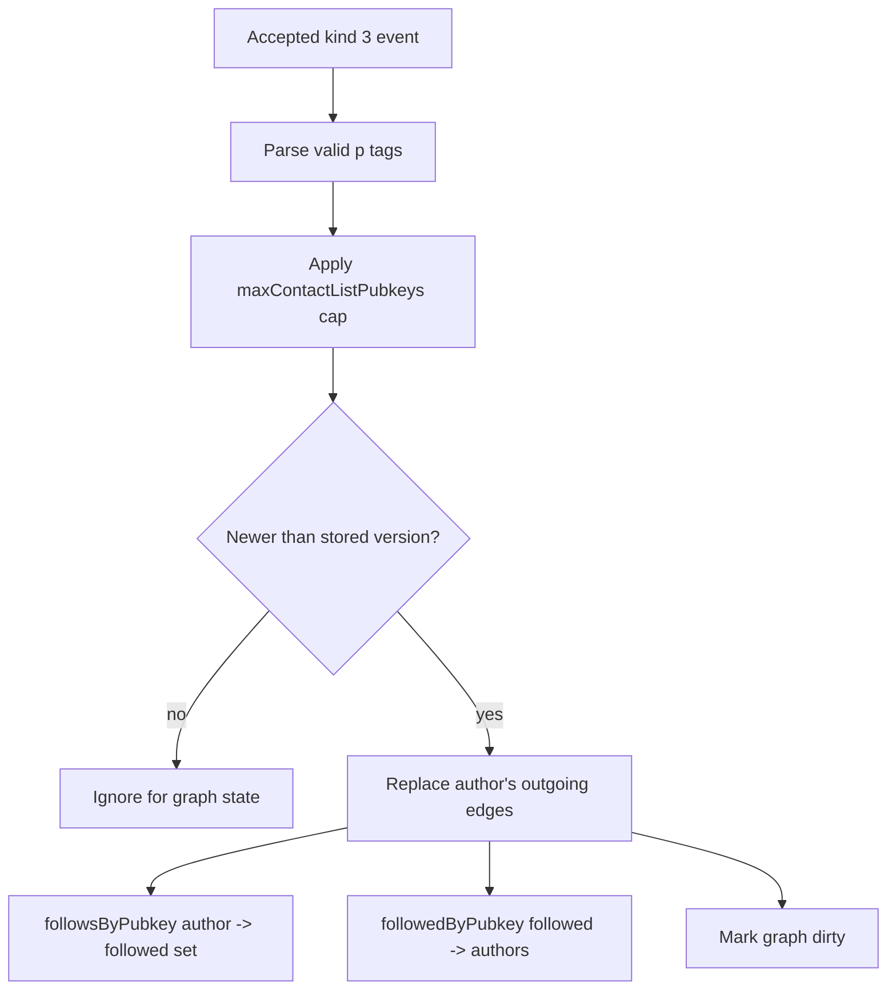
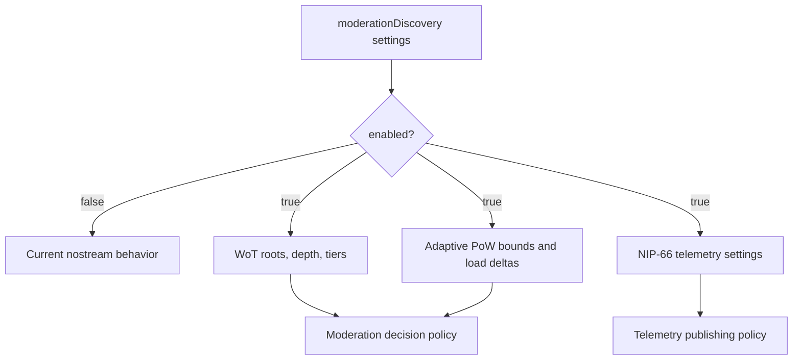
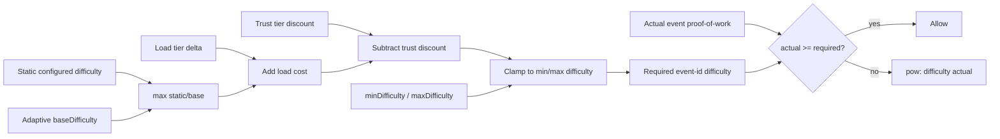
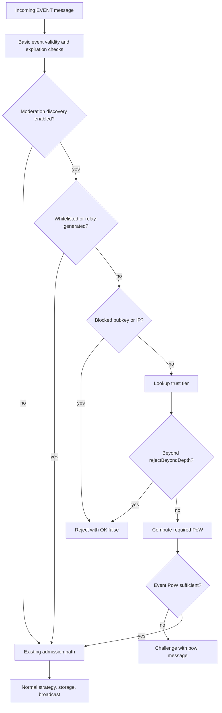
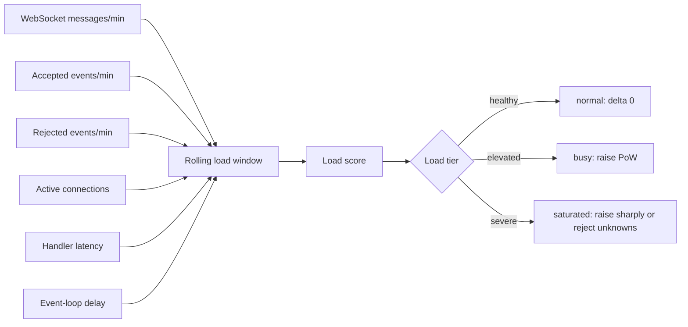
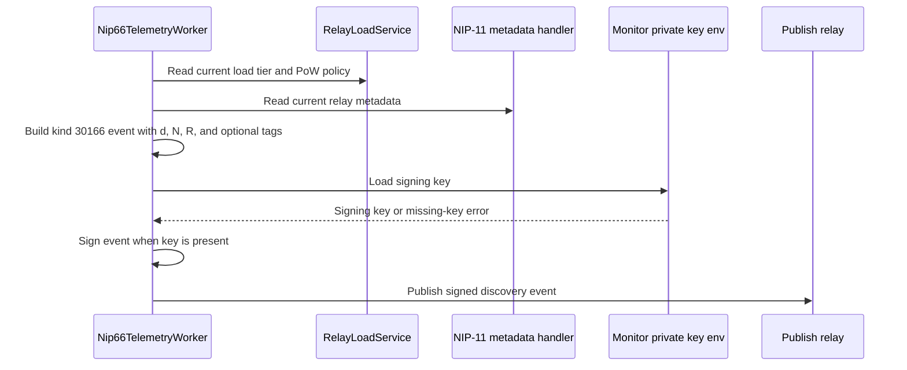
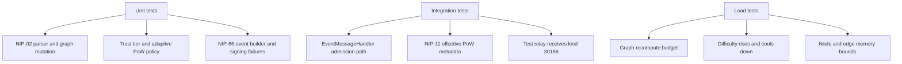
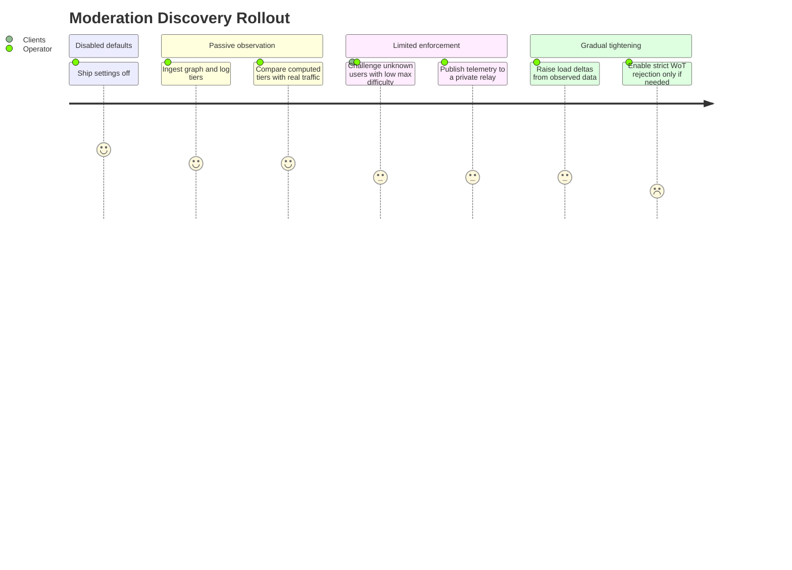

# Moderation & Discovery Engine Plan

Date: 2026-04-22

This document is a planning artifact only. It explains how to add Web of Trust moderation, adaptive NIP-13 proof-of-work, and NIP-66 relay discovery telemetry to nostream without making source-code changes yet.

## Scope

Build a spam-resistance layer that combines three signals:

1. Social trust from NIP-02 follow lists.
2. Dynamic client cost from NIP-13 proof-of-work.
3. Relay operating-state publication through NIP-66 discovery events.

The target behavior is:

- Trusted users near the relay operator's Web of Trust can publish with little or no added proof-of-work.
- Unknown users can still publish, but must provide more proof-of-work as relay load rises.
- Obviously distant or blocked graph regions can be rejected before they consume expensive relay resources.
- The relay can periodically publish signed NIP-66 events that describe its current policy, load tier, supported NIPs, and proof-of-work requirements.

Primary references:

- NIP-02: https://github.com/nostr-protocol/nips/blob/master/02.md
- NIP-13: https://github.com/nostr-protocol/nips/blob/master/13.md
- NIP-66: https://github.com/nostr-protocol/nips/blob/master/66.md
- Current NIP-66 mirror checked on 2026-04-22: https://nips.nostr.com/66

## Current Codebase Context

nostream already has the main extension points this project needs:

- NIP-02 kind `3` follow-list events are already recognized by the relay as replaceable events.
- NIP-13 support already exists through `src/utils/proof-of-work.ts` and event/pubkey proof-of-work checks in `src/handlers/event-message-handler.ts`.
- Event admission is centralized in `EventMessageHandler.handleMessage()`, which makes it the right place to integrate trust tier and adaptive proof-of-work decisions.
- NIP-11 relay metadata is generated in `src/handlers/request-handlers/root-request-handler.ts`; its `limitation.min_pow_difficulty` field already reflects static proof-of-work settings.
- Settings are loaded and hot-reloadable through `src/utils/settings.ts`.
- Background workers already exist through `src/app/maintenance-worker.ts`, `src/factories/maintenance-worker-factory.ts`, and the clustered startup path in `src/app/app.ts`.
- Redis is already a project dependency and adapter target, so a Redis-backed graph or distributed metric cache can be added later without changing the external policy model.

The implementation should extend these boundaries instead of creating a separate relay process or a second event-ingestion path.

## Core Design

Use a small set of dedicated services:

- `WotGraphService`: owns the follow graph and computes trust distance.
- `WotIngestionService`: updates the graph when kind `3` follow lists are accepted or imported.
- `RelayLoadService`: summarizes current relay pressure from event rate, message rate, open connections, rejection rate, CPU/event-loop lag where available, and queue depth if introduced.
- `AdaptivePowPolicyService`: turns user trust tier plus relay load tier into the required NIP-13 difficulty.
- `ModerationDecisionService`: gives `EventMessageHandler` one admission decision: allow, allow with required proof-of-work, or reject.
- `Nip66TelemetryWorker`: periodically signs and broadcasts NIP-66 kind `30166` relay discovery events and optional kind `10166` monitor announcements.

Why this shape works:

Event ingestion should stay simple. The handler should not know graph traversal details, load scoring formulas, or NIP-66 event construction. It should ask one policy service for a decision, then use the existing `OK` result path. This keeps protocol handling stable and makes trust, proof-of-work, and telemetry independently testable.



## Important Product Decisions To Make First

1. Choose trust roots.

   Recommendation: start with explicit operator-configured root pubkeys under settings, plus an optional relay pubkey root. Do not infer roots from every admitted user.

2. Choose graph depth.

   Recommendation: compute distances up to depth `3` by default. Depth `0` is a root, depth `1` is directly followed by a root, depth `2` is followed by someone at depth `1`, and depth `3` is a weak-trust edge. Anything beyond the configured max is unknown.

3. Choose edge direction.

   Recommendation: an edge `A -> B` means `A` follows or endorses `B` because NIP-02 stores followed pubkeys as `p` tags in author `A`'s kind `3` event. Trust distance from a root to a candidate follows outgoing edges.

4. Choose whether unknown users are blocked or challenged.

   Recommendation: challenge unknown users with higher proof-of-work first, and reserve hard blocks for configured deny lists, abusive IPs, unsupported event kinds, and graph distances beyond a strict operator setting.

5. Choose NIP-66 publishing identity.

   Recommendation: use a dedicated relay monitor key from settings. This avoids mixing operator identity, relay metadata identity, and monitoring identity.

6. Choose Redis timing.

   Recommendation: implement an in-memory graph first behind an interface. Add Redis only when multi-process consistency or restart persistence becomes necessary.

## Data Model

### In-Memory Graph

Represent the graph with adjacency sets:

```ts
type Pubkey = string

interface WotGraph {
  followsByPubkey: Map<Pubkey, Set<Pubkey>>
  followedByPubkey: Map<Pubkey, Set<Pubkey>>
  contactListVersion: Map<Pubkey, number>
}
```

Store both directions because:

- `followsByPubkey` makes breadth-first traversal from roots fast.
- `followedByPubkey` makes incremental invalidation easier when a pubkey's follow list changes.
- `contactListVersion` prevents older replaceable kind `3` events from overwriting newer graph state.

For each latest kind `3` event:

- Parse only valid `p` tags with 32-byte lowercase hex pubkeys.
- Ignore relay hints and petnames for trust calculation.
- Replace the author's previous outgoing edge set atomically.
- Cap maximum follows per author, for example `5_000`, so one oversized contact list cannot dominate memory.



### Trust Snapshot

Keep computed distances separate from raw graph edges:

```ts
interface WotDistanceSnapshot {
  generatedAt: number
  roots: Pubkey[]
  maxDepth: number
  distanceByPubkey: Map<Pubkey, number>
}
```

This allows event admission to do an `O(1)` lookup instead of running graph traversal for every incoming event.

```mermaid
flowchart LR
  roots[Configured trust roots] --> bfs[Bounded breadth-first search]
  graph[(followsByPubkey graph)] --> bfs
  maxDepth[maxDepth] --> bfs
  bfs --> distances[(distanceByPubkey)]
  distances --> tiers{Trust tier}
  tiers -->|0| root[root]
  tiers -->|1| trusted[trusted]
  tiers -->|2| familiar[familiar]
  tiers -->|3| weak[weak]
  tiers -->|missing| unknown[unknown]
```

### Redis-Backed Option

If clustering needs shared graph state, keep the same service interface and store:

- Latest contact-list event metadata in Redis hashes.
- Outgoing edges in Redis sets keyed by author pubkey.
- Current distance snapshot in a Redis hash keyed by pubkey.
- A snapshot version key to let workers atomically swap from old to new trust data.

Redis should be treated as a shared cache, not as the final event source of truth. PostgreSQL event storage remains authoritative.

## Configuration Plan

Add a `moderationDiscovery` settings section:

```yaml
moderationDiscovery:
  enabled: false
  wot:
    enabled: false
    roots: []
    maxDepth: 3
    recomputeIntervalMs: 30000
    maxContactListPubkeys: 5000
    unknownPolicy: challenge
    rejectBeyondDepth: -1
    tiers:
      root:
        maxDistance: 0
        powDiscount: 999
      trusted:
        maxDistance: 1
        powDiscount: 8
      familiar:
        maxDistance: 2
        powDiscount: 4
      weak:
        maxDistance: 3
        powDiscount: 1
      unknown:
        maxDistance: -1
        powDiscount: 0
  adaptivePow:
    enabled: false
    baseDifficulty: 0
    minDifficulty: 0
    maxDifficulty: 28
    loadWindowMs: 60000
    loadTiers:
      normal:
        difficultyDelta: 0
      busy:
        difficultyDelta: 4
      saturated:
        difficultyDelta: 8
  telemetry:
    nip66:
      enabled: false
      publishIntervalMs: 300000
      monitorPrivateKeyEnv: NOSTREAM_NIP66_MONITOR_PRIVATE_KEY
      publishRelays: []
      includeNip11Content: true
```

Why this works:

Operators need a conservative default that changes nothing until enabled. The settings also make the policy explainable: trust gives a discount, load adds cost, and bounds prevent accidental impossible proof-of-work requirements.



## Phase 1: Baseline And Interfaces

Work:

1. Add type definitions for trust tiers, graph snapshots, load snapshots, and moderation decisions.
2. Add service interfaces before implementation:
   - `IWotGraphService`
   - `IRelayLoadService`
   - `IAdaptivePowPolicyService`
   - `IModerationDecisionService`
   - `INip66TelemetryPublisher`
3. Write unit tests for expected policy outcomes before wiring the handler.
4. Capture the current NIP-13 behavior in tests so the adaptive logic does not regress static `limits.event.eventId.minLeadingZeroBits` and `limits.event.pubkey.minLeadingZeroBits`.

Why this works:

The risky part is policy composition, not parsing individual events. Interfaces and policy tests let the project prove the decision matrix before connecting it to live ingestion.

## Phase 2: NIP-02 Graph Ingestion

Work:

1. Add a parser for kind `3` follow-list events.
2. Ingest latest contact lists from existing stored events on startup or worker initialization.
3. Update the graph after a new kind `3` event is accepted by the normal event strategy.
4. Handle replaceable-event semantics:
   - Newer kind `3` event replaces the author's old outgoing edges.
   - Older imported or mirrored kind `3` event is ignored for graph state.
5. Add limits:
   - max tags parsed per event
   - max graph nodes
   - max graph edges
   - max recompute duration before aborting and keeping the previous snapshot

Why this works:

NIP-02 already encodes a social graph. Using only accepted and stored kind `3` events means the graph follows the relay's existing validation rules. Replacing outgoing edges matches NIP-02's "latest list replaces previous list" behavior, while a distance snapshot makes publish-time checks cheap.

## Phase 3: Trust Distance Computation

Work:

1. Run bounded breadth-first search from configured roots.
2. Stop traversal at `maxDepth`.
3. Store the shortest distance for each reached pubkey.
4. Convert distance to a tier:
   - `root`: distance `0`
   - `trusted`: distance `1`
   - `familiar`: distance `2`
   - `weak`: distance `3`
   - `unknown`: not present in snapshot
5. Recompute periodically and after significant graph updates, with debounce to avoid recomputing on every contact-list event.

Why this works:

Breadth-first search is the right algorithm because every follow edge has equal cost and the policy only needs shortest hop distance from a trusted root. Bounding depth keeps runtime predictable even if the relay has millions of known follow edges.

## Phase 4: Adaptive NIP-13 Policy

Work:

1. Keep the existing `getEventProofOfWork(event.id)` and `getPubkeyProofOfWork(event.pubkey)` helpers.
2. Add `AdaptivePowPolicyService.requiredDifficulty(pubkey, event, loadSnapshot)`.
3. Compute required event-id difficulty as:

   ```text
   required = clamp(
     max(staticConfiguredDifficulty, baseDifficulty)
       + loadTierDifficultyDelta
       - trustTierPowDiscount,
     minDifficulty,
     maxDifficulty
   )
   ```

4. Preserve static pubkey proof-of-work unless the project explicitly wants adaptive pubkey mining too. Event-id mining is more practical for clients because it does not require rotating identity keys.
5. Return NIP-20-compatible failure messages using the existing `pow:` prefix style, for example:

   ```text
   pow: difficulty 10<16
   ```

6. Add NIP-11 `limitation.min_pow_difficulty` support for the current effective minimum for unknown users, while documenting that per-user trust can reduce it.

Why this works:

NIP-13 proof-of-work is already defined as leading zero bits on event IDs. The relay can verify it cheaply, while senders pay the mining cost. Tying required difficulty to load turns proof-of-work into a pressure valve: when the relay is healthy, requirements stay low; when overloaded, unknown senders must spend more work before their events reach storage.



## Phase 5: Event Admission Integration

Work:

1. Add the moderation decision after basic event validity and expiration checks, before expensive persistence or broadcast.
2. Decision order:
   - If feature disabled, preserve current behavior exactly.
   - If pubkey is explicitly whitelisted, allow.
   - If pubkey or IP is explicitly blocked, reject.
   - Lookup WoT tier from the latest snapshot.
   - If the tier is beyond `rejectBeyondDepth`, reject.
   - Compute adaptive proof-of-work requirement.
   - Verify event proof-of-work.
   - Allow or return an `OK false` command result.
3. Ensure relay-generated events bypass user-facing proof-of-work just as existing relay-pubkey checks do.
4. Keep existing rate limits, payment admission, NIP-05 checks, content limits, and kind limits in place.

Why this works:

This keeps moderation as an admission gate, not a storage rewrite. Existing behavior remains intact when the feature is disabled, and all accepted events still go through the normal strategy system.



## Phase 6: Relay Load Metrics

Work:

1. Track rolling counters:
   - incoming WebSocket messages per minute
   - accepted events per minute
   - rejected events per minute
   - active connections
   - current rate-limit rejections
   - average event-handler latency
2. Optionally track Node event-loop delay using `perf_hooks.monitorEventLoopDelay()`.
3. Convert metrics into load tiers:
   - `normal`: within configured healthy thresholds
   - `busy`: elevated pressure, raise proof-of-work
   - `saturated`: severe pressure, raise proof-of-work sharply and optionally reject unknowns
4. In clustered mode, aggregate metrics through Redis or primary-process messages. Start with per-worker metrics if the first implementation is single-process.

Why this works:

Adaptive proof-of-work only helps if load detection is stable. Rolling windows and tier thresholds avoid changing difficulty on every small spike. Operators can tune thresholds based on real deployment behavior.



## Phase 7: NIP-66 Telemetry Worker

Work:

1. Add a background worker that wakes on `publishIntervalMs`.
2. Build a NIP-66 kind `30166` relay discovery event.
3. Set the required `d` tag to the normalized relay URL.
4. Add useful tags:
   - `N` for supported NIPs.
   - `R` for requirements such as `pow`, `!payment`, `!auth`, or `writes`, based on current relay settings.
   - `rtt-open`, `rtt-read`, and `rtt-write` only if the worker actually measures those values.
   - `t` tags for operator-configured topics, if any.
   - `k` tags for accepted or blocked event kinds if configured.
5. Put the current NIP-11 document in `content` when `includeNip11Content` is enabled.
6. Sign with the monitor private key from an environment variable, never from the YAML file.
7. Publish to configured relays through the existing WebSocket client stack or a small dedicated publisher.
8. Optionally publish kind `10166` monitor announcements if the relay wants to advertise regular monitoring behavior.

Why this works:

Current NIP-66 defines kind `30166` for relay discovery and liveness data. Publishing this from a worker closes the feedback loop: the same metrics used to adjust proof-of-work become visible to the network. Signing with a dedicated key gives consumers a stable identity for the relay's monitoring statements without exposing the operator's personal key.



## Phase 8: Tests

Unit tests:

- NIP-02 parser accepts valid `p` tags and ignores invalid tags.
- Contact-list replacement removes stale outgoing graph edges.
- Bounded BFS returns shortest distances and stops at `maxDepth`.
- Trust tier mapping handles root, known, weak, and unknown pubkeys.
- Adaptive proof-of-work clamps to min/max difficulty.
- Trusted users receive configured discounts.
- Unknown users receive load-based difficulty increases.
- Moderation decisions preserve current behavior when disabled.
- NIP-66 event builder includes required `d` tag and configured relay metadata.
- NIP-66 signing fails closed when no monitor key is configured.

Integration tests:

- A root contact list makes a followed pubkey trusted for publishing.
- A depth-2 pubkey receives a smaller proof-of-work discount than a depth-1 pubkey.
- An unknown pubkey is challenged with higher proof-of-work under simulated busy load.
- A pubkey beyond the configured maximum distance is rejected when strict mode is enabled.
- Existing static NIP-13 scenarios still pass.
- NIP-11 reports a current proof-of-work limitation.
- The telemetry worker emits a valid signed kind `30166` event to a test relay.

Load tests:

- Generate many kind `3` contact lists and confirm graph recompute stays below the target time budget.
- Generate publish bursts and confirm difficulty rises, then falls after the window cools down.
- Verify memory stays bounded by configured node and edge limits.

Why this works:

The core failure modes are policy mistakes and performance regressions. Unit tests prove the decision matrix, integration tests prove the relay path, and load tests prove graph traversal and adaptive proof-of-work remain operational under spam-like pressure.



## Rollout Plan

1. Ship all settings disabled by default.
2. Enable graph ingestion in passive mode and log computed trust tiers without enforcing them.
3. Enable adaptive proof-of-work for unknown users only, with a low `maxDifficulty`.
4. Publish NIP-66 telemetry to a private/test relay.
5. Compare rejection rates, accepted event volume, and client error reports.
6. Gradually raise difficulty deltas and enable strict WoT rejection only if the data shows challenge mode is insufficient.

Why this works:

Spam controls can accidentally block legitimate users. Passive mode gives operators evidence before enforcement, and staged proof-of-work increases give clients time to adapt.



## Security And Abuse Considerations

- Sybil resistance depends on root quality. If roots follow spam accounts, the graph will trust spam accounts.
- Contact lists are public social signals, not cryptographic authorization. Use WoT for cost adjustment and coarse moderation, not for high-value permission decisions.
- Never let unknown users force expensive graph recomputes synchronously during publish.
- Cap graph size and contact-list fanout.
- Use monotonic snapshot replacement so workers never see half-built trust data.
- Keep monitor private keys outside repository and YAML config.
- Do not publish unmeasured telemetry fields. If RTT is not measured, omit RTT tags.
- Treat NIP-66 data from other monitors as advisory only; clients should not rely on one monitor as authoritative.

## Expected File-Level Implementation Areas

Likely code areas for a future implementation:

- `src/@types/settings.ts`: add settings types.
- `resources/default-settings.yaml`: add disabled defaults.
- `src/@types/moderation-discovery.ts`: add graph, tier, load, and decision types.
- `src/services/wot-graph-service.ts`: graph mutation and snapshot lookup.
- `src/services/wot-ingestion-service.ts`: kind `3` parsing and graph updates.
- `src/services/relay-load-service.ts`: rolling load metrics.
- `src/services/adaptive-pow-policy-service.ts`: required difficulty calculation.
- `src/services/moderation-decision-service.ts`: final admission decision.
- `src/handlers/event-message-handler.ts`: call the decision service.
- `src/app/nip66-telemetry-worker.ts`: scheduled NIP-66 publisher.
- `src/factories/*`: wire services and worker construction.
- `test/unit/services/*`: policy, graph, load, and telemetry tests.
- `test/integration/features/nip-13/*`: extend proof-of-work scenarios.
- `test/integration/features/nip-66/*`: add telemetry publishing scenarios.

## Final Explanation

This approach works because it keeps expensive and dynamic work away from the hot publish path. NIP-02 follow lists are ingested into a graph ahead of time, graph traversal runs on a schedule, and event admission only performs constant-time snapshot lookups. NIP-13 proof-of-work then becomes the adjustable cost mechanism: trust reduces the cost, load increases it, and the relay verifies the result cheaply.

The architecture also matches nostream's existing design. Event validation already flows through one handler, settings already support operator policy, proof-of-work helpers already exist, and background workers are already part of the process model. That means the project can add this engine incrementally without rewriting storage, WebSocket routing, or event strategies.

NIP-66 completes the loop by making the relay's current state visible to the network. The relay can publish signed discovery events that say, in effect, "these are my current requirements and capabilities." Other clients and monitors can use that as advisory data, while the relay continues to enforce its own local policy at ingestion time.
